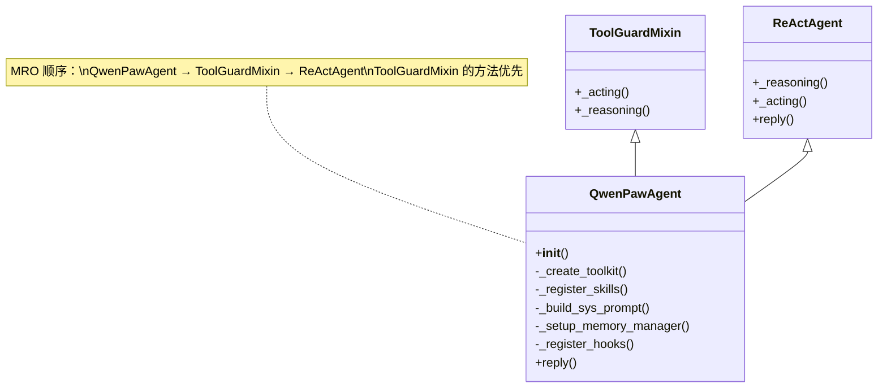

# 第三章 Agent 的诞生

```
浏览器 ─→ HTTP ─→ Runner ─→ [Agent 实例化] ─→ Prompt ─→ ReAct ─→ LLM ─→ Tool ─→ 响应
                                 |
                              你在这里
```

## 问题：Agent 是什么？它是怎么被创建出来的？

上一章，我们跟着一条请求穿过了 Runner 的调度，看到了 `MultiAgentManager` 如何找到正确的 Workspace。在 Workspace 启动的过程中，有一个关键的步骤：创建一个 `QwenPawAgent` 实例。

但"创建一个 Agent"到底意味着什么？当我们说"一个 Agent 被启动了"，屏幕后面到底发生了什么事？为什么需要把"创建模型"这件事交给一个"工厂"来做？为什么 18 个内置工具不是一个一个硬编码进去的？一个 Agent 从无到有，到底经历了几步？

这一章，我们就来回答这些问题。我们要打开 `react_agent.py`，亲眼看着一个 Agent 从零开始，一步步装备好模型、工具、记忆和技能，最终变成那个能跟你对话的"Friday"。

---

## 术语其实很简单

> **术语：Agent（智能体）**
> Agent 是整个系统的"大脑"。你发给它的每一条消息，都是它在处理：它要理解你的意思、决定用哪些工具、执行操作、组织回答。你可以把它想象成一个全能的私人助理——它会思考（调用大模型），也会动手（执行工具）。QwenPaw 里这个助理的名字叫"Friday"。

> **术语：类与实例**
> 类（Class）是一张蓝图，实例（Instance）是按蓝图造出来的实体。就像"汽车设计图纸"是类，"你停在车库里的那辆车"是实例。代码里 `class QwenPawAgent` 是蓝图，`agent = QwenPawAgent(config)` 就是用蓝图造出了一辆真车。同一个蓝图可以造出很多辆车（多个实例），每辆车有自己独立的油箱和里程（各自独立的记忆和状态）。

> **术语：工厂模式（Factory Pattern）**
> 想象你去买蛋糕——你不需要知道烤箱怎么用、面粉从哪进货，你只需要跟柜台说"我要一个草莓蛋糕"。柜台后面的师傅（工厂）会根据你的订单选择配方、准备材料、烤好蛋糕，然后递给你。代码里的"工厂模式"也是这样：你不需要知道模型怎么创建、格式化器怎么匹配，你只要调用 `create_model_and_formatter()`，工厂会帮你搞定一切。

> **术语：Mixin**
> Mixin 是一种"混入"技术——就像给手机套上不同的保护壳。手机本身能打电话（核心功能），保护壳能防摔（附加功能）。你不需要重新设计一款新手机，只需要把壳套上去就行。在代码里，`ToolGuardMixin` 就是这样一个"壳"：`ReActAgent` 是核心推理能力，`ToolGuardMixin` 混入后给推理加上了安全检查。把壳套上，手机就既能打电话又防摔了。

---

## 探索：Agent 的诞生全过程

### 第一步：看一眼继承链——Agent 的"家族谱"

打开 `src/qwenpaw/agents/react_agent.py`，第 76 行：

```python
class QwenPawAgent(ToolGuardMixin, ReActAgent):
```

这一行代码定义了 `QwenPawAgent` 类。括号里的 `ToolGuardMixin` 和 `ReActAgent` 是它的"父母"——用面向对象编程的术语来说，叫"父类"或"基类"。`QwenPawAgent` 继承了它们的能力。

什么意思？想象你在填一份简历。你有两项技能：一项是从学校里学来的（ReActAgent），一项是从培训班学的（ToolGuardMixin）。你把两项技能都写在简历上，用人单位就认为两样你都会。Python 的继承也是这样——`QwenPawAgent` 写明了它继承自 `ToolGuardMixin` 和 `ReActAgent`，所以它同时拥有两者的全部能力。

但这里有一个微妙的问题：如果"学校"和"培训班"都教了同一门课（比如都定义了 `_acting` 方法），到底听谁的？Python 有一套明确的规则来回答这个问题，叫做**方法解析顺序**（Method Resolution Order，简称 MRO）。

下面这张图展示了完整的继承链和 MRO 顺序：



MRO 顺序是：`QwenPawAgent` → `ToolGuardMixin` → `ReActAgent`。也就是说，当调用 `_acting()` 或 `_reasoning()` 时，Python 会先看 `QwenPawAgent` 自己有没有定义，再看 `ToolGuardMixin`，最后才看 `ReActAgent`。`ToolGuardMixin` 正好重写了 `_acting` 和 `_reasoning`——所以每次推理和执行时，安全检查都会先介入。

源码里的注释也特别提醒了这一点（第 87-93 行）：

```python
# MRO note
# ToolGuardMixin overrides _acting and _reasoning via Python's MRO:
# QwenPawAgent → ToolGuardMixin → ReActAgent.
# If you add a _acting or _reasoning override in this class,
# you MUST call super()._acting(...) / super()._reasoning(...)
# so the guard interception remains active.
```

这段注释翻译过来就是："如果将来有人在 `QwenPawAgent` 里也重写了 `_acting` 或 `_reasoning`，一定要记得调用 `super()`，否则 ToolGuardMixin 的安全拦截就失效了。"这是一个非常重要的工程约束——继承链越复杂，这种提醒就越必要。

### 第二步：__init__——Agent 诞生的六道工序

找到了类定义，下一步就是看 `__init__` 方法。这是 Python 里每个实例被创建时自动调用的初始化方法——蓝图变成实车的那一刻。

`__init__` 从第 96 行开始，接收一批参数：

```python
def __init__(
    self,
    agent_config: "AgentProfileConfig",
    env_context: Optional[str] = None,
    enable_memory_manager: bool = True,
    mcp_clients: Optional[List[Any]] = None,
    memory_manager: "BaseMemoryManager | None" = None,
    request_context: Optional[dict[str, str]] = None,
    namesake_strategy: NamesakeStrategy = "skip",
    workspace_dir: Path | None = None,
    task_tracker: Any | None = None,
):
```

参数不少，但别被吓到。最核心的就两个：`agent_config` 是这个 Agent 的全部配置信息（名字叫什么、用哪个模型、启用哪些工具等），`workspace_dir` 是它的工作目录。其余的都是可选的增强功能。

方法的主体（第 128-188 行）按固定顺序执行六道工序。让我用一张流程图来展示整个过程：

```
QwenPawAgent.__init__()  ——  Agent 诞生的六道工序

  ┌─────────────────────────────────────────────────────────┐
  │ 工序 1: 保存配置                                         │
  │ agent_config, env_context, request_context 等存入 self   │
  └────────────────────────┬────────────────────────────────┘
                           │
  ┌────────────────────────▼────────────────────────────────┐
  │ 工序 2: 创建工具箱                                       │
  │ toolkit = _create_toolkit()                              │
  │ 把 18 个内置工具逐个注册进 toolkit                        │
  └────────────────────────┬────────────────────────────────┘
                           │
  ┌────────────────────────▼────────────────────────────────┐
  │ 工序 3: 加载技能                                         │
  │ _register_skills(toolkit)                                │
  │ 从工作目录的 skills/ 文件夹加载外部技能                    │
  └────────────────────────┬────────────────────────────────┘
                           │
  ┌────────────────────────▼────────────────────────────────┐
  │ 工序 4: 构建系统提示词                                    │
  │ sys_prompt = _build_sys_prompt()                         │
  │ 从 AGENTS.md / SOUL.md 等文件拼装出完整的提示词           │
  └────────────────────────┬────────────────────────────────┘
                           │
  ┌────────────────────────▼────────────────────────────────┐
  │ 工序 5: 通过工厂创建模型                                  │
  │ model, formatter = create_model_and_formatter()          │
  │ 工厂根据配置选择正确的 LLM 和格式化器                      │
  └────────────────────────┬────────────────────────────────┘
                           │
  ┌────────────────────────▼────────────────────────────────┐
  │ 工序 6: 初始化父类 + 注册钩子                             │
  │ super().__init__(name="Friday", model, sys_prompt, ...)  │
  │ 然后设置记忆管理器和命令处理器                             │
  │ 最后注册 bootstrap 和记忆压缩钩子                          │
  └─────────────────────────────────────────────────────────┘
```

这六道工序的顺序不是随意的。工具箱必须先创建（工序 2），因为技能也要注册到工具箱里（工序 3）。系统提示词必须在模型之前构建（工序 4 先于工序 5），因为提示词要传给父类。父类初始化必须放在最后（工序 6），因为在那之前所有东西都得准备好。

接下来，我们深入其中几道关键工序。

### 第三步：工厂模式——工序 5 的内幕

工序 5 调用了 `create_model_and_formatter()`（第 150 行）：

```python
model, formatter = create_model_and_formatter(
    agent_id=agent_config.id,
)
```

一行代码，但背后是 `model_factory.py` 里整整一百多行的逻辑。为什么要搞得这么复杂？让我们打开 `src/qwenpaw/agents/model_factory.py`，看看这个"工厂"做了什么。

工厂的核心逻辑从第 930 行开始，分三个阶段：

**阶段一：确定用哪个模型。** 先尝试从 Agent 的专属配置中读取模型信息。如果这个 Agent 配了自己的模型（比如指定了用 GPT-4），就用专属的。如果没有配，就退回到全局默认模型。这就像你去餐厅——如果你提前点了菜，就上你点的；如果没有特殊要求，就上今日推荐。

```python
# 尝试获取 Agent 专属模型
if model_slot and model_slot.provider_id and model_slot.model:
    # 用专属的
    provider = manager.get_provider(model_slot.provider_id)
    model = provider.get_chat_model_instance(model_slot.model)
else:
    # 退回到全局默认
    model = ProviderManager.get_active_chat_model()
```

**阶段二：创建对应的格式化器。** 不同的模型厂商（OpenAI、Anthropic、Google）对消息格式的要求不同——就像不同国家的信件格式不一样。格式化器（Formatter）负责把统一的内部格式翻译成每个模型能理解的语言。

```python
# 根据模型的真实类来创建格式化器
formatter = _create_formatter_instance(model.__class__)
```

工厂会根据模型的实际类型（OpenAI 的？Anthropic 的？Gemini 的？）自动选择对应的格式化器。你不需要关心这些细节——工厂帮你匹配好了。

**阶段三：包装上重试和限流。** 网络请求可能会失败，API 可能会有速率限制。工厂在返回之前，会用 `TokenRecordingModelWrapper`（记录 token 用量）和 `RetryChatModel`（自动重试 + 限流）把原始模型包起来。

```python
wrapped_model = TokenRecordingModelWrapper(provider_id, model)
wrapped_model = RetryChatModel(
    wrapped_model,
    retry_config=retry_config,
    rate_limit_config=rate_limit_config,
)
return wrapped_model, formatter
```

这就像寄快递：模型是包裹本身，`TokenRecordingModelWrapper` 是贴上的"签收单"（记录用量），`RetryChatModel` 是"保价服务"（失败了自动重试）。层层包装之后，你拿到的就是一个既可靠又可追踪的模型实例。

工厂返回的是一个元组 `(wrapped_model, formatter)`，刚好对应调用处的 `model, formatter = create_model_and_formatter(...)`。

### 第四步：18 个内置工具——工序 2 的细节

回到 `react_agent.py`，工序 2 调用 `_create_toolkit()`（第 190 行）。这个方法负责创建一个空的工具箱，然后往里面注册 QwenPaw 的 18 个内置工具。

首先创建一个空的 `Toolkit` 实例：

```python
toolkit = Toolkit()
```

然后，方法定义了一个字典，把工具名映射到实际的工具函数（第 233-253 行）：

```python
tool_functions = {
    "execute_shell_command": execute_shell_command,
    "read_file": read_file,
    "write_file": write_file,
    "edit_file": edit_file,
    "grep_search": grep_search,
    "glob_search": glob_search,
    "browser_use": browser_use,
    "desktop_screenshot": desktop_screenshot,
    "view_image": view_image,
    "view_video": view_video,
    "send_file_to_user": send_file_to_user,
    "get_current_time": get_current_time,
    "set_user_timezone": set_user_timezone,
    "get_token_usage": get_token_usage,
    "delegate_external_agent": delegate_external_agent,
    "list_agents": list_agents,
    "chat_with_agent": chat_with_agent,
    "submit_to_agent": submit_to_agent,
    "check_agent_task": check_agent_task,
}
```

数一数，正好 18 个。它们大致可以分为四类：

```
文件操作类                系统信息类
├── read_file            ├── get_current_time
├── write_file           ├── set_user_timezone
├── edit_file            └── get_token_usage
├── grep_search
├── glob_search          多媒体类
                         ├── view_image
Shell 执行类             ├── view_video
├── execute_shell_command├── desktop_screenshot
                         └── send_file_to_user
Agent 协作类
├── delegate_external_agent
├── list_agents
├── chat_with_agent
├── submit_to_agent
└── check_agent_task
```

注册时不是无脑全部加进去——方法会先检查 Agent 的配置，看每个工具是否被启用：

```python
for tool_name, tool_func in tool_functions.items():
    # 如果配置中明确禁用了这个工具，跳过
    if not enabled_tools.get(tool_name, True):
        logger.debug("Skipped disabled tool: %s", tool_name)
        continue

    toolkit.register_tool_function(
        tool_func,
        namesake_strategy=namesake_strategy,
        async_execution=async_exec,
    )
```

这里有一个设计细节值得注意：`enabled_tools.get(tool_name, True)` 的默认值是 `True`。意思是，如果配置里没有提到某个工具，默认启用它。这是一种**向后兼容**的设计——旧版本的配置文件没有这个字段，但系统不会因此崩掉，而是用默认值兜底。

还有一个有趣的逻辑：如果任何一个工具启用了异步执行（目前只有 `execute_shell_command` 支持），系统会自动额外注册三个任务管理工具（`view_task`、`wait_task`、`cancel_task`），让 Agent 能够管理后台任务。这就像你如果开了"后台下载"功能，系统就会自动给你加一个"下载管理器"。

### 第五步：技能加载——工序 3 的灵活性

内置工具是"出厂标配"，技能（Skill）则是"用户自选"。`_register_skills()` 方法（第 309 行）从工作目录的 `skills/` 文件夹里加载用户自定义的技能：

```python
def _register_skills(self, toolkit: Toolkit) -> None:
    workspace_dir = self._workspace_dir or WORKING_DIR
    ensure_skills_initialized(workspace_dir)

    # 根据渠道（console / web / api）决定加载哪些技能
    channel_name = request_context.get("channel", "console")
    effective_skills = resolve_effective_skills(
        workspace_dir,
        channel_name,
    )
```

注意 `resolve_effective_skills` 接收了 `channel_name` 参数——这意味着同一个 Agent 在不同渠道下可以加载不同的技能。比如你在终端里用它，可能加载的是命令行相关的技能；在 Web 界面里用它，可能加载的是网页交互相关的技能。

加载过程也很优雅：

```python
for skill_name in effective_skills:
    skill_dir = working_skills_dir / skill_name
    if skill_dir.exists():
        try:
            toolkit.register_agent_skill(str(skill_dir))
        except Exception as e:
            logger.error("Failed to register skill '%s': %s", ...)
```

遍历技能列表，检查目录是否存在，存在就注册，不存在就跳过，注册失败也只是记个日志而不是直接崩溃。这种**容错设计**保证了即使某个技能文件损坏或缺失，Agent 仍然能正常启动——只是少了那个技能而已。

### 第六步：记忆与钩子——工序 6 的收尾

工具和技能都准备好了，最后是两项"基础设施"。

**记忆管理器**（`_setup_memory_manager`，第 393 行）：如果启用了记忆功能，会把 `memory_search` 工具注册到工具箱里，这样 Agent 就能搜索以前的对话记录。它还会检查一个环境变量 `ENABLE_MEMORY_MANAGER`——运维人员可以在不修改配置的情况下，通过环境变量直接关闭记忆功能。

**钩子注册**（`_register_hooks`，第 428 行）：注册两个"钩子"（Hook），它们会在特定时机自动触发：

```
钩子名称              触发时机           作用
─────────────────────────────────────────────────────
bootstrap_hook        推理前（首轮）      检查 BOOTSTRAP.md，
                                      首次对话时加载引导信息

memory_compact_hook   推理前（每轮）      检查上下文长度，
                                      超过阈值自动压缩记忆
```

钩子就像电路里的继电器——它们串联在正常的推理流程前面，不影响主逻辑，但能在关键时刻自动介入。比如 `memory_compact_hook` 会在每次推理前检查记忆是否太长了，如果太长就自动做一次压缩，防止把大模型的上下文窗口撑爆。

### 第七步：调用父类——Agent 真正"活"了过来

所有组件准备就绪后，`__init__` 的最后一步是调用 `super().__init__()`（第 162 行）：

```python
super().__init__(
    name="Friday",
    model=model,
    sys_prompt=sys_prompt,
    toolkit=toolkit,
    memory=InMemoryMemory(),
    formatter=formatter,
    max_iters=running_config.max_iters,
)
```

这一行把所有东西汇总，传给父类 `ReActAgent` 的初始化方法。`ReActAgent` 会存储这些参数，建立起内部的推理循环框架。从这一刻起，Agent 有了名字（"Friday"）、有了大脑（model）、有了人设（sys_prompt）、有了工具（toolkit）、有了记忆（memory）——它正式"活"了过来，准备好接收你的第一条消息。

注意 `name="Friday"` 是硬编码的。每一个 `QwenPawAgent` 实例都叫"Friday"——这个名字来自《鲁滨逊漂流记》里鲁滨逊的仆人星期五。一个 AI 助手叫"星期五"，暗示它永远在你身边，随时待命。

---

## 实验：在 IDE 中找到 Agent 的创建代码

打开你的 IDE，按照以下步骤来实地观察：

1. 打开文件 `src/qwenpaw/agents/react_agent.py`
2. 跳转到第 96 行，你会看到 `def __init__` 的定义
3. 在 `__init__` 内部，找到第 162 行的 `super().__init__()`——这是 Agent 真正初始化的一行
4. 按住 Command（macOS）或 Ctrl（Windows/Linux）点击 `create_model_and_formatter`，跳转到 `model_factory.py`
5. 在 `model_factory.py` 里，观察第 983-1006 行的分支逻辑——你能清楚地看到"先找专属模型，没有就用全局"的策略

试着在 `__init__` 里打个断点（如果你会用调试器的话），然后发送一条消息触发 Agent 创建。你会看到六个步骤依次执行，最后 Agent 活了过来。

---

## 工程权衡

### 为什么用工厂模式创建模型？

`create_model_and_formatter()` 做的事情看起来不复杂——根据配置选择模型、创建格式化器。那为什么不直接在 `__init__` 里写呢？

答案是**解耦**。模型的创建逻辑涉及配置读取、多厂商适配、重试包装、限流控制——如果把这些全部塞进 `__init__`，那个方法会膨胀到几百行，而且每次新增一个模型厂商都得改 `__init__`。用工厂模式把这些逻辑抽出去后，`__init__` 只需要一行调用就能拿到模型，模型怎么创建的它完全不用关心。

这就像你装修房子——你不需要自己学会接水管和拉电线，你只需要叫专业师傅来干。水管工（工厂）负责水管，电工（另一个工厂）负责电路。你（`__init__`）只负责说"我要一个能用的厨房"。

### 为什么工具注册是动态的？

看 `_create_toolkit` 里的 `tool_functions` 字典——18 个工具排得整整齐齐。有人可能会问：为什么不直接在类里写 18 个方法？

第一，**配置灵活**。用户可以通过配置文件启用或禁用任何一个工具。如果工具是硬编码的方法，要实现这个功能就得多写一堆 if-else。用字典 + 循环注册的方式，天然支持"遍历 + 过滤"。

第二，**重名处理**。`namesake_strategy` 参数允许你控制"工具重名时怎么办"——覆盖、跳过、报错、还是自动改名。这个需求在 MCP（Model Context Protocol）外部工具接入时尤其重要，因为外部工具的名字不受你控制。字典 + 注册的设计让这个问题迎刃而解。

第三，**可扩展**。工具可以来自三个渠道：内置的（18 个）、用户技能（skills/）、MCP 外部工具。它们全部注册到同一个 `Toolkit` 实例里，用同一套机制管理。这种"统一入口"的设计让新增工具变得极其简单——写个函数，调一下 `register_tool_function`，就完了。

---

## 动手：在 IDE 中浏览 Agent 的初始化代码

这是第三章的动手环节。你不需要写代码，只需要打开文件看一看。

**目标**：亲眼看到 `__init__` 的六道工序。

**步骤**：

1. 用你喜欢的编辑器打开 `src/qwenpaw/agents/react_agent.py`
2. 跳到第 96 行附近，找到 `def __init__`
3. 从第 128 行开始，往下慢慢读。每一行左边应该有行号
4. 找到第 141 行——这是 `toolkit = self._create_toolkit(...)`
5. 找到第 144 行——这是 `self._register_skills(toolkit)`
6. 找到第 147 行——这是 `sys_prompt = self._build_sys_prompt()`
7. 找到第 150 行——这是 `model, formatter = create_model_and_formatter()`
8. 找到第 162 行——这是 `super().__init__(name="Friday", ...)`

这六行就是六道工序的入口。如果你想深入某一工序，按住 Command/Ctrl 点击对应的方法名，就能跳到它的实现。

**加分挑战**：数一数 `tool_functions` 字典里到底有多少个键值对。然后打开 `src/qwenpaw/agents/tools/` 目录，看看这些工具函数分别定义在哪些文件里。你会对"模块化"有更直观的感受。
