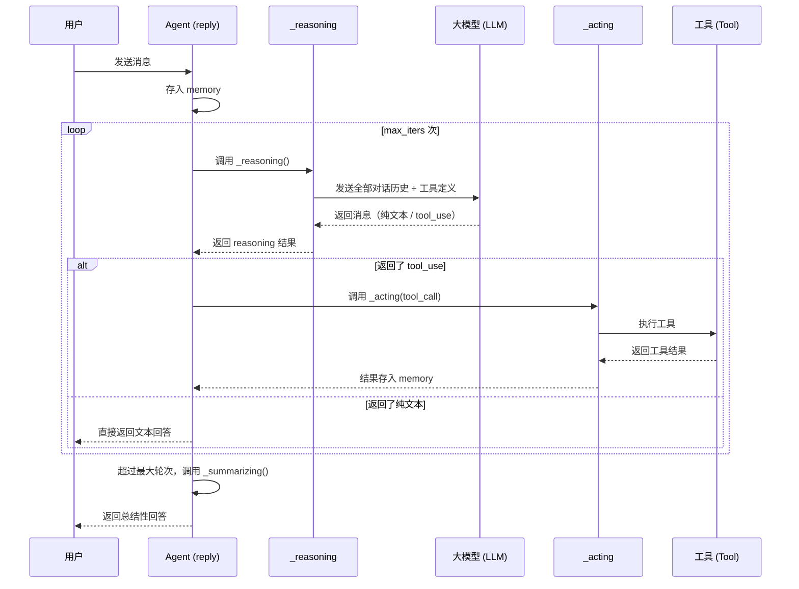

# 第五章 进入 ReAct 循环

```
浏览器 -> [HTTP/FastAPI] -> Runner -> Agent -> Prompt -> [ReAct循环] -> LLM -> Tool -> 响应
                                                        |
                                                     你在这里
```

## 问题：Agent 收到消息后做了什么？为什么不是直接回答？

上一章我们结束了 Prompt 的组装——系统提示词写好了，工具列表注册完了，消息队列（memory）里存着用户的问题。一切准备就绪。

那么，Agent 是不是直接把消息丢给大模型，拿到回答，然后收工？

不是。

一个真正能干活的 Agent，不是"一问一答"那么简单。它需要**思考**——想一想，这个问题要不要查时间？要不要读文件？要不要搜索网页？然后**行动**——调用工具，拿到结果。接着再**思考**——结果拿到了，够不够？要不要继续查？不够就再来一轮。

这个"思考-行动-观察-再思考"的循环，叫做 **ReAct 循环**。它是整个 Agent 最核心的运转机制。QwenPaw 之所以能像一个真正的助手那样完成复杂任务，全靠这个循环在背后不停地转。

这一章，我们就钻进这个循环里，看看它怎么转、什么时候停、以及一种叫做"MRO 拦截链"的机制，怎么在循环的中间插入安全检查。

---

## 术语其实很简单

> **术语：ReAct（Reasoning + Acting）**
> 想象你在做一道复杂的数学题。你不是一口气写完所有步骤的——你会先想"这道题应该用什么方法？"（Reasoning），然后动手计算（Acting），看看结果对不对（Observation）。如果不对，再想新的方法，再算。ReAct 就是让 AI 按同样的方式工作：先想，再做，观察结果，循环往复，直到得出最终答案。

> **术语：消息队列（Memory）**
> 想象一个聊天记录。每条消息都按顺序排在里面——用户说了什么、助手回了什么、工具返回了什么。Agent 每次思考时，都会把整个聊天记录翻一遍（当然，太长的会被压缩，这是下一章的事）。这个"聊天记录"在 QwenPaw 里叫 memory，它是 ReAct 循环的"记忆本"。

---

## 探索：循环是怎么转起来的

### 一张图看懂 ReAct 循环

在深入代码之前，先用一张时序图把整个循环画出来：



用文字描述，就是这样的流程：

```
                    ┌──────────────────────────────────────────┐
                    │            reply() 收到消息              │
                    └──────────────────┬───────────────────────┘
                                       │
                                       v
               ┌──────────── for i in range(max_iters) ───────────┐
               │                                                      │
               │   ┌─────────────────────────────────────────────┐  │
               │   │         _reasoning()  思考                   │  │
               │   │  把 memory 里的消息格式化，发送给大模型      │  │
               │   │  大模型返回：纯文本 or tool_use block         │  │
               │   └────────────────┬────────────────────────────┘  │
               │                    │                                │
               │                    v                                │
               │          ┌─────────────────┐                       │
               │          │ 有 tool_use 吗？ │                       │
               │          └────┬───────┬────┘                       │
               │               │       │                            │
               │          没有  │       │ 有                         │
               │               v       v                            │
               │     ┌──────────┐  ┌──────────────────────┐        │
               │     │ 跳出循环  │  │ _acting(tool_call)   │        │
               │     │ 返回文本  │  │ 执行工具，拿结果     │        │
               │     └──────────┘  │ 结果存入 memory      │        │
               │                   └──────────┬───────────┘        │
               │                              │                    │
               │                              v                    │
               │                      回到循环开头 ────────────────┘
               │
               └──────  循环结束（超过 max_iters） ───> _summarizing()
                                                           │
                                                           v
                                                      返回总结回答
```

这个流程的核心逻辑写在哪里？打开 agentscope 库里的 `_react_agent.py`，在 `reply()` 方法里（大约第 432 行），你能看到这样一段循环：

```python
# -------------- The reasoning-acting loop --------------
structured_output = None
reply_msg = None
for _ in range(self.max_iters):
    # -------------- The reasoning process --------------
    msg_reasoning = await self._reasoning(tool_choice)

    # -------------- The acting process --------------
    futures = [
        self._acting(tool_call)
        for tool_call in msg_reasoning.get_content_blocks("tool_use")
    ]

    # ...
    # -------------- Check for exit condition --------------
    elif not msg_reasoning.has_content_blocks("tool_use"):
        reply_msg = msg_reasoning
        break
```

就是这么一个 `for` 循环，`max_iters` 默认是 10。每次循环做三件事：

1. **_reasoning()**：让大模型思考，生成回复
2. **_acting()**：如果回复里有工具调用，就执行它们
3. **检查退出条件**：如果没有工具调用了（大模型只返回了纯文本），就跳出循环

如果循环了 `max_iters` 次还没结束，就调用 `_summarizing()`，让大模型总结当前状态，给出一个收尾的回答。

### 第一步：思考（Reasoning）

`_reasoning()` 是整个循环的"大脑"。它做的事情很直接：把 memory 里的所有消息组装成 prompt，发给大模型，拿到回复。

在 agentscope 的基类里，`_reasoning()` 长这样（简化版）：

```python
async def _reasoning(self, tool_choice=None) -> Msg:
    # 把 memory 里的消息格式化成大模型需要的格式
    prompt = await self.formatter.format(
        msgs=[
            Msg("system", self.sys_prompt, "system"),
            *await self.memory.get_memory(
                exclude_mark=_MemoryMark.COMPRESSED,
            ),
        ],
    )

    # 调用大模型
    res = await self.model(
        prompt,
        tools=self.toolkit.get_json_schemas(),
        tool_choice=tool_choice,
    )

    # ... 处理流式/非流式输出，打印到控制台 ...
    # 把回复存入 memory
    await self.memory.add(msg)
    return msg
```

关键点有两个：

第一，`self.formatter.format()` 把 memory 里的消息转换成大模型能理解的格式。大模型 API 不认识 QwenPaw 的 `Msg` 对象，它需要的是特定的 JSON 结构。formatter 就是做这个翻译的。

第二，`tool_choice` 参数控制大模型"要不要调用工具"。`"auto"` 表示大模型自己决定，`"none"` 表示禁止调用工具，`"required"` 表示必须调用。正常情况下是 `"auto"`，但某些特殊时刻（比如要求只输出文本总结）会切换成 `"none"`。

大模型返回的 `msg` 里面，可能包含两种内容块：
- **text block**：纯文本，大模型"说"的话
- **tool_use block**：工具调用请求，包含工具名和参数

### 第二步：行动（Acting）

如果 `_reasoning()` 返回的消息里有 `tool_use` 块，`reply()` 的循环就会把它们取出来，逐个调用 `_acting()`：

```python
futures = [
    self._acting(tool_call)
    for tool_call in msg_reasoning.get_content_blocks("tool_use")
]
```

基类的 `_acting()` 做的事情也很直接：调用工具，拿到结果，存入 memory。

```python
async def _acting(self, tool_call) -> dict | None:
    # 执行工具
    tool_res = await self.toolkit.call_tool_function(tool_call)

    # 处理工具返回的结果（支持流式输出）
    async for chunk in tool_res:
        tool_res_msg.content[0]["output"] = chunk.content
        await self.print(tool_res_msg, chunk.is_last)

    # 把工具结果存入 memory
    await self.memory.add(tool_res_msg)
    return None
```

`toolkit.call_tool_function(tool_call)` 这行是真正的"干活"——找到对应的工具函数，执行它，返回结果。

### 第三步：观察与循环

工具执行完毕后，结果已经存进了 memory。循环回到开头，再次调用 `_reasoning()`。这一次，大模型看到的不只是用户的原始问题，还有：
- 上一轮它自己生成的工具调用请求
- 工具执行后返回的结果

大模型根据这些新信息，决定下一步：
- 继续调用工具？那就再来一轮
- 信息够了，直接回答？那就返回纯文本，循环结束

这就是 ReAct 里的"Observe"——不是一段独立的代码，而是隐含在 memory 的积累中。每次 `_reasoning()` 时，大模型通过 memory "看到"了之前的工具结果，这就完成了观察。

### 循环什么时候停下来

有两种情况循环会停止：

**正常退出**：大模型在某一轮只返回了纯文本，没有 `tool_use` 块。这意味着它认为任务完成了，直接给出最终回答。

```python
elif not msg_reasoning.has_content_blocks("tool_use"):
    reply_msg = msg_reasoning
    break
```

**超时退出**：循环了 `max_iters` 次（默认 10 次）还没结束。这时调用 `_summarizing()`：

```python
# When the maximum iterations are reached and no reply message
if reply_msg is None:
    reply_msg = await self._summarizing()
```

`_summarizing()` 会往 memory 里注入一条提示："你已经达到了最大迭代次数，请根据当前情况总结回答。"然后做最后一次 `_reasoning()`，这次 `tool_choice` 设为 `"none"`，强制大模型只输出文本，不再调用工具。

---

## 探索：MRO 拦截链——在循环中间"插队"

上面讲的是 ReAct 循环的基本流程。但 QwenPaw 不是直接用 agentscope 的基类。它做了两件额外的事：

1. 在 `_reasoning()` 里加了多媒体处理
2. 在 `_acting()` 里加了安全检查

这两件事都是通过 Python 的 **MRO（Method Resolution Order）** 机制实现的。这是 QwenPaw 架构里非常精巧的设计，值得专门讲一讲。

### 什么是 MRO

Python 支持多继承。当一个类继承了多个父类，并且多个父类都定义了同名方法时，Python 需要一个规则来决定调用哪个。这个规则就是 MRO——方法解析顺序。

来看 QwenPawAgent 的继承关系：

```python
class QwenPawAgent(ToolGuardMixin, ReActAgent):
    ...
```

`QwenPawAgent` 同时继承了 `ToolGuardMixin` 和 `ReActAgent`。当你在 `QwenPawAgent` 的实例上调用 `self._acting()` 时，Python 按 MRO 顺序查找：

```
QwenPawAgent -> ToolGuardMixin -> ReActAgent
```

所以 `self._acting()` 会先找到 `ToolGuardMixin._acting()`，而不是 `ReActAgent._acting()`。

那 `ToolGuardMixin._acting()` 怎么保证最终还是会调用到基类的工具执行逻辑呢？靠 `super()`：

```python
# ToolGuardMixin 里
async def _acting(self, tool_call):
    # ... 先做安全检查 ...

    # 检查通过，调用 MRO 里的下一个：ReActAgent._acting()
    result = await super()._acting(tool_call)
    return result
```

`super()` 不是"调用父类"，而是"调用 MRO 链上的下一个类"。在 `ToolGuardMixin` 里，`super()._acting()` 指向的是 `ReActAgent._acting()`。

> **术语：super()**
> 不是"爸爸"，是"接力棒"。`super()` 把当前方法的调用传给继承链上的下一个类。想象一条接力跑：QwenPawAgent 跑第一棒，传给 ToolGuardMixin 跑第二棒，再传给 ReActAgent 跑第三棒。每一棒都可以选择"自己加料然后继续传"或者"直接传"。

### ToolGuardMixin 怎么拦截 _acting()

让我们看看 `ToolGuardMixin._acting()` 的完整逻辑（位于 `src/qwenpaw/agents/tool_guard_mixin.py` 第 291 行）：

```python
async def _acting(self, tool_call) -> dict | None:
    # 先检查是否跳过守卫
    ctx = getattr(self, "_request_context", None) or {}
    if ctx.get("_headless_tool_guard", "true").lower() == "false":
        return await super()._acting(tool_call)

    self._ensure_tool_guard()

    # 在锁的保护下做安全决策
    action = None
    async with self._tool_guard_lock:
        action = await self._decide_guard_action(tool_call)

    # 如果需要特殊处理，走守卫逻辑
    if action is not None:
        return await self._execute_guard_action(action, tool_call)

    # 安全检查通过，放行到基类
    result = await super()._acting(tool_call)
    return result
```

这段代码的思路很清晰：

1. **先检查是否跳过**：某些场景（比如 headless 模式）不需要安全检查，直接 `super()._acting()` 放行
2. **做安全决策**：在锁的保护下调用 `_decide_guard_action()`，判断这个工具调用是否安全
3. **根据决策行动**：如果需要拦截（自动拒绝、需要用户批准等），走守卫分支；否则放行

### _decide_guard_action：安全决策的三条路

`_decide_guard_action()` 是安全检查的核心（第 346 行），它根据不同的情况返回不同的决策：

```python
async def _decide_guard_action(self, tool_call):
    engine = self._tool_guard_engine
    tool_name = str(tool_call.get("name", ""))
    tool_input = tool_call.get("input", {})

    # 路径一：工具被明确禁止
    if engine.is_denied(tool_name):
        return _GuardAction("auto_denied", ...)

    # 路径二：工具有预授权（用户已经批准过一次）
    if guarded and await self._consume_preapproval(tool_name, tool_input):
        return _GuardAction("preapproved", ...)

    # 路径三：运行守卫规则检查
    guard_result = engine.guard(tool_name, tool_input, ...)
    if guard_result and guard_result.findings:
        if self._should_require_approval():
            return _GuardAction("needs_approval", ...)

    # 路径四：没问题，放行
    return None
```

四条路径，含义各不同：

- **auto_denied**：这个工具被配置文件标记为"禁止使用"，直接拒绝，不执行
- **preapproved**：这个工具调用和之前用户批准过的调用一样（一次性授权），自动放行
- **needs_approval**：守卫引擎发现了安全风险（比如要删除的文件路径很敏感），需要暂停循环，等用户确认
- **None**：一切正常，交给基类执行

当返回 `None` 时，`_acting()` 里的逻辑就走到 `super()._acting(tool_call)`，也就是 agentscope 基类里真正执行工具的代码。守卫对这一层完全透明——工具执行的时候，根本不知道自己被检查过。

### MRO 链上的 _reasoning() 也是同样的道理

不只是 `_acting()`，`_reasoning()` 也被同样地拦截了。看 QwenPawAgent 的 `_reasoning()`（第 796 行）：

```python
async def _reasoning(self, tool_choice=None) -> Msg:
    # 主动层：如果模型不支持多模态，预先清理媒体内容
    if not get_active_model_supports_multimodal():
        n = self._proactive_strip_media_blocks()
        ...

    # 传递给 MRO 链的下一个：ToolGuardMixin._reasoning()
    try:
        msg = await super()._reasoning(tool_choice=tool_choice)
    except Exception as e:
        # 被动层：如果报了媒体相关错误，清理后重试
        ...

    # 自动续行：如果模型只返回了文本但任务还没完
    return await self._auto_continue_if_text_only(msg, tool_choice)
```

这里 `super()._reasoning()` 会调用到 `ToolGuardMixin._reasoning()`（第 662 行），后者又调用自己的 `super()._reasoning()`，最终到达 `ReActAgent._reasoning()`。

完整的调用链是这样的：

```
QwenPawAgent.reply()
  -> super().reply()  # ReActAgent.reply() 的循环
       -> self._reasoning()  # 按 MRO 找到 QwenPawAgent._reasoning()
            -> 多媒体预处理
            -> super()._reasoning()  # ToolGuardMixin._reasoning()
                 -> 守卫状态检查（是否在等待用户批准？）
                 -> super()._reasoning()  # ReActAgent._reasoning()
                      -> 格式化消息，调用大模型
       -> self._acting()  # 按 MRO 找到 ToolGuardMixin._acting()
            -> 安全决策
            -> super()._acting()  # ReActAgent._acting()
                 -> 执行工具
```

每一层都只关心自己的职责，通过 `super()` 把控制权传递给下一层。就像一封信经过多个邮局：每个邮局可以在信上盖章（加处理），但最终信还是会被送到目的地。

### ToolGuardMixin._reasoning()：为批准流程暂停循环

`ToolGuardMixin._reasoning()` 的拦截逻辑比较特殊（第 662 行）：

```python
async def _reasoning(self, tool_choice=None) -> Msg:
    # 情况一：强制重放已完成，继续下一个排队的工具调用
    replay_msg = await self._reason_about_replay_done()
    if replay_msg is not None:
        return replay_msg

    # 情况二：有强制注入的工具调用
    forced_tool_call = self._pop_forced_tool_call()
    if forced_tool_call is not None:
        replay_msg = await self._emit_forced_tool_use(forced_tool_call)
        if replay_msg is not None:
            return replay_msg

    # 情况三：上一个工具被拒绝了，等待用户批准
    if self._last_tool_response_is_denied():
        return await self._emit_waiting_for_approval()

    # 正常情况：传递给基类
    return await super()._reasoning(tool_choice=tool_choice)
```

这三种"拦截"情况，都是为了处理一个场景：**用户批准工具调用**。

当守卫引擎说"这个工具调用需要用户批准"时，ReAct 循环不能继续往下走——它得停下来，把决定权交给用户。这时 `_acting()` 不执行工具，而是返回一个特殊的"等待批准"消息。下一轮 `_reasoning()` 被 `ToolGuardMixin` 拦截，发现"上一个工具被拒绝了"，就不再调用大模型，而是返回一个等待消息，让循环自然结束。

用户点击"批准"后，消息队列里会被注入之前的工具调用（"重放"），循环重新开始，这次工具调用会自动通过守卫检查。

---

## 探索：自动续行——当模型"忘了"调用工具

ReAct 循环有一个实际问题：大模型不是每次都能准确判断是否需要调用工具。有时候，任务明明还需要继续，大模型却直接返回了一段纯文本，"以为"自己已经回答完了。

比如用户问"帮我查一下北京和上海的天气，然后对比一下"。大模型可能先调用了一次天气工具查到了北京的天气，然后觉得"差不多了"，直接返回了一段文本描述北京的天气——忘了还要查上海。

QwenPaw 用 `_auto_continue_if_text_only()` 来处理这个问题（第 711 行）：

```python
async def _auto_continue_if_text_only(self, msg, tool_choice) -> Msg:
    # 如果配置里没开这个功能，直接返回
    if not running.auto_continue_on_text_only:
        return msg
    # 如果消息里有 tool_use，说明模型正常调用了工具，不需要续行
    if msg.has_content_blocks("tool_use"):
        return msg

    # 开始自动续行，最多额外跑几轮
    extra = 0
    while extra < self._AUTO_CONTINUE_MAX_EXTRA:
        extra += 1
        # 构造一条提示消息："你可能还有工具需要调用"
        hint_body = self._auto_continue_system_hint()
        hint_msg = Msg("user", hint_body, "user")
        await self.memory.add(hint_msg, marks=_MemoryMark.HINT)

        # 再做一次 reasoning
        next_msg = await super()._reasoning(tool_choice=tool_choice)
        if next_msg.has_content_blocks("tool_use"):
            msg = next_msg
            continue
        # 还是纯文本，放弃
        break
    return msg
```

这段代码的逻辑是：如果模型在循环中间只返回了纯文本（没有工具调用），就往 memory 里注入一条提示消息，告诉模型"你可能还有工具需要调用，请继续"，然后再做一次 reasoning。

这就像考试时老师走到你身边轻声说："同学，你确定做完了？再检查一下。"如果模型"醒悟"过来开始调用工具，就让它继续；如果还是只返回文本，就接受这个结果，让循环走到正常的退出判断。

注意 `self._AUTO_CONTINUE_MAX_EXTRA` 限制了额外续行的次数——不会无限循环下去。

---

## 实验：观察一次完整的 ReAct 循环

理论讲完了，让我们动手做一个小实验，亲眼看看 ReAct 循环是怎么工作的。

### 准备工作

打开 QwenPaw 的网页控制台，确保日志级别设为 INFO 或更低（这样能看到循环的日志输出）。

### 发送一条会触发工具调用的消息

在输入框里输入：

> 现在几点了？

这条消息会触发 Agent 调用 `get_current_time` 工具。让我们看看日志里发生了什么。

### 观察日志输出

你应该能看到类似这样的日志（简化版）：

```
INFO  QwenPawAgent.reply: max_iters=10
INFO  [ReAct Loop] Iteration 1/10
INFO  _reasoning: sending prompt to model (messages: 3)
DEBUG model request: tools=['get_current_time', 'shell', 'read_file', ...]

INFO  model response: tool_use block found
      tool_name='get_current_time', tool_input={}

INFO  _acting: executing tool 'get_current_time'
      tool_result: "当前时间是 2026-05-10 14:30:00 (UTC+8)"

INFO  [ReAct Loop] Iteration 2/10
INFO  _reasoning: sending prompt to model (messages: 5)

INFO  model response: text only (no tool_use)
      text="现在是北京时间 2026年5月10日 下午2点30分。"

INFO  ReAct loop exited: text-only response, returning to user
```

这段日志清晰地展示了两次循环迭代：

**第一次迭代（Think -> Act -> Observe）：**
- _reasoning()：大模型看到用户问"现在几点了"，决定调用 `get_current_time` 工具
- _acting()：执行工具，得到"2026-05-10 14:30:00"
- 结果存入 memory，进入下一轮

**第二次迭代（Think -> Done）：**
- _reasoning()：大模型看到了用户的问题和工具返回的时间，觉得信息够了
- 返回纯文本："现在是北京时间 2026年5月10日 下午2点30分。"
- 没有工具调用，循环结束

两次迭代，一次工具调用，任务完成。对于简单问题，ReAct 循环很快就会停下来。

---

## 工程权衡：为什么用 ReAct？为什么用 MRO 拦截？

### 为什么不用"一次性生成"？

最简单的做法是把用户的问题和所有工具的定义一起丢给大模型，让它一次性生成最终答案。不需要循环，不需要多轮。

问题在于：大模型没法"真的"调用工具。它只能在文本里输出"我想调用 xxx 工具"这样的请求。如果你不让它真正执行工具、把结果反馈给它，它就只能"编"工具的返回值。让大模型编造工具结果，和让一个侦探编造证据一样——看起来有模有样，实际上不可靠。

ReAct 的核心思想就是：让大模型"想"要做什么（Reasoning），你帮它"做"（Acting），然后把真实结果告诉它（Observe），让它基于事实继续推理。这样每一轮的推理都建立在真实数据上。

### 为什么限制 max_iters？

循环可能无限跑下去。大模型可能陷入"调用工具 -> 拿到结果 -> 又调用另一个工具 -> ..."的死循环，特别是任务定义不清晰的时候。

`max_iters` 是一个安全阀。默认 10 次，意味着最多做 10 轮"思考-行动"循环。如果 10 轮还没结束，就强制收尾。这是一个工程上的务实选择：宁可让大模型做一个不太完美的总结，也不能让循环永远跑下去。

### 为什么用 MRO 拦截而不是 if-checks？

另一种做法是直接在 `_acting()` 里写 if 判断：

```python
# 方案 A：if-checks
async def _acting(self, tool_call):
    if self._tool_guard_engine.is_denied(tool_call["name"]):
        return self._deny(tool_call)
    result = await self._execute_tool(tool_call)
    return result
```

MRO 方案：

```python
# 方案 B：MRO 拦截
# ToolGuardMixin._acting() 做安全检查，然后 super()._acting() 执行工具
# ReActAgent._acting() 只负责执行工具，不知道守卫的存在
```

MRO 方案的好处是**关注点分离**：

- `ReActAgent`（agentscope 基类）只关心 ReAct 算法本身——思考、行动、观察
- `ToolGuardMixin` 只关心安全——检查、拦截、批准
- `QwenPawAgent` 只关心多媒体处理和自动续行

每一层都可以独立修改，不会互相影响。如果明天要加一个新的拦截功能（比如限流），只需要写一个新的 Mixin，插进继承列表就行：

```python
class QwenPawAgent(RateLimitMixin, ToolGuardMixin, ReActAgent):
    ...
```

不需要改 `ReActAgent` 的一行代码。

### MRO 的代价

MRO 不是银弹。它的代价是**调用链不直观**。看代码时，`super()._reasoning()` 到底跳到哪里？你得记住 MRO 的顺序才能回答这个问题。Python 的 MRO 算法（C3 线性化）是确定的，但对人类来说不一定是显然的。

QwenPaw 的代码注释做得不错——在 `QwenPawAgent` 的类文档里明确写了 MRO 顺序：

```
QwenPawAgent -> ToolGuardMixin -> ReActAgent
```

每个 `super()` 调用也都有注释说明跳转到哪里。这降低了理解成本。

## 工程现实：代码中的已知问题

了解了 ReAct 循环的设计之后，值得看看它在工程层面有哪些已知的技术债和性能问题。这不是为了挑毛病，而是帮你理解"真正的代码长什么样"——没有完美的系统，只有不断权衡的系统。

**最值得关注的问题：`_reasoning` 和 `_summarizing` 的代码重复。** 这两个方法有约 70 行几乎一样的多媒体处理逻辑（主动剥离 + 被动 fallback）。它们是先后独立写的，没有抽取公共逻辑。如果你要改多媒体处理的行为，必须同时改两个地方——容易漏改。重构方向是抽取一个 `_media_resilient_model_call()` 辅助方法。

**auto-continue 的额外 LLM 调用成本。** `_auto_continue_if_text_only()` 每触发一次就多一次完整的 LLM API 请求（最多额外 2 次）。对于按 token 计费的模型，这会显著增加成本。

**MemoryCompactionHook 的重入问题。** agentscope 的 metaclass 机制会导致钩子在同一轮推理中被触发两次。代码用 `_REENTRANCY_ATTR` 属性守卫来防护——这不是过度设计，而是框架行为的现实约束。

**调试技巧**：如果你想追踪 ReAct 循环的行为，在日志中搜索以下关键字：
- `"QwenPawAgent.reply: max_iters="` — 确认最大迭代次数
- `"Auto-continue: text-only"` — 检测自动续行是否被触发
- `"Proactively stripped"` — 多媒体主动剥离
- `"Tool guard:"` — 所有守卫相关操作

---

## 动手：观察 ReAct 循环日志（观察级）

这个实验不需要写代码，只需要"看"。

### 步骤一：准备环境

确保 QwenPaw 正在运行，并且你能看到终端的日志输出。如果日志太少了，检查一下配置文件里的日志级别是不是设得太高。

### 步骤二：发送一条多步任务的消息

在网页控制台里输入：

> 列出当前目录下的文件，然后告诉我哪个文件最大。

这条消息会触发至少两次工具调用：
1. 先调用 `shell` 或 `list_directory` 列出文件
2. 可能再调用一次工具检查文件大小
3. 最后返回纯文本回答

### 步骤三：在日志里数循环次数

在终端日志里，你应该能看到类似 `[ReAct Loop] Iteration N/10` 的输出。数一数一共循环了几次？每次循环的 `_reasoning()` 返回了什么？`_acting()` 调用了哪个工具？

### 步骤四：试试触发自动续行

如果 `auto_continue_on_text_only` 配置是开启的，试试问一个稍微复杂的问题：

> 帮我在 /tmp 目录下创建一个名为 test-qwenpaw.txt 的文件，写入"Hello QwenPaw"，然后读回来告诉我内容。

观察日志里是否出现了 `Auto-continue: text-only` 的字样。如果出现了，说明模型在中间某一步只返回了文本，QwenPaw 自动注入了提示消息让它继续。

### 步骤五：清理

如果创建了测试文件，记得删掉：

> 请帮我删除 /tmp/test-qwenpaw.txt

---

## 小结

这一章我们钻进了 ReAct 循环——Agent 最核心的运转机制。

ReAct 循环的本质是一个 `for` 循环，每轮做三件事：
1. **思考（_reasoning）**：把 memory 里的对话历史发给大模型，拿到回复
2. **行动（_acting）**：如果回复里有工具调用，执行工具，把结果存回 memory
3. **判断**：如果大模型只返回了纯文本，循环结束

循环的退出条件有两个：正常退出（纯文本回答）和超时退出（超过 max_iters 次后总结）。

QwenPaw 在基类的循环之上，通过 MRO 拦截链加了两层处理：
- **QwenPawAgent._reasoning()**：多媒体预处理 + 自动续行
- **ToolGuardMixin._acting()**：安全检查和用户批准流程

每一层通过 `super()` 把控制权传递给下一层，实现了关注点的干净分离。

到这里，你已经理解了 Agent 是怎么"思考"和"行动"的。但还有一个问题没解决：memory 里的消息会越来越多，大模型的上下文窗口是有限的。当对话太长时，怎么办？

答案就在下一章——记忆压缩。

---

> 本章阅读的源码文件：
> - `src/qwenpaw/agents/react_agent.py`：QwenPawAgent 的 `_reasoning()`（第 796 行）、`_auto_continue_if_text_only()`（第 711 行）、`_summarizing()`（第 877 行）、`reply()`（第 1132 行）
> - `src/qwenpaw/agents/tool_guard_mixin.py`：ToolGuardMixin 的 `_reasoning()`（第 662 行）、`_acting()`（第 291 行）、`_decide_guard_action()`（第 346 行）
> - agentscope 基类 `_react_agent.py`：`reply()` 的循环结构（第 376 行）、基类 `_reasoning()`（第 540 行）、基类 `_acting()`（第 657 行）
