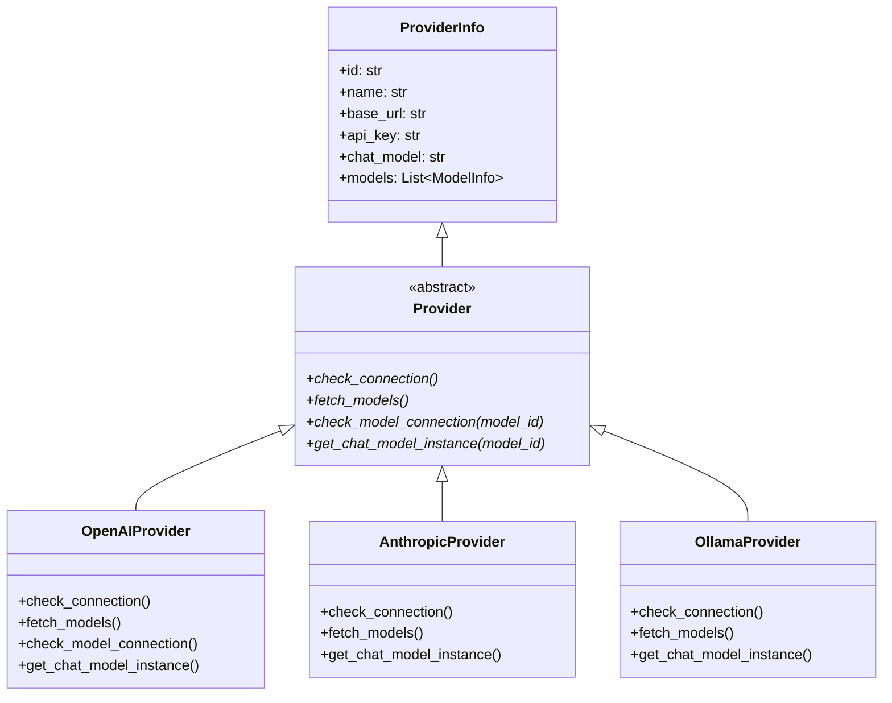

# 第六章 调用大语言模型

```
浏览器 -> [HTTP/FastAPI] -> Runner -> Agent -> Prompt -> ReAct -> [LLM调用] -> Tool -> 响应
                                                                        |
                                                                     你在这里
```

## 问题：Agent 的"思考"其实是把提示词发给 LLM。这个调用是怎么发生的？

上一章，我们看到 Agent 在 ReAct 循环里反复做一件事：把对话历史、系统提示词、工具定义打包在一起，交给大语言模型（LLM），等它"思考"出下一步该做什么。

但我们一直回避了一个关键问题：这个"交给大语言模型"到底是怎么实现的？

你在前端界面上选了一个模型——比如 OpenAI 的 GPT-5，或者本地 Ollama 跑的 Qwen。Agent 的代码在服务器上运行，它需要通过网络向 LLM 的 API 发送请求，拿到回复。可问题是，OpenAI 的 API 格式和 Anthropic 的不一样，Gemini 的又不一样，Ollama 虽然兼容 OpenAI 格式，但也有自己的特殊之处。

如果直接在 Agent 代码里写 `openai.ChatCompletion.create(...)`，那换成 Anthropic 怎么办？换成 Ollama 又怎么办？

QwenPaw 的做法是：建一层**抽象层**。Agent 不直接调用任何 SDK，而是通过一个统一的"Provider"接口来操作。每个 LLM 服务商都有自己的 Provider 实现，Agent 只管对着接口说话，不关心背后是哪家。

但这还没完。调用 LLM 可能会失败——网络断了、API 限速了、服务器崩了。所以还需要一个**重试机制**。而且每次调用花了多少 Token（字数），得**记录**下来，方便用户查看用量。

于是，一个简单的"把消息发给 LLM"的动作，在代码里就变成了一个三层包装：

```
Agent 看到的 -> RetryChatModel -> TokenRecordingModelWrapper -> Provider 创建的真实模型
```

这一章，我们就从里到外，把这三层拆开来看。

---

## 术语其实很简单

> **术语：Provider（提供者）**
> 想象你去旅行，要订酒店。你可以通过携程、Booking.com、或者直接打电话给酒店。虽然最终都是住在同一个房间，但预订的"渠道"不同。Provider 就是 LLM 的"预订渠道"——OpenAI 有自己的 Provider，Anthropic 有自己的，Ollama 也有自己的。Agent 只需要说"我要订一个房间"，不需要关心具体通过哪个渠道。

> **术语：流式响应（Streaming）**
> 你可能注意过，ChatGPT 回答问题时，文字是一个字一个字蹦出来的，不是等很久然后一大段文字一起出现。这就是"流式响应"——服务器每生成几个字，就立刻发给你，不用等全部写完。技术上，这通过一种叫 SSE（Server-Sent Events）的协议实现。QwenPaw 从 LLM 收到的也是流式数据，再一路转发到浏览器。

> **术语：Token（词元）**
> LLM 不是按"字"收费的，而是按 Token 收费。你可以把 Token 理解为"计费单位"。通常一个英文字母是几分之一个 Token，一个汉字大约是 1-2 个 Token。你发送给 LLM 的文字消耗"输入 Token"，LLM 回复的文字消耗"输出 Token"。记录 Token 用量对控制成本很重要。

---

## 探索：从配置到模型实例

### Provider：为什么不直接调用 SDK？

先看核心的抽象——Provider 类。



Provider 同时继承了 `ProviderInfo` 和 `ABC`（Python 的抽象基类）。`ProviderInfo` 存配置数据——API 地址、密钥、模型列表。`ABC` 强制子类实现四个抽象方法。这四个方法就是 Provider 的"合同"：

- `check_connection`：检查 API 能不能连上
- `fetch_models`：拉取这个服务商有哪些模型可用
- `check_model_connection`：检查某个具体模型能不能用
- `get_chat_model_instance`：创建一个可以实际调用的模型实例

看 `Provider` 类的骨架（`provider.py` 第 147 行）：

```python
class Provider(ProviderInfo, ABC):
    """Represents a provider instance with its configuration."""

    @abstractmethod
    async def check_connection(self, timeout=5) -> tuple[bool, str]:
        ...

    @abstractmethod
    async def fetch_models(self, timeout=5) -> List[ModelInfo]:
        ...

    @abstractmethod
    async def check_model_connection(self, model_id, timeout=5):
        ...

    @abstractmethod
    def get_chat_model_instance(self, model_id: str) -> ChatModelBase:
        ...
```

任何子类都必须实现这四个方法。这是典型的"策略模式"——定义接口，不同的服务商提供不同的实现。Agent 代码只需要拿到一个 `Provider` 对象，就能调用这些方法，完全不知道背后是 OpenAI 还是 Ollama。

### OpenAIProvider：最常用的实现

`OpenAIProvider` 是最重要的实现，因为不仅 OpenAI 自己用它，DashScope、DeepSeek、Kimi 等服务商也兼容 OpenAI 的 API 格式。

看它怎么创建模型实例（`openai_provider.py` 第 138 行）：

```python
def get_chat_model_instance(self, model_id: str) -> ChatModelBase:
    client_kwargs = {"base_url": self.base_url}
    # DashScope 需要特殊的请求头
    if self.base_url == DASHSCOPE_BASE_URL:
        client_kwargs["default_headers"] = {
            "x-dashscope-agentapp": json.dumps({...}),
        }
    return OpenAIChatModelCompat(
        model_name=model_id,
        stream=True,
        api_key=self.api_key,
        client_kwargs=client_kwargs,
        generate_kwargs=self.get_effective_generate_kwargs(model_id),
    )
```

注意两个细节。第一，`stream=True`——默认开启流式响应。LLM 的回复不是一个整块返回，而是像溪流一样一点点流过来。第二，`generate_kwargs`——每个模型可以有自己独特的生成参数（比如温度、最大长度），通过 `get_effective_generate_kwargs` 合并 Provider 级别和模型级别的配置。

创建出来的 `OpenAIChatModelCompat` 是 AgentScope 框架提供的 `OpenAIChatModel` 的增强版。它在流式解析的基础上增加了容错处理——有些模型的 tool_call 格式不太规范，这个兼容层会把格式错误的块修正过来，避免整个请求失败。

### ProviderManager：管理所有 Provider 的管家

系统里有很多 Provider——OpenAI、Anthropic、Gemini、Ollama、DeepSeek......QwenPaw 内置了二十多个。谁来管理它们？`ProviderManager`。

它是一个**单例**——整个程序只有一个实例。它维护三个字典：

```
builtin_providers:  内置服务商（OpenAI, Anthropic, Gemini ...）
custom_providers:   用户自己添加的服务商
plugin_providers:   插件注册的服务商
```

用户在前端界面切换模型时，调用的就是 `ProviderManager.activate_model()`（`provider_manager.py` 第 987 行）：

```python
async def activate_model(self, provider_id: str, model_id: str):
    provider = self.get_provider(provider_id)
    if not provider:
        raise ProviderError(...)
    if not provider.has_model(model_id):
        raise ModelNotFoundException(...)
    self.active_model = ModelSlotConfig(
        provider_id=provider_id,
        model=model_id,
    )
    self.save_active_model(self.active_model)
```

做了三件事：找到 Provider、确认模型存在、把选择保存到磁盘。下次启动时，程序会自动加载上次的配置。

`get_provider`（第 823 行）的查找顺序是：插件 Provider -> 内置 Provider -> 自定义 Provider。它会根据 `provider_id` 在三个字典里依次查找。

### model_factory：模型创建的总装车间

现在到了最关键的部分——`create_model_and_formatter()`（`model_factory.py` 第 930 行）。这个函数是整个 LLM 调用链的起点。Agent 每次需要调用 LLM 时，都会通过这个函数拿到一个"包装好的"模型实例。

它的逻辑可以用伪代码概括：

```
def create_model_and_formatter(agent_id=None):
    # 1. 确定要用的模型配置
    if agent_id 有专属模型配置:
        config = 加载 agent 专属配置
        provider = manager.get_provider(config.provider_id)
        model = provider.get_chat_model_instance(config.model)
    else:
        model = ProviderManager.get_active_chat_model()  # 全局默认

    # 2. 创建格式化器（负责把消息转成 API 需要的格式）
    formatter = 创建格式化器实例(model.__class__)

    # 3. 包装模型（这是关键的三层套娃）
    wrapped = TokenRecordingModelWrapper(provider_id, model)  # 记录 Token
    wrapped = RetryChatModel(wrapped, retry_config, rate_limit_config)  # 自动重试

    return wrapped, formatter
```

注意第 3 步——模型被套了两层包装。Agent 拿到的不是裸的 `OpenAIChatModelCompat`，而是 `RetryChatModel`。让我们分别看看这两层包装做了什么。

---

## 探索：Token 记录——每次调用花了多少钱

第一层包装是 `TokenRecordingModelWrapper`。它的任务很简单：每次调用 LLM 之后，把消耗的 Token 数记录下来。

看它的核心逻辑（`token_usage/model_wrapper.py` 第 61 行）：

```python
async def __call__(self, messages, tools=None, ...):
    result = await self._model(messages=messages, tools=tools, ...)

    if isinstance(result, AsyncGenerator):
        return self._wrap_stream(result)   # 流式响应：包装流
    await self._record_usage(result.usage) # 非流式：直接记录
    return result
```

对于流式响应，它需要特殊处理——流是一块一块过来的，Token 用量通常在最后一块里。所以它把流包装了一下，等流结束后再记录：

```python
async def _wrap_stream(self, stream):
    last_usage = None
    async for chunk in stream:
        if chunk.usage is not None:
            last_usage = chunk.usage  # 抓住最后出现的 usage
        yield chunk                   # 原样转发给上层
    await self._record_usage(last_usage)  # 流结束了，记录用量
```

这是一个典型的"透明代理"模式——它不改变数据本身，只是在数据流过时"偷看"一下 Token 用量，然后原封不动地传给上层。

---

## 探索：自动重试——失败了不用你操心

第二层包装是 `RetryChatModel`。LLM 的 API 调用不像本地函数调用那么稳定。网络可能断，服务器可能宕机，请求可能因为"太多人同时用"被限速（HTTP 429 错误）。`RetryChatModel` 的工作就是自动处理这些意外。

它判断哪些错误可以重试（`retry_chat_model.py` 第 124 行）：

```python
RETRYABLE_STATUS_CODES = {429, 500, 502, 503, 504, 529}

def _is_retryable(exc):
    # OpenAI 的限速、超时、连接错误
    # Anthropic 的限速、超时、连接错误
    # 4xx/5xx 中的特定状态码
    ...
```

429（请求太多）、500（服务器内部错误）、502（网关错误）、503（服务不可用）——这些都是"暂时性"错误，重试可能就好了。而 400（请求格式错误）这种，重试多少次都一样，所以不重试。

重试的等待时间不是固定的，而是**指数退避**——第一次等 1 秒，第二次等 2 秒，第三次等 4 秒......越来越长，避免短时间内大量重试让服务器更崩溃：

```python
def _compute_backoff(attempt, config):
    return min(config.backoff_cap,
               config.backoff_base * 2 ** (attempt - 1))
```

### 限速器：别一窝蜂地挤上去

除了单个请求的重试，QwenPaw 还有一个全局的**限速器**（`LLMRateLimiter`），防止并发请求太多把 API 打爆。

它的策略有三层：

```
                    ┌──────────────────────────┐
                    │     acquire() 被调用      │
                    └────────────┬─────────────┘
                                 │
                    ┌──────────── v ────────────┐
                    │ 1. 检查全局 429 冷却期    │
                    │    如果全局暂停中，先等待  │
                    └────────────┬──────────────┘
                                 │
                    ┌──────────── v ────────────┐
                    │ 2. 检查 QPM（每分钟请求数）│
                    │    滑动窗口，不能超过上限  │
                    └────────────┬──────────────┘
                                 │
                    ┌──────────── v ────────────┐
                    │ 3. 获取信号量（并发控制）  │
                    │    同时最多 N 个请求在飞   │
                    └────────────┬──────────────┘
                                 │
                                 v
                           执行 LLM 调用
```

这三层防护分别解决不同问题：

**全局冷却**（第 1 层）：如果某个请求收到了 429 错误，限速器会设置一个全局暂停时间。之后所有请求都要等暂停结束才能继续。每个请求还会加一点随机的"抖动"（jitter），避免大家同时醒来再次冲爆服务器。

**QPM 限制**（第 2 层）：用滑动窗口记录过去 60 秒内的请求数量，超过上限就排队等待。

**并发信号量**（第 3 层）：用 `asyncio.Semaphore` 控制同时在"飞行中"的请求数量。比如限制最多 3 个并发请求，第 4 个就得等前面的完成。

### 流式响应的槽位管理

流式响应有一个独特的并发控制挑战：如果信号量要等整个流结束才释放，那一个长回复就会长时间占用一个槽位，其他调用者只能干等。

`RetryChatModel` 的解决方案是**槽位提前释放**（`_consume_stream_with_slot()`，第 235 行）：流的首个 chunk 到达后立即释放信号量，不等整个流结束。如果流在首个 chunk 之前就失败了，`finally` 块会兜底释放。这确保了只有"等待服务器首字节"的时间才占用并发槽位，流式传输本身不阻塞其他调用者。

这个机制通过一个 `owns_semaphore` 布尔标志协调：`__call__` 方法返回流式生成器前把它设为 `False`（跳过 finally 块的释放），生成器内部的 `_consume_stream_with_slot` 接管释放责任。

### 重试与限流的配置参数

这些参数都可以通过 `AgentProfileConfig.running` 调整：

| 参数 | 默认值 | 说明 |
|------|--------|------|
| `llm_retry_enabled` | True | 是否启用自动重试 |
| `llm_max_retries` | 3 | 最大重试次数 |
| `llm_backoff_base` | 1.0s | 初始退避时间 |
| `llm_backoff_cap` | 10.0s | 最大退避时间 |
| `llm_max_concurrent` | 10 | 最大并发调用数 |
| `llm_max_qpm` | 600 | 每分钟最大请求数 |
| `llm_rate_limit_pause` | 5.0s | 429 触发的全局暂停时间 |
| `llm_rate_limit_jitter` | 1.0s | 随机抖动范围 |
| `llm_acquire_timeout` | 300s | 等待信号量槽位的超时时间 |

429 时所有并发调用者暂停相同时间（加上各自的随机抖动），避免同时重试造成新一轮限流——这是经典的"雷鸣群"（thundering herd）问题防护。

---

## 探索：流式响应——文字是怎么一点点流过来的

从 LLM 到浏览器，数据的流动路径是这样的：

```
LLM API (SSE 流)
    │
    v
OpenAIChatModelCompat (解析 SSE -> ChatResponse 对象)
    │
    v
TokenRecordingModelWrapper (转发流，最后记录 Token)
    │
    v
RetryChatModel (如果流出错，重新发起请求)
    │
    v
Agent (消费流，处理 tool_use 或文本)
    │
    v
Runner (转成 SSE 发给浏览器)
    │
    v
浏览器 (一个字一个字显示)
```

SSE（Server-Sent Events）是一种基于 HTTP 的单向推送协议。服务器发回的不是一整块 JSON，而是一系列 `data: {...}` 行，每一行是一个"块"。对于流式 Chat API，每个块包含一小段文字：

```
data: {"choices": [{"delta": {"content": "你"}}]}
data: {"choices": [{"delta": {"content": "好"}}]}
data: {"choices": [{"delta": {"content": "！"}}]}
data: [DONE]
```

`OpenAIChatModelCompat` 把这些原始块解析成 `ChatResponse` 对象，然后一路传上去。每一层都可以检查这些对象，但不修改内容（除非是为了修正格式错误）。

对于流式响应的重试，有一个特别之处：如果流已经在传输中途失败了（比如传了 100 个字后连接断了），RetryChatModel 会**从头开始**重新发起整个请求。因为 LLM 是有状态的——你不能告诉它"请从第 100 个字继续"，只能把完整的对话历史重新发一遍。

---

## 探索：完整的 API 调用时序

把上面所有内容串起来，一次完整的 LLM 调用时序如下：

```
Agent                 RetryChatModel        TokenRecorder        Provider (OpenAI)
  │                        │                      │                     │
  │  create_model_and_formatter()                  │                     │
  │  ───────────────────────────────────────────────────────────────────>
  │                        │                      │                     │
  │  <──── 返回 RetryChatModel(model, formatter) ──                     │
  │                        │                      │                     │
  │  model(messages)       │                      │                     │
  │  ──────────────────>   │                      │                     │
  │                        │                      │                     │
  │                        │  acquire() (限速器)   │                     │
  │                        │  ──[获取信号量]──>    │                     │
  │                        │                      │                     │
  │                        │  inner(messages)      │                     │
  │                        │  ─────────────────>   │                     │
  │                        │                      │                     │
  │                        │                      │  model(messages)    │
  │                        │                      │  ──────────────────>
  │                        │                      │                     │
  │                        │                      │                     │  HTTP POST /chat/completions
  │                        │                      │                     │  ──────────────────>
  │                        │                      │                     │
  │                        │                      │                     │  <── SSE 流 ──
  │                        │                      │                     │
  │                        │                      │  <── AsyncGenerator ─
  │                        │                      │                     │
  │                        │                      │  记录 Token         │
  │                        │                      │  ──[写入统计]──>    │
  │                        │                      │                     │
  │                        │  <── AsyncGenerator ─ │                     │
  │                        │                      │                     │
  │                        │  release() (限速器)   │                     │
  │                        │  ──[释放信号量]──>    │                     │
  │                        │                      │                     │
  │  <── AsyncGenerator ── │                      │                     │
  │                        │                      │                     │
  │  async for chunk in generator:                │                     │
  │    处理每个文字块 / tool_use                   │                     │
```

调用是嵌套的：Agent 调 RetryChatModel，RetryChatModel 调 TokenRecorder，TokenRecorder 调 Provider 创建的真实模型。每一层只关注自己的职责，对上下层透明。

---

## 实验：切换 Provider，看看日志有什么不同

我们可以做一个有趣的实验：先用 OpenAI 的 Provider 调用 GPT-5，然后切换到本地的 Ollama Provider，观察日志变化。

### 使用 OpenAI

在前端界面选择 Provider: OpenAI，Model: GPT-5，发送一条消息。后台日志会显示：

```
INFO  Provider: OpenAI
INFO  Model: gpt-5
INFO  API: POST https://api.openai.com/v1/chat/completions
INFO  Token usage: prompt=245, completion=128, total=373
```

### 切换到 Ollama

选择 Provider: Ollama，Model: qwen3:8b（一个本地模型），发送同样的消息：

```
INFO  Provider: Ollama
INFO  Model: qwen3:8b
INFO  API: POST http://localhost:11434/v1/chat/completions
INFO  Token usage: prompt=245, completion=156, total=401
```

关键区别：

1. **API 地址**变了：从 OpenAI 的云端地址变成了本地的 `localhost:11434`
2. **Token 用量**不同：两个模型的分词方式不同，消耗的 Token 数不一样
3. **不需要 API Key**：Ollama 是本地服务，不需要认证
4. **延迟**不同：本地模型没有网络延迟，但推理速度取决于你的显卡

而 Agent 的代码呢？**一行都没改**。因为它只对着 `Provider` 接口说话，切换 Provider 的事情由 `ProviderManager` 和 `model_factory` 处理了。

---

## 工程权衡：抽象的代价与收益

### 为什么要抽象层？

最大的好处是**可扩展性**。QwenPaw 支持二十多个 LLM 服务商。如果没有 Provider 抽象层，每增加一个服务商，就要在 Agent 代码里加一堆 if-else。有了抽象层，只需要写一个新的 Provider 子类，注册到 ProviderManager，就完成了。

另一个好处是**可测试性**。写单元测试时，可以创建一个 Mock Provider，返回预设的回答，不需要真的去调 API。

### 为什么要重试包装？

LLM API 的稳定性远不如本地函数。即使是大厂商，偶尔也会返回 500 错误。如果不自动重试，用户体验会很差——一个本来好好的对话，因为一次网络波动就失败了。

重试包装放在最外层是有道理的。如果流式响应中途失败了，需要重新获取信号量、重新发起请求、重新记录 Token。只有最外层才能协调这些操作。

### 包装的代价是什么？

每一层包装都增加了一点点调用开销——多一层函数调用、多一次异步 await。但这个开销比起网络 I/O（一次 API 调用通常需要几百毫秒到几秒），几乎可以忽略不计。

真正的代价是**代码复杂度**。三层嵌套的包装让调试变得困难——如果你想在 Token 记录层打个断点，得先搞清楚你手里的 `model` 对象到底是被哪一层包装了。不过，这种复杂度换来的稳定性和可维护性，在工程上是值得的。

### 为什么用全局限速器而不是每 Provider 一个？

QwenPaw 的设计是"同一时刻只激活一个模型"。既然只有一个模型在工作，限速就应该是全局的。如果用户频繁切换模型然后又切回来，全局限速器能防止短时间内发送过多请求。

---

## 动手：切换 Provider，观察日志差异

这个实验不需要写代码，只需要观察。

**步骤：**

1. 打开 QwenPaw 的前端界面
2. 在设置中选择一个 Provider（比如 OpenAI）和一个模型
3. 发送一条消息："今天天气怎么样？"
4. 打开后台日志（终端或日志文件），找到与这次调用相关的日志行
5. 切换到另一个 Provider（比如 Ollama），选择一个模型
6. 发送同样的消息
7. 对比两次的日志

**观察要点：**

- 日志中的 Provider ID 和 Model 名称是否正确切换
- API 地址（base_url）是否变化
- Token 用量是否不同（不同的模型对同样的输入，消耗的 Token 可能不同）
- 如果使用本地模型（Ollama），观察响应延迟是否更低
- 如果反复快速发送消息，观察是否触发限速器的日志（`LLM rate limiter` 相关的 warning）

如果想看更底层的日志，可以设置环境变量 `OPENAI_LOG=debug`，这样 OpenAI SDK 会打印每一个 HTTP 请求和响应的详细内容。

---

## 小结

这一章我们跟踪了一个 LLM API 调用从配置到执行的完整路径：

1. **Provider 抽象层**：用统一接口屏蔽不同 LLM 服务商的差异
2. **model_factory**：根据配置找到 Provider，创建模型实例，套上包装
3. **Token 记录层**：透明地记录每次调用的 Token 消耗
4. **重试层**：自动处理暂时性错误，指数退避，限制并发
5. **限速器**：全局控制请求频率，防止打爆 API

Agent 拿到的模型实例经过了这三层包装，对外仍然表现为一个普通的 `ChatModelBase`——传入消息，返回回答。但在内部，每一次调用都经过了限速检查、Token 记录、错误重试。Agent 代码不需要关心这些细节，但用户享受到的是更稳定、更可观测的服务。

下一章，我们将进入 ReAct 循环中最激动人心的部分——**工具调用**。当 LLM 决定"我需要读一个文件"或"我需要搜索网页"时，这个请求是如何变成一次真正的函数调用的？我们即将看到。
