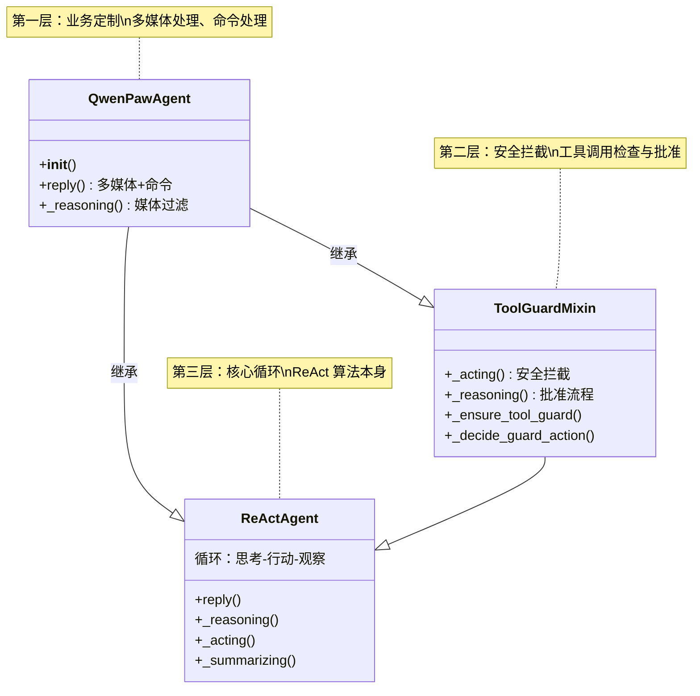

# 第十章 Agent 的身世——Mixin 与继承

```
浏览器 -> [HTTP/FastAPI] -> Runner -> Agent -> Prompt -> [ReAct循环] -> LLM -> Tool -> 响应
                                            |
                                         你在这里
```

## 问题：为什么 QwenPawAgent 中间插了一个 ToolGuardMixin？

打开 `src/qwenpaw/agents/react_agent.py`，第 76 行，你会看到这样的类定义：

```python
class QwenPawAgent(ToolGuardMixin, ReActAgent):
```

问题来了：如果 QwenPawAgent 想扩展 ReActAgent，直接继承不就行了？`ToolGuardMixin` 夹在中间干什么？为什么它不是一个普通的父类？Mixin 到底是什么？Python 又是怎么决定调用哪个方法的？

这些问题的答案，涉及 Python 面向对象编程中三个互相纠缠的概念：**多继承**、**MRO** 和 **Mixin 模式**。理解了它们，你不仅能看懂 QwenPawAgent 的继承链，还能理解一整套在 Python 项目中非常常见的设计思路。

---

## 术语其实很简单

> **术语：MRO（Method Resolution Order，方法解析顺序）**
> 当一个类继承了多个父类，并且多个父类都定义了同名方法时，Python 需要一个确定的顺序来决定"先找谁、再找谁"。这个顺序就是 MRO。Python 使用一种叫 C3 线性化的算法来计算 MRO——你不需要知道算法细节，只需要知道它的结果是一条确定的、线性的类列表。可以用 `类名.__mro__` 查看。

> **术语：Mixin（混入）**
> Mixin 是一种特殊的类，它不打算独立使用，而是专门设计成"混入"其他类的继承列表里，为它们添加某个具体功能。Mixin 通常只包含方法，不定义 `__init__`。在 Python 里，Mixin 和普通类在语法上没有区别——区别在于设计意图。

> **术语：开放封闭原则（Open-Closed Principle）**
> "对扩展开放，对修改封闭。"意思是：你想给一个系统加新功能时，应该通过添加新代码来实现，而不是修改已有的、正在正常工作的代码。Mixin 正是实现这条原则的一种手段——你不需要改 ReActAgent 的代码，就能给它加上安全检查功能。

---

## 探索：继承链的每一层都在做什么

### 继承关系全貌

QwenPawAgent 的继承关系用一张图来看最清楚：



三层，三个职责：

- **QwenPawAgent**（第一层）：业务定制。处理多媒体消息、系统命令、自动续行等 QwenPaw 特有的功能
- **ToolGuardMixin**（第二层）：安全拦截。检查每个工具调用是否安全，不安全的拦截下来，需要批准的暂停循环等待用户
- **ReActAgent**（第三层）：核心算法。ReAct 循环的基本运转——思考、行动、观察。这是 agentscope 库提供的基类

### MRO 顺序——Python 怎么找到正确的方法

当你在 QwenPawAgent 的实例上调用 `self._acting(tool_call)` 时，Python 按照 MRO 的顺序逐个类查找 `_acting` 这个方法。

用 Python 自带的工具可以直接看到 MRO：

```python
# 在 Python 里执行
QwenPawAgent.__mro__
```

输出大约是这样的（简化版）：

```
QwenPawAgent
 -> ToolGuardMixin
 -> ReActAgent
 -> Agent          # agentscope 更上层的基类
 -> object
```

这意味着，当你调用 `self._acting(tool_call)` 时：

1. Python 先在 `QwenPawAgent` 里找——QwenPawAgent 没有定义 `_acting`，跳过
2. 然后在 `ToolGuardMixin` 里找——找到了！调用 `ToolGuardMixin._acting()`
3. `ToolGuardMixin._acting()` 做完安全检查后，调用 `super()._acting(tool_call)`
4. `super()` 在这里意味着"MRO 链上的下一个"，也就是 `ReActAgent`
5. 最终执行 `ReActAgent._acting()`——真正地执行工具

这就是为什么第五章里提到的"MRO 拦截链"能工作：`ToolGuardMixin` 像一个安检门，所有工具调用都要先过它这一关，通过了才放行到基类。

### super() 不是"调用父类"，是"传递接力棒"

很多人学 Python 时形成的印象是 `super()` = "调用父类的方法"。在单继承的时候这个理解碰巧是对的，但在多继承的场景下，它不够准确。

更精确的理解是：**`super()` 意味着"把调用传递给 MRO 链上的下一个类"**。

打个比方。想象一条接力赛道，有三位选手：QwenPawAgent 跑第一棒，ToolGuardMixin 跑第二棒，ReActAgent 跑第三棒。当 `reply()` 方法调用了 `self._reasoning()` 时：

```
接力赛开始！

QwenPawAgent._reasoning()
  -> 处理多媒体内容
  -> 举起接力棒：super()._reasoning()
     |
     v
ToolGuardMixin._reasoning()
  -> 检查是否在等待用户批准
  -> 举起接力棒：super()._reasoning()
     |
     v
ReActAgent._reasoning()
  -> 格式化消息，调用大模型
  -> 返回结果
```

每一棒拿到接力棒后，可以选择：
- **"加点料再传"**——先做自己的事情，再 `super()` 传下去（ToolGuardMixin 就是这么做的）
- **"截住不传"**——自己处理完直接返回，不调用 `super()`（比如 `ToolGuardMixin` 在工具被拒绝时不传给基类）
- **"直接传"**——什么都不做，直接 `super()` 传下去

关键点在于：**每一棒不需要知道其他棒在做什么**。`ReActAgent` 不知道 `ToolGuardMixin` 的存在，`ToolGuardMixin` 也不知道 `QwenPawAgent` 会不会在前面加一层。它们只负责自己的事情，然后通过 `super()` 传递控制权。

### _reasoning() 的三层接力

让我们用一个更完整的例子来跟踪 `self._reasoning()` 的实际调用路径。这个方法在三层里各有一份：

**第一棒：QwenPawAgent._reasoning()**（第 796 行）

```python
async def _reasoning(self, tool_choice=None) -> Msg:
    # 如果模型不支持多媒体，先清理媒体内容
    if not get_active_model_supports_multimodal():
        self._proactive_strip_media_blocks()

    # 传给下一棒
    try:
        msg = await super()._reasoning(tool_choice=tool_choice)
    except Exception as e:
        # 如果大模型报了媒体相关的错误，清理后重试
        ...
    return msg
```

这一层的职责是多媒体适配。它不关心安全检查，也不关心怎么调用大模型——只关心"发给大模型的内容里有没有不该出现的图片或视频"。

**第二棒：ToolGuardMixin._reasoning()**（第 662 行）

```python
async def _reasoning(self, tool_choice=None) -> Msg:
    # 检查是否有需要重放的工具调用
    replay_msg = await self._reason_about_replay_done()
    if replay_msg is not None:
        return replay_msg

    # 检查是否有强制注入的工具调用
    forced_tool_call = self._pop_forced_tool_call()
    if forced_tool_call is not None:
        return await self._emit_forced_tool_use(forced_tool_call)

    # 检查上一个工具是否被拒绝了
    if self._last_tool_response_is_denied():
        return await self._emit_waiting_for_approval()

    # 正常情况，传给下一棒
    return await super()._reasoning(tool_choice=tool_choice)
```

这一层的职责是"批准流程控制"。当工具被守卫拦截、等待用户批准时，`_reasoning()` 不能直接调大模型——需要先处理完批准相关的状态。只有在一切正常时，才传递给基类。

**第三棒：ReActAgent._reasoning()**

这一层是 agentscope 库提供的基类实现。它做的是最核心的事：把 memory 里的消息格式化，调用大模型，拿到回复。

三层，三个关注点，互不干扰。这就是 MRO 链的威力。

### _acting() 的两层接力

`_acting()` 的接力路径稍短一些——QwenPawAgent 没有覆盖这个方法，所以只有两层：

```
self._acting(tool_call)
  |
  v
ToolGuardMixin._acting(tool_call)          # 第二棒
  -> _ensure_tool_guard()                  # 延迟初始化守卫组件
  -> _decide_guard_action(tool_call)       # 安全决策
  -> 根据决策分支：
     需要拦截 -> _execute_guard_action()   # 拒绝/批准流程
     正常放行 -> super()._acting(tool_call) # 传给下一棒
  |
  v
ReActAgent._acting(tool_call)              # 第三棒
  -> toolkit.call_tool_function(tool_call) # 真正执行工具
```

注意这里有一个有趣的细节：`ToolGuardMixin._acting()` 在第 312 行调用了 `self._ensure_tool_guard()`。这是一种叫"延迟初始化"的模式。

### 延迟初始化：_ensure_tool_guard()

打开 `tool_guard_mixin.py` 第 80-92 行：

```python
def _init_tool_guard(self) -> None:
    """Lazy-init tool-guard components (called once)."""
    from qwenpaw.security.tool_guard.engine import get_guard_engine
    from qwenpaw.app.approvals import get_approval_service

    self._tool_guard_engine = get_guard_engine()
    self._tool_guard_approval_service = get_approval_service()
    self._tool_guard_pending_info: dict | None = None
    self._tool_guard_lock = asyncio.Lock()

def _ensure_tool_guard(self) -> None:
    if not hasattr(self, "_tool_guard_engine"):
        self._init_tool_guard()
```

为什么不直接在 `__init__` 里初始化这些组件？因为 `ToolGuardMixin` **没有 `__init__` 方法**。

这是 Mixin 的一个常见约定：Mixin 不参与构造过程。它的组件在第一次被需要时才初始化——`_ensure_tool_guard()` 先检查属性是否存在，不存在才创建。这样做的好处是：

1. 不需要在 QwenPawAgent 的 `__init__` 里显式调用 Mixin 的初始化
2. 如果某个场景下安全检查功能从未触发，相关组件就永远不会被创建——省资源
3. 避免了多继承场景下 `__init__` 调用链的复杂性

### 一张图看清 Mixin 的"注入"能力

```
没有 Mixin 的世界：                        有 Mixin 的世界：

  ReActAgent                              ToolGuardMixin
  +-----------+                           +------------------+
  | _acting() |                           | _acting()        |
  |   执行工具 |                           |   先做安全检查    |
  +-----^-----+                           |   然后super()放行 |
        |                                  +--------^---------+
        |                                           |
  QwenPawAgent                                      |
  +-----------------------+                         |
  | 继承 ReActAgent       |                         |
  | _acting() = 基类的    |                         |
  | (没法加安全检查)      |                         |
  +-----------------------+                         |
                                                    |
  想加安全检查？只能改 ReActAgent 的代码    QwenPawAgent
  或者把 _acting() 整个重写一遍            +-------------------------------+
                                           | 继承 ToolGuardMixin, ReActAgent|
                                           | _acting() 按 MRO 找到 Mixin   |
                                           | 安全检查自动生效               |
                                           +-------------------------------+

  结果：修改了基类代码（违反开放封闭原则）   结果：一行都没改 ReActAgent
```

左边是传统继承的困境：如果你想给基类加功能，要么改基类本身，要么在子类里把方法整个重写。右边是 Mixin 的解法：只需要把 Mixin 插进继承列表，功能就自动注入了。

---

## 实验：亲手体验 Mixin 的机制

与其看图表，不如写几行代码，自己感受 MRO 和 Mixin 是怎么工作的。

### 实验一：查看 MRO

打开 Python 终端，在 QwenPaw 项目目录下执行：

```python
from qwenpaw.agents.react_agent import QwenPawAgent

for cls in QwenPawAgent.__mro__[:5]:
    print(cls.__name__)
```

你应该看到：

```
QwenPawAgent
ToolGuardMixin
ReActAgent
...
```

这个顺序就是 Python 查找方法时的优先级：从上到下，先找到的就调用。

### 实验二：观察 super() 的接力

不用 QwenPaw 的代码，我们用几个简单的类来模拟同样的结构：

```python
class Base:
    def work(self):
        print("Base: 执行核心工作")
        return "done"

class SecurityMixin:
    def work(self):
        print("SecurityMixin: 安全检查... 通过")
        result = super().work()
        print("SecurityMixin: 安全检查完毕")
        return result

class MyApp(SecurityMixin, Base):
    def work(self):
        print("MyApp: 业务处理")
        result = super().work()
        print("MyApp: 业务处理完毕")
        return result
```

现在调用 `MyApp().work()`：

```python
MyApp().work()
```

输出是：

```
MyApp: 业务处理
SecurityMixin: 安全检查... 通过
Base: 执行核心工作
SecurityMixin: 安全检查完毕
MyApp: 业务处理完毕
```

注意看输出顺序——这是一个"洋葱"结构：最外层先开始，往里传，最里层执行完，再一层层返回来。这正是 QwenPawAgent 里 `_reasoning()` 和 `_acting()` 的工作方式。

### 实验三：拦截——Mixin 说"不"

把 SecurityMixin 改一下，让它在某些情况下拦截请求，不传给基类：

```python
class StrictMixin:
    def work(self):
        print("StrictMixin: 检查权限... 拒绝!")
        return "denied"     # 没有 super()，接力到此为止

class MyApp2(StrictMixin, Base):
    pass

MyApp2().work()
```

输出：

```
StrictMixin: 检查权限... 拒绝!
```

`Base.work()` 完全没有被调用。这就像 `ToolGuardMixin` 在工具被拒绝时的行为——不放行，基类不知道发生过什么。

---

## 工程权衡：Mixin vs 继承 vs 组合

Mixin 不是唯一的选择。让我们对比三种给 Agent 添加安全检查的方式，看看各自的优缺点。

### 方案一：直接继承（在子类里重写）

```python
class QwenPawAgent(ReActAgent):
    async def _acting(self, tool_call):
        # 安全检查 + 工具执行 混在一起
        if self._is_dangerous(tool_call):
            return self._deny(tool_call)
        return await super()._acting(tool_call)
```

**优点**：简单直观，所有逻辑在一个类里。

**缺点**：`_acting()` 变成了一个越来越长的方法。安全检查、多媒体处理、工具执行全混在一起。如果要给另一个 Agent 也加同样的安全检查，就得把这段代码复制一遍——违反了 DRY 原则。

### 方案二：Mixin（QwenPaw 的选择）

```python
class ToolGuardMixin:
    async def _acting(self, tool_call):
        # 安全检查在这里
        if action_needed:
            return self._handle_guard(action)
        return await super()._acting(tool_call)

class QwenPawAgent(ToolGuardMixin, ReActAgent):
    # 安全检查自动生效
    ...
```

**优点**：
- 关注点分离：安全逻辑独立在 ToolGuardMixin 里
- 可插拔：不需要安全检查的 Agent 直接不混入 Mixin 就行
- 复用：其他 Agent 也可以混入同一个 Mixin
- 不修改基类：ReActAgent 的代码一行都不用改

**缺点**：
- 调用链不直观：读代码时需要理解 MRO 才知道 `super()` 跳到哪里
- 调试困难：调用栈比直接继承更深
- 隐式依赖：Mixin 假设自己会和 ReActAgent 一起使用，但语法上并没有强制这个约束

### 方案三：组合（把安全检查做成独立对象）

```python
class ToolGuard:
    def __init__(self, agent):
        self.agent = agent

    async def checked_acting(self, tool_call):
        if self._is_dangerous(tool_call):
            return self._deny(tool_call)
        return await self.agent._acting(tool_call)

class QwenPawAgent(ReActAgent):
    def __init__(self, ...):
        self.guard = ToolGuard(self)

    async def _acting(self, tool_call):
        return await self.guard.checked_acting(tool_call)
```

**优点**：
- 最灵活：运行时可以替换 guard 对象
- 最清晰：没有隐式的 super() 链，每个调用都显式地指向明确的对象
- 最容易测试：可以独立地测试 ToolGuard 类

**缺点**：
- 代码量大：每个方法都要写一层转发
- 改动面广：如果 ReActAgent 新增了方法，QwenPawAgent 需要手动添加转发代码
- 不够"Pythonic"：Python 社区更习惯用 Mixin 来实现这种横切关注点

### QwenPaw 为什么选 Mixin？

QwenPaw 选择 Mixin 的核心理由有两个：

**第一，基类不可修改。** ReActAgent 是 agentscope 库的一部分。QwenPaw 不能去改它的代码——改了就没法跟进上游更新了。Mixin 让 QwenPaw 在不碰基类的前提下，给 `_acting()` 和 `_reasoning()` 加上新行为。

**第二，关注点天然正交。** 安全检查和 ReAct 循环算法是完全独立的两件事。安全检查不关心循环怎么转，循环也不关心工具安不安全。Mixin 让这两个关注点各居一层，通过 `super()` 串联，不会纠缠在一起。

如果用继承，安全检查和业务逻辑会长在同一个方法里，越来越难分开。如果用组合，每加一个 ReActAgent 的新方法都要手动转发，维护成本高。Mixin 在这两个极端之间找到了平衡点。

### 当 Mixin 变多的风险

Mixin 有一个隐含的风险：当 Mixin 超过两个时，MRO 链会变得难以追踪。

```python
# 假设未来这样发展
class QwenPawAgent(
    RateLimitMixin,
    AuditLogMixin,
    ToolGuardMixin,
    ReActAgent,
):
    ...
```

四个 Mixin 意味着 `_acting()` 的调用链变成了五层。每一层都可能拦截、修改或放行。调试的时候，你需要在脑子里跟踪一条很长的调用链，这对人类来说不轻松。

好在 QwenPaw 目前只有一个 Mixin——ToolGuardMixin。如果你未来要给项目加新的 Mixin，建议在类文档里像 QwenPawAgent 的 docstring 那样明确标注 MRO 顺序和每一层的职责，让后来者不需要自己推算。

---

## 动手：写一个简单的日志 Mixin（验证级）

这个练习让你亲手写一个 Mixin，体验它如何给一个类添加功能而不修改类的代码。

### 目标

写一个 `LoggingMixin`，让任何带有 `work()` 方法的类自动获得日志输出：在调用 `work()` 前后各打印一条消息。

### 步骤一：准备基类

先写一个简单的基类，它有一个 `work()` 方法：

```python
class Worker:
    def work(self, task: str) -> str:
        """执行一项任务。"""
        print(f"  正在处理: {task}")
        return f"{task} 完成"
```

### 步骤二：写 LoggingMixin

Mixin 要做的事情很简单：在 `work()` 调用前后打印日志，然后通过 `super()` 传递给下一个类：

```python
import time

class LoggingMixin:
    """给 work() 方法加上执行日志。"""

    def work(self, task: str) -> str:
        name = type(self).__name__
        print(f"[LOG] {name}.work() 开始: {task}")
        start = time.time()
        result = super().work(task)          # 传给 MRO 链上的下一个
        elapsed = time.time() - start
        print(f"[LOG] {name}.work() 完成, 耗时 {elapsed:.3f}s")
        return result
```

注意：`LoggingMixin` 不知道 `Worker` 的存在。它只关心"在 `work()` 前后加日志"这一件事。

### 步骤三：组合使用

```python
class MonitoredWorker(LoggingMixin, Worker):
    """Worker + 自动日志。"""
    pass

# 测试
w = MonitoredWorker()
result = w.work("翻译文档")
print(f"返回值: {result}")
```

输出：

```
[LOG] MonitoredWorker.work() 开始: 翻译文档
  正在处理: 翻译文档
[LOG] MonitoredWorker.work() 完成, 耗时 0.000s
返回值: 翻译文档 完成
```

### 步骤四：验证 MRO

```python
for cls in MonitoredWorker.__mro__:
    print(cls.__name__)
```

输出：

```
MonitoredWorker
LoggingMixin
Worker
object
```

调用 `work()` 时，Python 按 MRO 顺序查找：MonitoredWorker 没有 `work()`，找 LoggingMixin——找到了。LoggingMixin 的 `work()` 加上日志后，`super().work()` 传给 Worker——Worker 执行真正的任务。

### 步骤五：不动 Worker 也能加更多 Mixin

现在再写一个 Mixin，给 `work()` 加上执行时间上限检查：

```python
class TimeoutMixin:
    """如果 work() 执行超过 1 秒，打印警告。"""

    def work(self, task: str) -> str:
        start = time.time()
        result = super().work(task)
        elapsed = time.time() - start
        if elapsed > 1.0:
            print(f"[WARN] {task} 耗时 {elapsed:.1f}s, 超过 1 秒!")
        return result

class SmartWorker(TimeoutMixin, LoggingMixin, Worker):
    pass

SmartWorker().work("分析数据")
```

Worker 和 LoggingMixin 的代码一行都没改，TimeoutMixin 就自动插进了调用链。这就是 Mixin 的威力——**对扩展开放，对修改封闭**。

---

## 小结

这一章我们从一行类定义出发，深入理解了 QwenPawAgent 的身世。

**QwenPawAgent 的继承链有三层**：QwenPawAgent 负责业务定制（多媒体处理、命令处理），ToolGuardMixin 负责安全拦截（工具调用的检查与批准），ReActAgent 负责核心算法（ReAct 循环的运转）。每一层通过 `super()` 把控制权传递给下一层，形成了一条接力链。

**MRO 是这条接力链的规则**。Python 按照 C3 线性化算法计算出一个确定的方法查找顺序。`super()` 不是"调用父类"，而是"传递给 MRO 链上的下一个类"。每一层可以加料再传、截住不传、或者直接传。

**Mixin 是实现开放封闭原则的手段**。QwenPaw 不能修改 agentscope 的 ReActAgent 代码，又需要给 `_acting()` 和 `_reasoning()` 加上新行为。Mixin 让它在不碰基类的前提下做到了这一点——安全检查独立成类，可插拔，可复用。

**但 Mixin 有代价**。调用链不直观，调试时需要跟踪更深的栈，Mixin 多了以后 MRO 链会变得复杂。QwenPaw 目前只用了一个 Mixin，复杂度还在可控范围内。

到这里，你已经理解了 QwenPaw 最核心的架构决策之一。下一章，我们将把目光从 Agent 的"身世"转向它的"大脑"——看看 QwenPaw 是如何用策略模式来支持 OpenAI、Anthropic、Ollama 等多种大模型服务商的。
