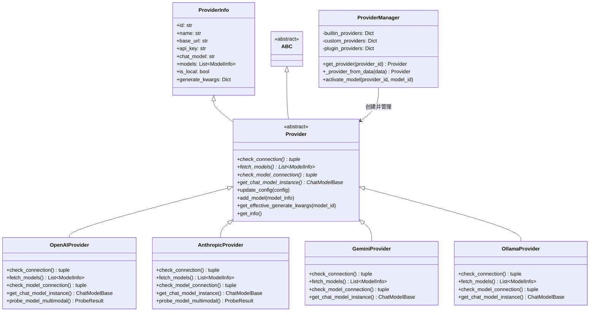

# 第十一章 Provider 的棋局——策略模式与抽象层

```
                         QwenPaw 架构全景
  ┌─────────────────────────────────────────────────────┐
  │  浏览器 -> HTTP -> Runner -> Agent -> Prompt -> ReAct│
  │                                          │          │
  │                                     [LLM 调用]     │
  │                                          │          │
  │                              ┌───────────────────┐  │
  │                              │   Provider 体系    │  │
  │                              │                   │  │
  │                              │  Provider (ABC)   │  │
  │                              │   ├── OpenAI      │  │
  │                              │   ├── Anthropic   │  │
  │                              │   ├── Gemini      │  │
  │                              │   ├── Ollama      │  │
  │                              │   └── ...         │  │
  │                              │                   │  │
  │                              │ ProviderManager   │  │
  │                              └───────────────────┘  │
  │                                       ↑             │
  │                                   你在这里          │
  └─────────────────────────────────────────────────────┘
```

第六章我们看到了 Agent 调用 LLM 的三层包装：RetryChatModel、TokenRecordingModelWrapper，以及最底层由 Provider 创建的真实模型实例。但那时候我们只是匆匆一瞥 Provider 的存在，没有展开。

现在是时候深入 Provider 体系本身了。

这一章属于第二卷"设计模式篇"。我们不再追踪请求的流动，而是换一个角度：看看 QwenPaw 是如何用面向对象的设计模式，把"调用不同 LLM 服务商"这件事变成一盘可扩展的棋局。

## 问题：为什么 Agent 不直接调用 OpenAI 的 SDK？

假设你正在写一个 AI 聊天应用。最直接的做法是这样的：

```python
from openai import OpenAI
client = OpenAI(api_key="sk-...")
response = client.chat.completions.create(
    model="gpt-5", messages=[...]
)
```

这段代码能跑。但仔细想想，它有三个致命问题：

第一，**换模型要改代码**。如果用户想从 GPT-5 切换到 Claude，你得把整个 `openai` 库的调用替换成 `anthropic` 库的调用，API 格式完全不同。

第二，**加新服务商要改代码**。如果明天出了一个新的大模型公司，你要在 Agent 的核心逻辑里到处插入 `if provider == "xxx":` 的判断。

第三，**没法测试**。你想测试 Agent 的逻辑，就必须真的调用 OpenAI 的 API，花真金白银。

QwenPaw 支持二十多个 LLM 服务商——OpenAI、Anthropic、Gemini、Ollama、DeepSeek、Kimi、MiniMax、智谱、硅基流动......如果每加一个服务商都要改 Agent 的核心代码，项目早就乱成一锅粥了。

那 QwenPaw 是怎么做的？答案是：在 Agent 和 LLM SDK 之间，放一层**抽象层**。这层抽象的学名叫做**策略模式**。

---

## 术语其实很简单

> **术语：策略模式（Strategy Pattern）**
> 想象你要从北京去上海。你可以坐飞机、坐高铁、或者自己开车。每种交通方式都是一个"策略"。你的行程计划不需要关心具体坐什么，只需要说"我要出发"——具体走哪条路线，取决于你选了哪个策略。在代码里，策略模式就是把"做什么"和"怎么做"分开：定义一个统一接口（"出发"），然后让每种具体方式各自实现。

> **术语：抽象基类（Abstract Base Class，简称 ABC）**
> 想象一份合同模板。合同上写着"乙方必须完成以下工作：A、B、C"，但没有写具体怎么做。每个签合同的乙方可以有自己的完成方式，但必须把 A、B、C 都做了——少一项就算违约。在 Python 里，`ABC`（Abstract Base Class）就是这样一份"合同模板"。用 `@abstractmethod` 标记的方法就是合同上要求必须完成的工作。如果一个类继承了 ABC 但没有实现所有抽象方法，Python 会直接报错，就像"合同没签完不能开工"。

---

## 探索：Provider 体系的三层结构

### 第一层：Provider ABC——策略的"合同模板"

打开 `src/qwenpaw/providers/provider.py`，翻到第 147 行，你会看到这个类的声明：

```python
class Provider(ProviderInfo, ABC):
```

它同时继承了两样东西：`ProviderInfo`（Pydantic 模型，负责存储配置数据）和 `ABC`（抽象基类，负责定义行为契约）。

`ABC` 是 Python 标准库 `abc` 模块提供的机制。它本身不做任何事情，但它的存在意味着："我这个类是不完整的，有些方法必须由子类来实现。"

那么 Provider 这个"合同模板"要求子类必须完成哪些工作呢？只有四个带 `@abstractmethod` 装饰器的方法：

| 抽象方法 | 作用 | 返回值 |
|---------|------|--------|
| `check_connection()` | 检查 API 是否可达 | `(是否成功, 错误信息)` |
| `fetch_models()` | 拉取服务商支持的模型列表 | `List[ModelInfo]` |
| `check_model_connection()` | 检查某个模型是否可用 | `(是否成功, 错误信息)` |
| `get_chat_model_instance()` | 创建一个可用于对话的模型实例 | `ChatModelBase` |

这四个方法构成了 Provider 的全部"接口契约"。任何一个想成为 Provider 的类，必须实现这四个方法。Python 解释器会在你试图实例化一个没有实现全部抽象方法的类时报错：

```
TypeError: Can't instantiate abstract class XXX with abstract methods check_connection, ...
```

这就是抽象基类的威力——它把"合同"从文档变成了代码。不需要翻文档去看"我需要实现哪些方法"，Python 会自动告诉你。

除了这四个必须实现的方法，Provider 还提供了若干**通用方法**，所有子类可以直接继承使用：

- `update_config()` -- 更新配置
- `add_model()` / `delete_model()` -- 增删模型
- `has_model()` -- 查询是否包含某个模型
- `get_effective_generate_kwargs()` -- 获取生成参数（支持 provider 级和 model 级的合并）
- `get_info()` -- 导出配置快照（敏感字段脱敏）

这些方法写在 Provider 类里，不需要子类重写。子类只需要关心那四个"必须完成的工作"。

### 第二层：具体策略——OpenAI 和 Anthropic 的对弈

有了"合同模板"，接下来看两个"乙方"是怎么各自完成工作的。

**OpenAIProvider**（`src/qwenpaw/providers/openai_provider.py`）：

它使用 `openai` 库的 `AsyncOpenAI` 客户端。由于 OpenAI 的 API 格式已经成为事实标准，很多服务商（DashScope、DeepSeek、Kimi、智谱等）都兼容 OpenAI 格式。所以 OpenAIProvider 实际上是 QwenPaw 中使用最广泛的策略——二十多个服务商里，大部分都复用了它。

**AnthropicProvider**（`src/qwenpaw/providers/anthropic_provider.py`）：

它使用 `anthropic` 库的 `AsyncAnthropic` 客户端。Anthropic 的消息格式和 OpenAI 不同——消息内容是 `content` 数组而非 `messages`，图片用 `source` 嵌套而非 `image_url`。但这些差异被封装在 AnthropicProvider 内部，对 Agent 完全透明。

让我们对比一下它们在同一个方法上的差异：

**创建客户端**：

OpenAIProvider 用 `AsyncOpenAI`，参数是 `base_url` 和 `api_key`。AnthropicProvider 用 `AsyncAnthropic`，参数同样是 `base_url` 和 `api_key`。虽然类不同，但初始化方式几乎一样。

**检查连接**：

OpenAIProvider 调用 `client.models.list()`。AnthropicProvider 也调用 `client.models.list()`。殊途同归——都是"问服务商要一份模型列表"来验证连通性。

**获取模型实例**：

这里差异最明显。OpenAIProvider 返回 `OpenAIChatModelCompat` 实例，AnthropicProvider 返回 `AnthropicChatModel` 实例。两者都继承自 `ChatModelBase`（由 AgentScope 框架定义），所以对上层来说接口统一。

但要注意，两个 Provider 都做了同一件事：如果 `base_url` 是 DashScope 或阿里云编码平台的地址，就加上特殊的 HTTP 头。这是"策略内部"的实现细节——同样是 OpenAIProvider，不同的 base_url 会有不同的行为。策略模式的优雅之处正在于此：**差异被封装在策略内部，外界不需要知道**。

### 第三层：ProviderManager——策略的调度者

有了合同模板和具体策略，还需要一个角色来决定"什么时候用哪个策略"。这个角色就是 `ProviderManager`。

打开 `src/qwenpaw/providers/provider_manager.py`，第 720 行：

```python
class ProviderManager:
```

ProviderManager 维护着三个字典：

```
builtin_providers: Dict[str, Provider]   # 内置服务商
custom_providers:   Dict[str, Provider]   # 用户自定义服务商
plugin_providers:   Dict[str, Dict]       # 插件注册的服务商
```

当 Agent 需要调用 LLM 时，流程是这样的：

1. Agent 问 ProviderManager："我要用 `openai` 这个 provider 的 `gpt-5` 模型。"
2. ProviderManager 调用 `get_provider("openai")`（第 823 行），从字典里找到对应的 Provider 实例。
3. ProviderManager 调用 `provider.get_chat_model_instance("gpt-5")`，Provider 返回一个配置好的模型实例。
4. Agent 拿到模型实例，开始对话。它不知道也不关心背后是 OpenAI 还是 Anthropic。

这就是策略模式的精髓：**使用者只关心"我要一个能对话的模型"，不关心"这个模型是怎么来的"**。

### 工厂 + 策略：`_provider_from_data()` 的角色

策略模式解决的是"怎么用"，但还有另一个问题："怎么创建"。

当 ProviderManager 从磁盘加载配置时，它拿到的是一个 JSON 字典——里面只有 `id` 和 `chat_model` 等字符串，没有 Python 对象。怎么把一个字典变成正确的 Provider 实例？

答案在 `_provider_from_data()` 方法（第 1315 行）：

```python
def _provider_from_data(self, data: Dict) -> Provider:
    provider_id = str(data.get("id", ""))
    chat_model = str(data.get("chat_model", ""))

    if provider_id == "openrouter":
        return OpenRouterProvider.model_validate(data)
    if provider_id == "anthropic" or chat_model == "AnthropicChatModel":
        return AnthropicProvider.model_validate(data)
    if provider_id == "gemini" or chat_model == "GeminiChatModel":
        return GeminiProvider.model_validate(data)
    if provider_id == "ollama":
        return OllamaProvider.model_validate(data)
    return OpenAIProvider.model_validate(data)
```

这就是**工厂方法**——根据配置信息，决定创建哪种 Provider。判断依据有两个维度：`provider_id`（服务商的身份标识）和 `chat_model`（使用哪种聊天模型类）。如果都不匹配，默认使用 OpenAIProvider——因为 OpenAI 兼容格式是业界最通用的。

工厂方法和策略模式经常一起出现。工厂负责"创建哪个策略"，策略负责"怎么执行"。在 QwenPaw 里，`_provider_from_data()` 是工厂，`Provider` 的各个子类是策略。

### 切换模型 = 改一行配置

有了这套体系，切换模型变得极其简单。用户在前端界面选择不同的 Provider 或模型时，只是改了一个配置值。ProviderManager 根据新的配置值，从字典里取出不同的 Provider 实例，调用它的 `get_chat_model_instance()`。Agent 的代码一行都不用改。

```
用户选择 OpenAI / gpt-5
    │
    ▼
ProviderManager.get_provider("openai")
    │
    ▼
OpenAIProvider.get_chat_model_instance("gpt-5")
    │
    ▼
返回 OpenAIChatModelCompat 实例


用户切换到 Anthropic / claude-4
    │
    ▼
ProviderManager.get_provider("anthropic")
    │
    ▼
AnthropicProvider.get_chat_model_instance("claude-4")
    │
    ▼
返回 AnthropicChatModel 实例
```

Agent 的代码完全不变。它只是拿到了一个新的 `ChatModelBase` 实例，继续调用同样的接口。

### Provider 类图



注意继承关系：Provider 同时继承了 `ProviderInfo`（数据层）和 `ABC`（行为层）。这是一个有趣的设计——Provider 既是数据容器（存储 base_url、api_key 等配置），又是行为接口（定义 check_connection 等方法）。这种"数据+行为"合二为一的方式，在 Pydantic 的世界里很常见，因为 Pydantic 模型天然就是数据容器，加上 ABC 就同时拥有了行为定义能力。

### 策略切换流程

```
用户在前端选择 "Anthropic / claude-4"
        │
        ▼
前端发送请求: POST /activate {"provider_id": "anthropic", "model_id": "claude-4"}
        │
        ▼
ProviderManager.activate_model("anthropic", "claude-4")
        │
        ├── get_provider("anthropic")
        │       │
        │       ▼
        │   从 builtin_providers 字典取出 AnthropicProvider 实例
        │
        ├── 验证模型存在: provider.has_model("claude-4")
        │
        └── 保存配置到 active_model.json
                │
                ▼
下次 Agent 对话时:
        │
        ▼
ProviderManager.get_active_chat_model()
        │
        ├── 读取 active_model = {"provider_id": "anthropic", "model": "claude-4"}
        │
        ├── get_provider("anthropic") → AnthropicProvider
        │
        └── provider.get_chat_model_instance("claude-4") → AnthropicChatModel
                │
                ▼
Agent 用 AnthropicChatModel 进行对话
（Agent 不知道也不关心这个模型来自 Anthropic）
```

---

## 实验：阅读 Provider 的抽象方法列表

让我们亲手验证一下 Provider 的接口契约。

打开 `src/qwenpaw/providers/provider.py`，搜索 `@abstractmethod`。你应该能找到以下四个方法：

1. **`check_connection(self, timeout=5)`** -- 第 150 行。它尝试连接服务商的 API，返回一个元组 `(bool, str)`。成功时返回 `(True, "")`，失败时返回 `(False, "错误信息")`。所有 Provider 的实现思路都一样：构造一个轻量级请求（比如 `client.models.list()`），看能不能收到响应。

2. **`fetch_models(self, timeout=5)`** -- 第 155 行。从服务商拉取可用的模型列表。返回 `List[ModelInfo]`。每个 `ModelInfo` 包含模型的 `id`（API 调用用的标识符）、`name`（给人看的名字）等字段。

3. **`check_model_connection(self, model_id, timeout=5)`** -- 第 159 行。检查某个具体模型是否可用。通常的做法是构造一个极简的对话请求（发送 "ping"，限制 `max_tokens=1`），看模型是否能响应。

4. **`get_chat_model_instance(self, model_id)`** -- 第 310 行。这是最关键的方法——它返回一个 `ChatModelBase` 实例，Agent 拿着这个实例就能进行对话。不同的 Provider 返回不同的子类：OpenAIProvider 返回 `OpenAIChatModelCompat`，AnthropicProvider 返回 `AnthropicChatModel`，等等。但因为它们都继承自 `ChatModelBase`，Agent 可以用统一的接口调用。

你可以继续打开 `openai_provider.py` 和 `anthropic_provider.py`，对比它们对这四个方法的不同实现。你会发现，虽然具体调用的是不同的 SDK、不同的 API 格式，但"做什么"是完全一致的——这就是抽象层的意义。

---

## 工程权衡：抽象的代价与回报

### 抽象层的代价

**增加了理解成本。** 新贡献者需要理解 Provider/ProviderInfo/ProviderManager 三者的关系，而不是简单地"调 OpenAI SDK"。类图上有继承、有组合，初看会让人发懵。

**增加了代码量。** Provider 基类有 368 行，ProviderManager 有 1748 行，加上各个子类的实现，整个 providers 目录有几千行代码。如果只是调用一个 SDK，几十行就够了。

**可能过度设计。** 如果 QwenPaw 只支持 OpenAI，根本不需要抽象层。抽象层的价值在于"多"。当服务商数量超过三个，它的价值才开始显现。

### 抽象层的回报

**可替换性。** 切换模型不碰代码。这在用户侧体现为"在前端点一下就能换服务商"，在开发者侧体现为"加一个新服务商不需要改 Agent 的任何代码"。

**可测试性。** 你可以创建一个 MockProvider，让 `check_connection()` 永远返回 `True`，让 `get_chat_model_instance()` 返回一个假模型。这样就能在不调用真实 API 的情况下测试 Agent 的全部逻辑。

**可扩展性。** QwenPaw 目前有 OpenAIProvider、AnthropicProvider、GeminiProvider、OllamaProvider、LMStudioProvider、OpenRouterProvider 六种策略。加上插件系统和自定义 Provider，用户可以自行添加新策略。每一次扩展，ProviderManager 和 Agent 的代码都不需要改。

**一致性。** 所有服务商的配置格式统一（`ProviderInfo`），行为接口统一（Provider ABC），持久化方式统一（JSON + 加密）。这让整个系统的可维护性大大提高。

### 什么时候该引入抽象层

一个简单的判断标准：**如果只有一种实现，不要抽象；如果有三种以上实现，必须抽象；两种实现时，看趋势——如果未来大概率会加第三种，就提前抽象。**

QwenPaw 从一开始就知道要支持多个 LLM 服务商，所以 Provider 抽象层是在项目早期就引入的。这是一个正确的决策——二十多个服务商的事实证明了抽象层的价值。

---

## 动手：理解 Provider 的接口契约

本节的练习目标是验证你对 Provider 抽象层核心设计的理解。

**第一步：找到抽象方法。**

打开 `src/qwenpaw/providers/provider.py`，数一数有多少个方法标有 `@abstractmethod`。思考一下：为什么是这四个方法，而不是更多或更少？

提示：这四个方法覆盖了 Provider 生命周期的关键阶段——"能不能连通"（check_connection）、"有哪些模型"（fetch_models）、"某个模型能不能用"（check_model_connection）、"给我一个能对话的模型"（get_chat_model_instance）。不多不少，刚好够用。

**第二步：对比两种策略。**

打开 `openai_provider.py` 和 `anthropic_provider.py`，分别找到 `get_chat_model_instance()` 方法。对比它们的差异：

- 它们返回的模型类分别是什么？
- 它们都在什么条件下添加特殊的 HTTP 头？
- 它们如何传递 `generate_kwargs`？

你会发现，虽然实现细节不同，但"做的事情"完全一致：根据配置创建一个模型实例。

**第三步：追踪策略选择。**

打开 `provider_manager.py`，找到 `_provider_from_data()` 方法。回答以下问题：

- 如果 `chat_model` 字段是 `"AnthropicChatModel"`，会创建哪种 Provider？
- 如果 `provider_id` 不在任何一个 `if` 分支里，默认创建什么？
- 为什么 MiniMax 使用 AnthropicProvider 而不是 OpenAIProvider？（提示：看 `provider_manager.py` 第 601 行 `PROVIDER_MINIMAX` 的定义。）

做完这三步，你就理解了 QwenPaw Provider 体系的核心设计：用 ABC 定义接口契约，用具体子类封装差异，用工厂方法选择策略，用 Manager 管理生命周期。这就是策略模式在真实项目中的应用——不是为了炫技，而是为了解决"多服务商支持"这个实际问题。

---

## 本章小结

这一章我们拆解了 QwenPaw 的 Provider 体系，它是一个经典的策略模式实现：

- **Provider ABC** 是策略接口，用 `@abstractmethod` 定义了四个必须实现的方法，构成所有 LLM 服务商的统一契约。
- **OpenAIProvider、AnthropicProvider** 等具体类是策略实现，各自封装了不同 SDK 的调用细节。
- **ProviderManager** 是策略的调度者，负责创建、存储、查找 Provider 实例。
- **`_provider_from_data()`** 是工厂方法，根据配置信息决定创建哪种 Provider。
- **切换模型**只需要改配置，Agent 代码零修改——这就是抽象层的回报。

下一章，我们将继续深入第二卷的另一个设计模式：看看 QwenPaw 是如何用适配器模式来接入钉钉、飞书、Telegram 等多种聊天平台的。
