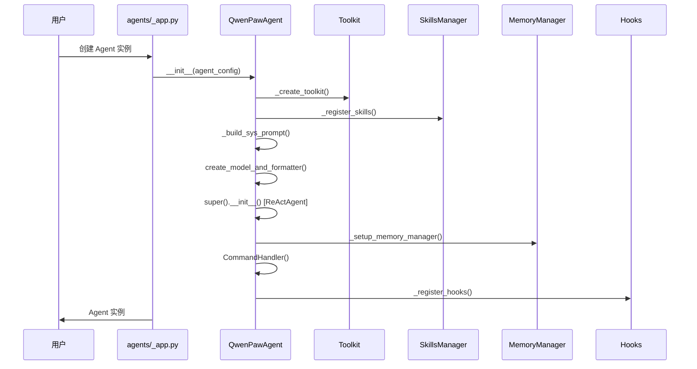
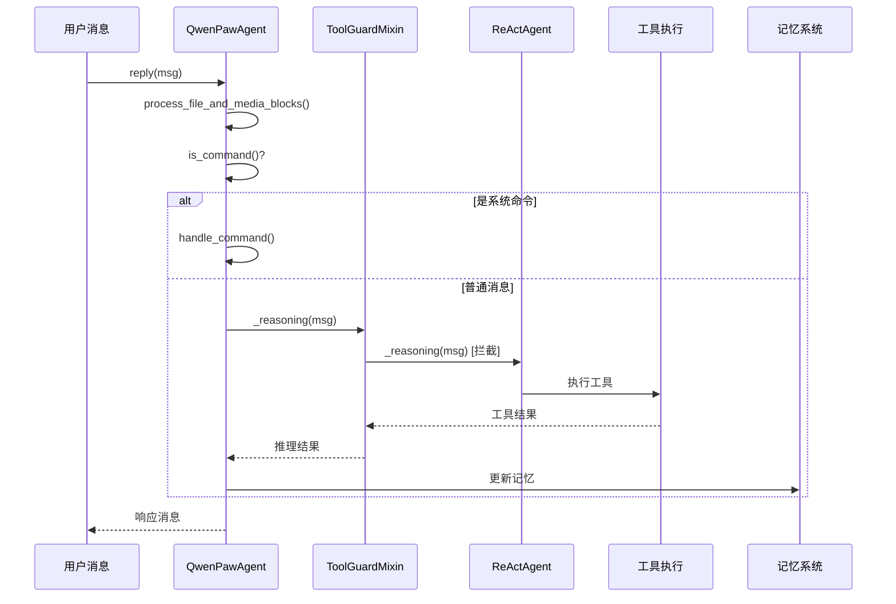
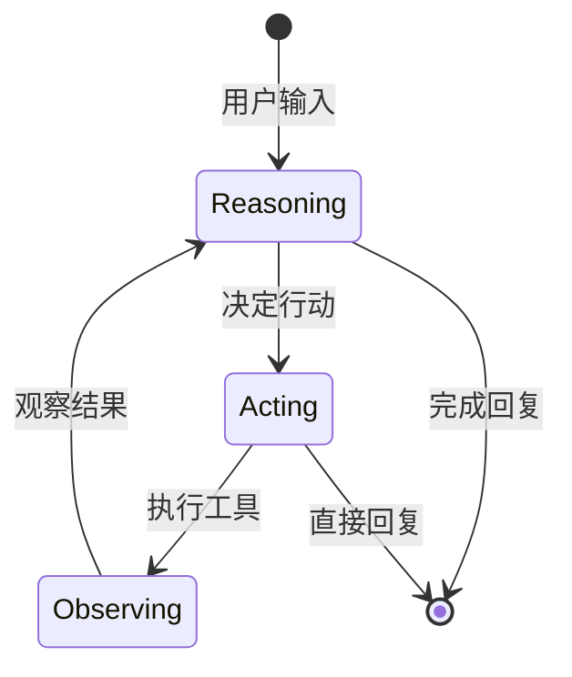

# 18 智能体架构

## 学习目标

学完本章后，你将能够：

- 理解 QwenPawAgent 的类层次结构和设计理念
- 掌握 ReAct 模式在 QwenPaw 中的实现方式
- 理解 ToolGuardMixin 如何拦截工具调用
- 跟踪智能体的初始化流程和生命周期
- 理解工具、技能、记忆三大系统的集成方式

## 源码入口

| 项目 | 内容 |
|------|------|
| **文件路径** | `src/qwenpaw/agents/react_agent.py` |
| **主类** | `QwenPawAgent` |
| **父类** | `ToolGuardMixin`, `ReActAgent` (from agentscope) |
| **关键方法** | `__init__`, `reply`, `_reasoning`, `_summarizing` |
| **初始化入口** | `agents/_app.py` 中实例化 |

## 背景问题

### 为什么需要 QwenPawAgent？

在 QwenPaw 之前，AgentScope 框架已经提供了 `ReActAgent`。QwenPawAgent 的存在是为了解决以下问题：

1. **集成工具安全**：AgentScope 的工具执行没有安全检查，需要 ToolGuardMixin 拦截危险操作
2. **动态技能加载**：需要从工作目录动态加载用户自定义技能
3. **记忆管理**：需要自动压缩长期记忆，防止上下文溢出
4. **多模态支持**：需要处理不同模型对图片/音频/视频的支持差异
5. **命令系统**：需要处理 `/compact`、`/new` 等系统命令

### QwenPawAgent 的设计理念

```python
class QwenPawAgent(ToolGuardMixin, ReActAgent):
```

采用**混入（Mixin）模式**进行功能扩展：
- `ToolGuardMixin` 提供安全拦截，不影响 ReActAgent 的核心逻辑
- `ReActAgent` 提供标准的 ReAct 推理能力
- QwenPawAgent 在此基础上添加业务逻辑

## 架构定位

### 模块职责

```
┌─────────────────────────────────────────────────────────┐
│                    QwenPawAgent                         │
│  ┌─────────────┐  ┌─────────────┐  ┌─────────────┐    │
│  │   Toolkit   │  │   Memory    │  │   Hooks     │    │
│  │  (工具系统)  │  │  (记忆系统)  │  │  (生命周期)  │    │
│  └─────────────┘  └─────────────┘  └─────────────┘    │
│  ┌─────────────┐  ┌─────────────┐  ┌─────────────┐    │
│  │   Skills   │  │  Commands   │  │   MCP       │    │
│  │  (技能系统)  │  │  (命令处理)  │  │  (扩展协议)  │    │
│  └─────────────┘  └─────────────┘  └─────────────┘    │
└─────────────────────────────────────────────────────────┘
                          │
                          ▼
              ┌───────────────────────┐
              │   ToolGuardMixin      │
              │   (安全拦截层)         │
              └───────────────────────┘
                          │
                          ▼
              ┌───────────────────────┐
              │     ReActAgent       │
              │   (推理核心)          │
              └───────────────────────┘
```

### 生命周期

```
1. __init__()
   ├── _create_toolkit()        # 创建工具包
   ├── _register_skills()       # 加载技能
   ├── _build_sys_prompt()      # 构建系统提示
   ├── create_model_and_formatter()  # 创建模型
   ├── _setup_memory_manager()  # 设置记忆管理
   ├── CommandHandler()         # 初始化命令处理
   └── _register_hooks()        # 注册生命周期钩子

2. reply(msg)
   ├── process_file_and_media_blocks()  # 处理文件/媒体块
   ├── is_command()              # 检查是否系统命令
   ├── handle_command()         # 处理命令
   └── super().reply()           # 正常推理流程

3. _reasoning()
   ├── _proactive_strip_media_blocks()  # 多模态处理
   ├── super()._reasoning()     # 调用父类推理
   └── _auto_continue_if_text_only()    # 自动继续

4. _summarizing()
   ├── _proactive_strip_media_blocks()  # 多模态处理
   ├── super()._summarizing()   # 调用父类总结
   └── _strip_tool_use_from_msg()       # 清理工具调用
```

## 核心源码分析

### 类层次结构

```python
# src/qwenpaw/agents/react_agent.py:60
class QwenPawAgent(ToolGuardMixin, ReActAgent):
    """QwenPaw Agent with integrated tools, skills, and memory management.

    This agent extends ReActAgent with:
    - Built-in tools (shell, file operations, browser, etc.)
    - Dynamic skill loading from working directory
    - Memory management with auto-compaction
    - Bootstrap guidance for first-time setup
    - System command handling (/compact, /new, etc.)
    - Tool-guard security interception (via ToolGuardMixin)
    """
```

**MRO（方法解析顺序）警告**：

```python
# 源码注释中的重要说明
MRO note
~~~~
``ToolGuardMixin`` overrides ``_acting`` and ``_reasoning`` via
Python's MRO: QwenPawAgent → ToolGuardMixin → ReActAgent.
如果你在 QwenPawAgent 中添加 ``_acting`` 或 ``_reasoning`` 覆盖，
**必须** 调用 ``super()._acting(...)`` / ``super()._reasoning(...)``
以便保持 guard 拦截生效。
```

### __init__ 方法流程分析

```python
def __init__(
    self,
    agent_config: "AgentProfileConfig",  # 智能体配置
    env_context: Optional[str] = None,    # 环境上下文
    enable_memory_manager: bool = True,   # 是否启用记忆管理
    mcp_clients: Optional[List[Any]] = None,  # MCP 客户端
    memory_manager: "BaseMemoryManager | None" = None,  # 记忆管理器
    request_context: Optional[dict[str, str]] = None,   # 请求上下文
    namesake_strategy: NamesakeStrategy = "skip",      # 同名工具策略
    workspace_dir: Path | None = None,                 # 工作目录
    task_tracker: Any | None = None,                    # 任务追踪器
):
```

关键初始化步骤：

```python
# 1. 保存配置
self._agent_config = agent_config
self._env_context = env_context
self._request_context = dict(request_context or {})
self._mcp_clients = mcp_clients or []
self._namesake_strategy = namesake_strategy
self._workspace_dir = workspace_dir
self._task_tracker = task_tracker

# 2. 创建工具包
toolkit = self._create_toolkit(namesake_strategy=namesake_strategy)

# 3. 加载技能
self._register_skills(toolkit)

# 4. 构建系统提示
sys_prompt = self._build_sys_prompt()

# 5. 创建模型和格式化器
model, formatter = create_model_and_formatter(agent_id=agent_config.id)

# 6. 初始化父类 ReActAgent
super().__init__(
    name="Friday",
    model=model,
    sys_prompt=sys_prompt,
    toolkit=toolkit,
    memory=InMemoryMemory(),
    formatter=formatter,
    max_iters=running_config.max_iters,
)

# 7. 设置记忆管理器
self._setup_memory_manager(enable_memory_manager, memory_manager, namesake_strategy)

# 8. 创建命令处理器
self.command_handler = CommandHandler(...)

# 9. 注册钩子
self._register_hooks()
```

### 工具包创建 (_create_toolkit)

```python
def _create_toolkit(self, namesake_strategy: NamesakeStrategy = "skip") -> Toolkit:
    """Create and populate toolkit with built-in tools."""
    toolkit = Toolkit()

    # 内置工具映射
    tool_functions = {
        "execute_shell_command": execute_shell_command,
        "read_file": read_file,
        "write_file": write_file,
        "edit_file": edit_file,
        "grep_search": grep_search,
        "glob_search": glob_search,
        "browser_use": browser_use,
        "desktop_screenshot": desktop_screenshot,
        "view_image": view_image,
        "view_video": view_video,
        "send_file_to_user": send_file_to_user,
        "get_current_time": get_current_time,
        "set_user_timezone": set_user_timezone,
        "get_token_usage": get_token_usage,
        "delegate_external_agent": delegate_external_agent,
        "list_agents": list_agents,
        "chat_with_agent": chat_with_agent,
        "submit_to_agent": submit_to_agent,
        "check_agent_task": check_agent_task,
    }

    # 注册每个工具
    for tool_name, tool_func in tool_functions.items():
        # 检查是否在配置中启用
        if not enabled_tools.get(tool_name, True):
            continue

        toolkit.register_tool_function(
            tool_func,
            namesake_strategy=namesake_strategy,
            async_execution=async_exec,
        )
```

### 技能注册 (_register_skills)

```python
def _register_skills(self, toolkit: Toolkit) -> None:
    """Load and register skills from workspace directory."""
    workspace_dir = self._workspace_dir or WORKING_DIR

    # 确保技能已初始化
    ensure_skills_initialized(workspace_dir)

    # 获取请求上下文中的渠道信息
    request_context = getattr(self, "_request_context", {})
    channel_name = request_context.get("channel", "console")

    # 解析该渠道的有效技能
    effective_skills = resolve_effective_skills(
        workspace_dir,
        channel_name,
    )

    working_skills_dir = get_workspace_skills_dir(Path(workspace_dir))

    # 注册每个技能
    for skill_name in effective_skills:
        skill_dir = working_skills_dir / skill_name
        if skill_dir.exists():
            toolkit.register_agent_skill(str(skill_dir))
```

### 系统提示构建 (_build_sys_prompt)

```python
def _build_sys_prompt(self) -> str:
    """Build system prompt from working dir files and env context."""
    # 获取智能体 ID
    agent_id = self._request_context.get("agent_id") if self._request_context else None

    # 检查心跳是否启用
    heartbeat_enabled = False
    if hasattr(self._agent_config, "heartbeat") and self._agent_config.heartbeat:
        heartbeat_enabled = self._agent_config.heartbeat.enabled

    # 构建系统提示
    sys_prompt = build_system_prompt_from_working_dir(
        working_dir=self._workspace_dir,
        agent_id=agent_id,
        heartbeat_enabled=heartbeat_enabled,
        memory_prompt_enabled=memory_prompt_enabled,
    )

    # 注入多模态提示
    multimodal_hint = build_multimodal_hint()
    if multimodal_hint:
        sys_prompt = sys_prompt + "\n\n" + multimodal_hint

    # 注入环境上下文
    if self._env_context is not None:
        sys_prompt = sys_prompt + "\n\n" + self._env_context

    return sys_prompt
```

### 记忆管理器设置 (_setup_memory_manager)

```python
def _setup_memory_manager(
    self,
    enable_memory_manager: bool,
    memory_manager: BaseMemoryManager | None,
    namesake_strategy: NamesakeStrategy,
) -> None:
    """Setup memory manager and register memory search tool if enabled."""
    # 检查环境变量
    env_enable_mm = os.getenv("ENABLE_MEMORY_MANAGER", "")
    if env_enable_mm.lower() == "false":
        enable_memory_manager = False

    self._enable_memory_manager = enable_memory_manager
    self.memory_manager = memory_manager

    # 注册记忆搜索工具
    if self._enable_memory_manager and self.memory_manager is not None:
        # 更新内存
        self.memory = self.memory_manager.get_in_memory_memory()
        self.memory_manager.chat_model = self.model
        self.memory_manager.formatter = self.formatter

        # 注册 memory_search 工具
        self.toolkit.register_tool_function(
            create_memory_search_tool(self.memory_manager),
            namesake_strategy=namesake_strategy,
        )
```

### 钩子注册 (_register_hooks)

```python
def _register_hooks(self) -> None:
    """Register pre-reasoning and pre-acting hooks."""
    # Bootstrap 钩子 - 检查 BOOTSTRAP.md
    working_dir = self._workspace_dir if self._workspace_dir else WORKING_DIR
    bootstrap_hook = BootstrapHook(
        working_dir=working_dir,
        language=self._language,
    )
    self.register_instance_hook(
        hook_type="pre_reasoning",
        hook_name="bootstrap_hook",
        hook=bootstrap_hook.__call__,
    )

    # 记忆压缩钩子 - 当上下文满时自动压缩
    if self._enable_memory_manager and self.memory_manager is not None:
        memory_compact_hook = MemoryCompactionHook(
            memory_manager=self.memory_manager,
        )
        self.register_instance_hook(
            hook_type="pre_reasoning",
            hook_name="memory_compact_hook",
            hook=memory_compact_hook.__call__,
        )
```

## 可视化结构

### 智能体初始化流程



### 消息处理流程



### ReAct 循环



## 工程经验

### 为什么使用 Mixin 模式？

**替代方案考虑**：
1. **继承**：直接继承 ReActAgent 并覆盖方法
2. **装饰器**：使用装饰器包装方法
3. **中间件**：使用代理模式

**Mixin 的优势**：
- 可以在不修改父类的情况下添加功能
- 可以灵活组合多个 Mixin
- 符合"组合优于继承"原则

**Mixin 的注意事项**：
- MRO（方法解析顺序）必须正确
- Mixin 之间不能有循环依赖
- 需要显式调用 `super()` 以保持链式调用

### 为什么需要主动媒体过滤？

在 `_reasoning` 方法中可以看到：

```python
async def _reasoning(self, tool_choice=None) -> Msg:
    # --- 主动过滤层 ---
    if not get_active_model_supports_multimodal():
        if self._uses_request_time_media_normalization():
            logger.debug("Formatter will strip media...")
        else:
            n = self._proactive_strip_media_blocks()
```

**问题**：某些模型声称支持多模态，但实际上某些媒体类型不支持。

**解决方案**：
1. 主动层：在调用模型前，根据模型能力标志过滤媒体块
2. 被动层：如果模型调用失败，检查是否是媒体问题，尝试过滤后重试
3. 标记不准确的模型：记录警告日志

### 历史包袱

1. **`async_execution` 标志**：某些工具（如 `execute_shell_command`）支持异步执行，但默认是同步
2. **向后兼容**：工具默认启用，除非在配置中明确禁用
3. **`Friday` 硬编码**：智能体名称硬编码为 "Friday"

## Contributor 指南

### 适合新手修改的区域

1. **工具注册** (`_create_toolkit`)
   - 添加新工具到 `tool_functions` 映射
   - 修改 `enabled_tools` 配置读取逻辑

2. **命令处理** (`CommandHandler`)
   - 添加新的系统命令
   - 修改命令解析逻辑

3. **提示构建** (`_build_sys_prompt`)
   - 添加新的提示组件
   - 修改提示模板

### 危险区域

1. **MRO 覆盖**：
   ```python
   # 如果你添加 _acting 或 _reasoning 覆盖，必须调用 super()
   async def _reasoning(self, tool_choice=None) -> Msg:
       # ... 你的代码 ...
       return await super()._reasoning(tool_choice=tool_choice)  # 必须！
   ```

2. **媒体过滤逻辑**：
   - 修改 `_proactive_strip_media_blocks` 可能导致多模态模型调用失败
   - 修改 `_auto_continue_if_text_only` 可能导致循环调用

3. **Hook 顺序**：
   - Hook 的执行顺序很重要，修改顺序可能影响行为

### 调试方法

1. **启用详细日志**：
   ```python
   import logging
   logging.getLogger("qwenpaw.agents").setLevel(logging.DEBUG)
   ```

2. **打印 MRO**：
   ```python
   print(QwenPawAgent.__mro__)
   ```

3. **检查工具注册**：
   ```python
   agent.toolkit.show_tools()  # 假设有该方法
   ```

### 测试方法

```python
import pytest
from qwenpaw.agents import QwenPawAgent

def test_agent_initialization():
    """测试智能体初始化"""
    config = AgentProfileConfig(...)
    agent = QwenPawAgent(agent_config=config)
    assert agent.name == "Friday"
    assert agent.max_iters == config.running.max_iters

def test_tool_registration():
    """测试工具注册"""
    agent = QwenPawAgent(...)
    assert "execute_shell_command" in agent.toolkit.get_tool_names()
```

---

## 延伸阅读

- [19 ReAct 模式](./19-ReAct模式.md)
- [20 工具系统](./20-工具系统.md)
- [21 记忆系统](./21-记忆系统.md)
- AgentScope 官方文档：https://agentscope.readthedocs.io/
