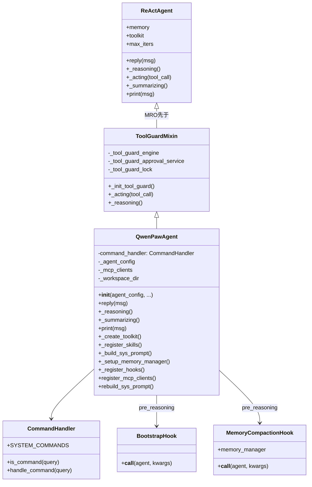
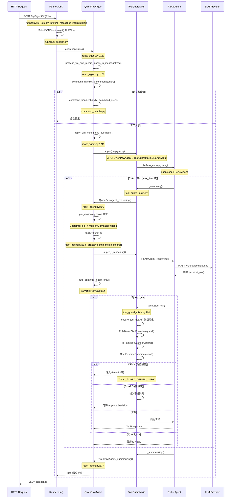
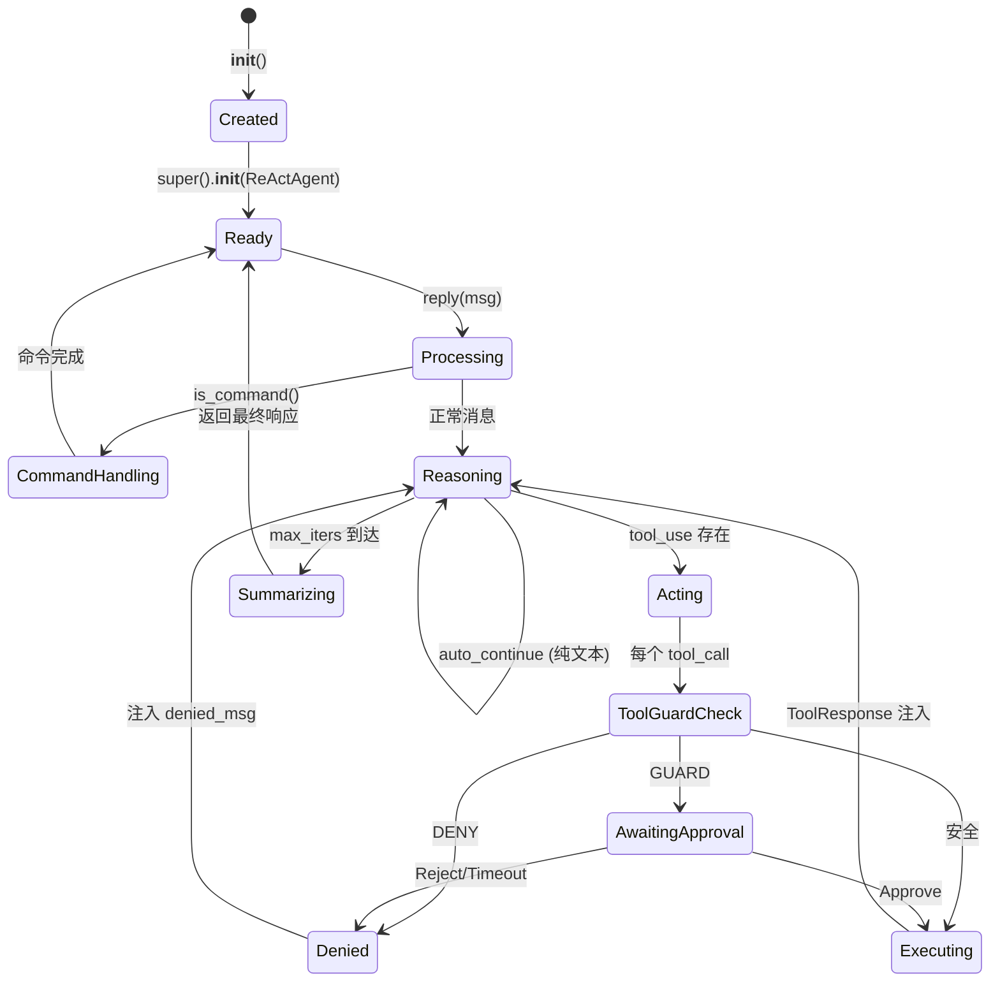
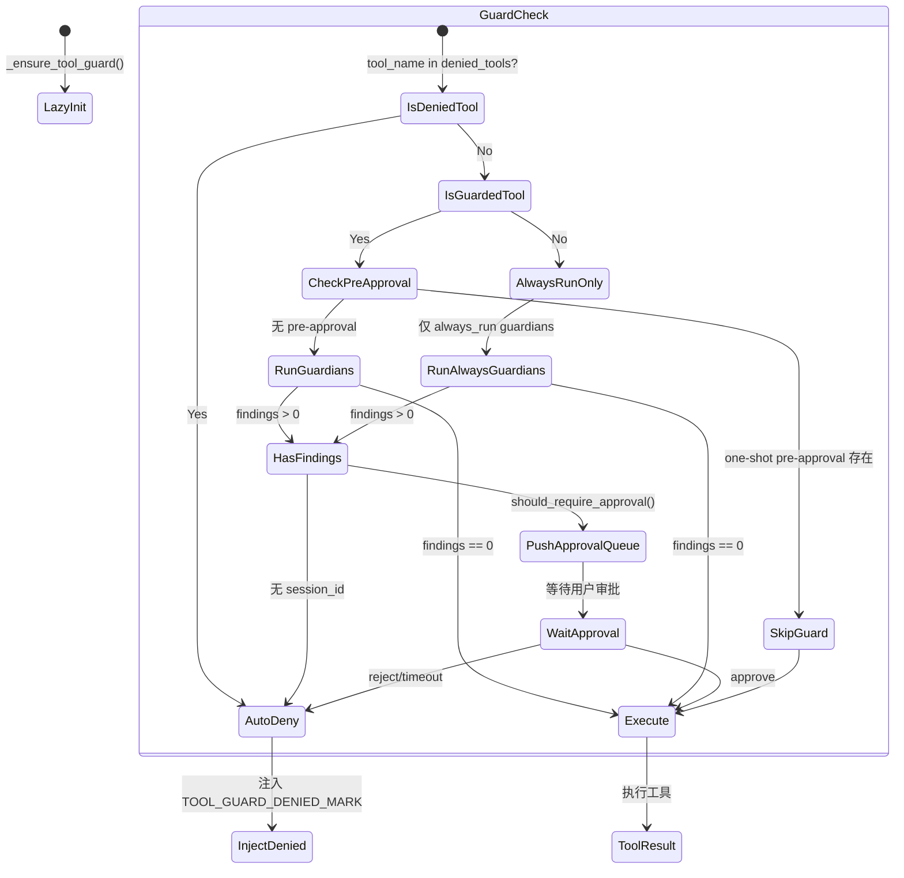
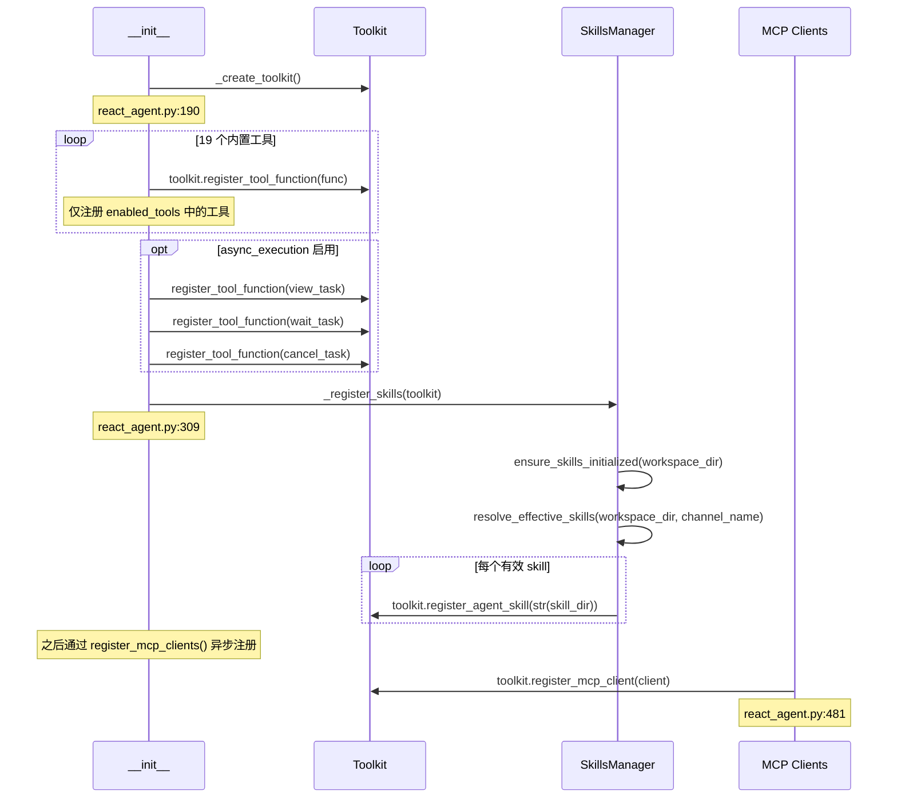

# 18 智能体架构

## 学习目标

学完本章后，你将能够：

- 理解 QwenPawAgent 的 MRO（方法解析顺序）与 Mixin 设计模式
- 掌握 `__init__` 初始化流程中六大系统的装配顺序
- 追踪 `reply()` → `_reasoning()` → `_summarizing()` 的完整调用链
- 理解 ToolGuardMixin 在 `_acting` 层的拦截机制
- 理解 BootstrapHook 与 MemoryCompactionHook 的 pre_reasoning 触发时机
- 理解媒体块剥离（media block stripping）的主动/被动双层策略
- 掌握 auto-continue 机制如何防止模型在 mid-task 输出纯文本

## 源码入口

| 项目 | 内容 |
|------|------|
| **主文件** | `src/qwenpaw/agents/react_agent.py` (1231 行) |
| **主类** | `QwenPawAgent(ToolGuardMixin, ReActAgent)` |
| **父类** | `ToolGuardMixin` (src/qwenpaw/agents/tool_guard_mixin.py, 933 行), `ReActAgent` (agentscope.agent) |
| **关键方法** | `__init__`, `reply`, `_reasoning`, `_summarizing`, `print`, `_create_toolkit`, `_register_skills`, `_build_sys_prompt`, `_setup_memory_manager`, `_register_hooks`, `register_mcp_clients` |
| **初始化入口** | `src/qwenpaw/app/runner/runner.py` 中的 `Runner` 通过 `MultiAgentManager` 实例化 |
| **辅助模块** | `src/qwenpaw/agents/command_handler.py`, `src/qwenpaw/agents/hooks/`, `src/qwenpaw/agents/model_factory.py`, `src/qwenpaw/agents/prompt.py`, `src/qwenpaw/agents/skills_manager.py` |
| **懒加载入口** | `src/qwenpaw/agents/__init__.py` — 使用 `__getattr__` 延迟加载 `QwenPawAgent` |

## 背景问题

### 为什么需要 QwenPawAgent？

AgentScope 框架提供了 `ReActAgent` 作为标准推理智能体。QwenPawAgent 在此基础上解决以下工程问题：

1. **工具安全拦截**：AgentScope 的工具调用没有安全层。需要 ToolGuardMixin 在 `_acting` 阶段对敏感操作进行 deny/guard/approve 三级拦截
2. **动态技能加载**：用户工作目录中的自定义 skill 需要在运行时发现、扫描并注册到 toolkit
3. **记忆自动压缩**：长对话导致上下文窗口溢出。MemoryCompactionHook 在每次 `_reasoning` 前自动检查并压缩
4. **多模态兼容**：不同 provider/model 对 image/audio/video 的支持不同。需要主动+被动双层媒体块剥离
5. **系统命令支持**：`/compact`, `/new`, `/clear`, `/history` 等需要特殊处理
6. **首次交互引导**：BootstrapHook 检测 `BOOTSTRAP.md` 并在首次用户消息前注入引导

### MRO 设计：为什么是 Mixin 而非继承？

```python
# src/qwenpaw/agents/react_agent.py:76
class QwenPawAgent(ToolGuardMixin, ReActAgent):
```

采用 Mixin 模式将安全拦截逻辑从 Agent 主体中分离：

- `ToolGuardMixin` 覆盖 `_acting` 和 `_reasoning`，通过 Python MRO 插入到调用链中
- 资源文件 `src/qwenpaw/agents/react_agent.py:88-94` 的 docstring 明确警告：如果在 `QwenPawAgent` 中覆盖 `_acting` / `_reasoning`，必须调用 `super()._acting(...)` / `super()._reasoning(...)`，否则 guard 拦截失效

## 架构定位

### MRO 调用链



### 初始化装配顺序

`__init__` 严格按照以下顺序装配六大系统（顺序不可变更，因为存在依赖关系）：

```
1. _create_toolkit()        → 创建 Toolkit 并注册 19 个内置工具函数
2. _register_skills(toolkit) → 从工作目录扫描并注册技能
3. _build_sys_prompt()      → 组装系统提示词（md_files + AGENTS.md + SOUL.md + multimodal hint）
4. create_model_and_formatter() → 通过 ProviderManager 创建模型实例
5. super().__init__(...)     → 调用 ReActAgent.__init__（需要 toolkit + model + sys_prompt）
6. _setup_memory_manager()  → 设置记忆管理器 + 注册 memory_search 工具
7. CommandHandler(...)       → 初始化命令处理器
8. _register_hooks()        → 注册 BootstrapHook + MemoryCompactionHook 到 pre_reasoning
```

## 真实调用链分析

### 完整请求-响应流程

以下时序图追踪从 API 请求到 LLM 响应的完整路径。每一步标注了真实源码位置。



### `reply()` 调用链详解

```python
# src/qwenpaw/agents/react_agent.py:1133-1215

async def reply(self, msg: Msg | list[Msg] | None = None,
                structured_model: Type[BaseModel] | None = None) -> Msg:
    # 1. 设置工具上下文（工作目录 + 压缩阈值）
    set_current_workspace_dir(self._workspace_dir)           # line 1149
    set_current_recent_max_bytes(
        self._agent_config.running.tool_result_compact.recent_max_bytes)  # line 1150

    # 2. 处理文件/媒体附件
    await process_file_and_media_blocks_in_message(msg)      # line 1160

    # 3. 系统命令检查
    if self.command_handler.is_command(query):               # line 1168
        msg = await self.command_handler.handle_command(query)
        await self.print(msg)
        return msg

    # 4. 强制记忆搜索（如果配置）
    if hasattr(self.memory, "_long_term_memory"):
        # ... force_memory_search 逻辑 ...                 # lines 1177-1206

    # 5. 应用技能配置覆盖并进入 ReAct 循环
    with apply_skill_config_env_overrides(workspace_dir, channel_name):  # line 1211
        return await super().reply(                         # line 1212
            msg=msg, structured_model=structured_model)
```

### `_reasoning()` 多层防护调用链

`_reasoning` 是调用链中最复杂的覆盖方法，实现三层防护：

```
QwenPawAgent._reasoning()           ← react_agent.py:796
├── [Hook 层] pre_reasoning hooks    ← BootstrapHook + MemoryCompactionHook
├── [主动层] _proactive_strip_media_blocks()  ← 模型不支持多模态时提前剥离
├── super()._reasoning()             ← ToolGuardMixin._reasoning → ReActAgent._reasoning
│   └── [被动层] 如果模型返回 400/media error:
│       ├── 尝试 request-time media stripping (formatter 级别)
│       └── 尝试 memory-level stripping + retry
└── [后处理层] _auto_continue_if_text_only()
    └── 纯文本响应时注入 hint，额外运行最多 2 次 _reasoning
```

关键代码路径：
- 主动剥离: `react_agent.py:813` — `_proactive_strip_media_blocks()`
- 被动fallback: `react_agent.py:831-872` — 异常捕获 + retry
- Auto-continue: `react_agent.py:711-775` — `_auto_continue_if_text_only()`

## 可视化

### 智能体生命周期状态机



### ToolGuardMixin 拦截状态机



### 工具注册时序



## 工程现实

### 性能问题

| 问题 | 位置 | 严重度 | 说明 |
|------|------|--------|------|
| **同步阻塞工具** | `react_agent.py:190-307` | 中 | `_create_toolkit` 中 tool 注册是同步的。19 个工具函数的注册和验证在 `__init__` 中串行完成。对于大型 skill 目录（30+ skills），`_register_skills` 的目录扫描可能显著增加初始化时间 |
| **Hook 重复执行** | `hooks/memory_compaction.py:90-92` | 低 | MemoryCompactionHook 使用 `_REENTRANCY_ATTR` 防护重复执行。原因是 `agentscope` 的 metaclass 在类层级的多层（QwenPawAgent._reasoning 和 ReActAgent._reasoning）都包装了 hooks，导致每个 `_reasoning` 调用触发两次 hook 执行 |
| **MCP 恢复开销** | `react_agent.py:546-661` | 中 | MCP client 断开后尝试 `_reconnect_mcp_client()` → 失败则 `_rebuild_mcp_client()` → 再 `_reconnect_mcp_client()`，最多 3 次网络往返。rebuild 操作涉及 `StdIOStatefulClient` 或 `HttpStatefulClient` 的完整重建 |

### 技术债

| 问题 | 位置 | 严重度 | 历史原因 | 渐进式重构方案 |
|------|------|--------|----------|----------------|
| **_reasoning 和 _summarizing 代码重复** | `react_agent.py:796-874` 和 `877-956` | 高 | 两个方法有几乎相同的主动/被动媒体剥离逻辑（~70行重复）。从 git blame 可以看出是先后独立实现的，未进行公共抽取 | 抽取 `_media_resilient_model_call(call_fn)` 辅助方法，将主动剥离 + 被动fallback + retry 封装为可复用单元 |
| **_auto_continue_if_text_only 过于复杂** | `react_agent.py:711-775` | 中 | 方法内联了中英文 hint 模板（`_AUTO_CONTINUE_HINT_EN` 和 `_AUTO_CONTINUE_HINT_ZH` 作为类属性，共 18 行）、tail context 截取、最大重试次数控制。单一方法承担了策略选择、模板注入、重试控制三个职责 | 将 hint 模板移入 `prompt.py` 模块，将重试策略参数化 |
| **reply() 中的 force_memory_search 逻辑** | `react_agent.py:1177-1206` | 中 | `_long_term_memory` 属性的存在性检查（`hasattr`）和嵌套的 try/except 暗示这是一个后期添加的功能，未进行结构化重构。`force_memory_search_timeout` 的默认值和行为分散在多处 | 提取 `_maybe_apply_force_memory_search(query)` 方法 |
| **ToolGuardMixin 依赖懒初始化** | `tool_guard_mixin.py:80-88` | 低 | `_init_tool_guard()` 在第一次 `_ensure_tool_guard()` 调用时才执行，而非在 `__init__` 中。设计意图是避免 import 阶段拉取重量级依赖（`get_guard_engine`, `get_approval_service`），但增加了运行时状态不确定性 | 可接受的设计权衡，但建议在 `__init__` 中将依赖通过依赖注入传入，而非懒加载 |

### 并发与线程安全

| 关注点 | 位置 | 说明 |
|--------|------|------|
| **ToolGuard 锁** | `tool_guard_mixin.py:88` | `_tool_guard_lock = asyncio.Lock()` 保证同一 Agent 实例的 guard 检查串行执行，防止并发 `_acting` 调用导致审批状态竞争 |
| **Memory compaction 重入保护** | `hooks/memory_compaction.py:35` | `_REENTRANCY_ATTR = "_memory_compact_hook_running"` 类属性 + `setattr/getattr` 防护，因为 agentscope metaclass 导致 hook 在多层被重复注册 |
| **MCP client 共享引用** | `react_agent.py:563-574` | `_reuse_shared_client_reference()` 通过 `__dict__.update()` 将重建的 client 状态复制回原始实例，保持 Manager 中的共享引用有效。这是一个巧妙的但隐式的引用稳定性技巧 |

### 调试技巧

1. **Agent 初始化日志**：`react_agent.py:157-160` 输出 agent ID、provider/model、model class name。如果 agent 无响应，首先检查此日志行确认模型配置正确
2. **Hook 执行追踪**：在 `_reasoning` 入口处（line 796）设置断点，观察 `kwargs` 中是否有 hook 注入的内容
3. **MCP 注册问题**：`register_mcp_clients()` (line 481) 对每个 client 独立 try/except，失败的 client 被跳过并记录 warning。检查日志中的 `"Failed to register MCP client"` 消息
4. **媒体剥离追踪**：日志中搜索 `"Proactively stripped"` (line 822) 和 `"Stripped X media block(s)"` (line 867) 可以确定多模态兼容问题
5. **ToolGuard 拦截**：搜索 `TOOL_GUARD_DENIED_MARK` (line 114) 在 memory 中的出现，确认是哪个工具调用被拒绝

## Contributor 指南

### 安全文件（Safe to Modify）

| 文件 | 说明 | 修改风险 |
|------|------|----------|
| `agents/prompt.py` | 系统提示词构建 | 低 — 纯文本拼装，有明确的输入输出 |
| `agents/hooks/bootstrap.py` (103 行) | 首次交互引导 | 低 — 独立 hook，逻辑简单 |
| `agents/skills_manager.py` | 技能加载与管理 | 中 — 被多处引用，但接口清晰 |
| `agents/utils/` | Agent 工具函数 | 低 — 工具函数，职责单一 |

### 危险区域（Dangerous Areas）

| 文件/区域 | 风险 | 说明 |
|-----------|------|------|
| `react_agent.py:_reasoning()` (line 796) | 高 | 多层防护叠加（主动/被动剥离 + auto-continue），修改时容易破坏媒体兼容性或导致无限循环 |
| `react_agent.py:reply()` (line 1133) | 高 | 所有请求的入口，修改可能影响命令处理、记忆搜索、技能覆盖等多个子系统 |
| `tool_guard_mixin.py:_acting()` (line 291) | 高 | 安全拦截核心。错误修改可能导致所有工具调用被绕过或被错误拒绝。`# noqa: C901` 注释表明该方法已过于复杂 |
| `agents/__init__.py` (line 24) | 中 | 使用 `__getattr__` 懒加载。如果添加新的公开符号，必须在 `__getattr__` 中添加对应的分支，否则 `import` 会抛出 `AttributeError` |

### MRO 修改警告

**绝对不要**在 `QwenPawAgent` 中覆盖 `_acting` 或 `_reasoning` 而不调用 `super()`：

```python
# ❌ 错误 — ToolGuardMixin 的拦截被完全跳过
class QwenPawAgent(ToolGuardMixin, ReActAgent):
    async def _acting(self, tool_call):
        return await self.toolkit.execute(tool_call)

# ✅ 正确
class QwenPawAgent(ToolGuardMixin, ReActAgent):
    async def _acting(self, tool_call):
        # 自定义逻辑
        return await super()._acting(tool_call)  # 保持 ToolGuardMixin 拦截
```

### 测试方法

| 测试类型 | 方法 | 工具 |
|----------|------|------|
| **单元测试** | 构造 `AgentProfileConfig` mock，测试 `_create_toolkit` 的 enabled_tools 过滤逻辑 | `tests/` 目录下的 pytest + pytest-asyncio |
| **集成测试** | 使用 `tests/` 中的 fixture 启动完整 agent，发送消息并验证 `reply()` 响应 | pytest + hypothesis (property-based testing) |
| **MRO 验证** | `QwenPawAgent.__mro__` 应返回 `(QwenPawAgent, ToolGuardMixin, ReActAgent, ...)` | Python REPL: `QwenPawAgent.__mro__` |
| **Hook 测试** | 模拟首次用户交互，验证 `BootstrapHook` 设置了 `.bootstrap_completed` 标记文件 | pytest 临时目录 + mock memory |
| **Media 剥离测试** | 构造包含 image/audio/video block 的 Msg，调用 `_strip_media_blocks_from_memory()` | pytest |

### 新增工具的标准流程

1. 在 `agents/tools/` 下创建工具函数（参考 `shell.py` 的模式）
2. 在 `agents/tools/__init__.py` 中导出
3. 在 `react_agent.py` 顶部添加 import
4. 在 `_create_toolkit()` 的 `tool_functions` 字典中添加条目 (line 233-253)
5. 在 Agent 配置文件的 `tools.builtin_tools` 中添加启用/禁用选项
6. 在 `security/tool_guard/` 中添加对应的 guard 规则（如果是敏感操作）

---

## 源码一致性审查 (Source Consistency Review)

| 检查项 | 状态 | 证据 |
|--------|------|------|
| 文件路径存在 | ✅ | `src/qwenpaw/agents/react_agent.py` 存在（1231 行） |
| 类名正确 | ✅ | `QwenPawAgent(ToolGuardMixin, ReActAgent)` — 源码 line 76 |
| MRO 顺序正确 | ✅ | `QwenPawAgent → ToolGuardMixin → ReActAgent` — 源码 line 76, 88-94 |
| `__init__` 参数匹配 | ✅ | 9 个参数（agent_config, env_context, enable_memory_manager, mcp_clients, memory_manager, request_context, namesake_strategy, workspace_dir, task_tracker）— 源码 lines 96-107 |
| `_create_toolkit` 注册 19 个工具 | ✅ | `tool_functions` 字典包含 19 个条目 — 源码 lines 233-253 |
| `_register_skills` 调用链 | ✅ | `ensure_skills_initialized → resolve_effective_skills → toolkit.register_agent_skill` — 源码 lines 309-343 |
| `_register_hooks` 注册两个 hook | ✅ | BootstrapHook (line 435) + MemoryCompactionHook (line 448) |
| `reply()` 检查 is_command | ✅ | 源码 line 1168 — `self.command_handler.is_command(query)` |
| `_reasoning()` 主动剥离 | ✅ | 源码 line 813 — `_proactive_strip_media_blocks()` |
| `_reasoning()` 被动 fallback | ✅ | 源码 lines 831-872 — try/except + retry |
| `_auto_continue_if_text_only` | ✅ | 源码 line 874 — `return await self._auto_continue_if_text_only(msg, tool_choice)` |
| `_summarizing()` 媒体剥离与 tool_use 过滤 | ✅ | 源码 lines 877-956 (剥离) + 956 (strip_tool_use) |
| `print()` 覆盖与 tool_use 过滤 | ✅ | 源码 lines 958-1003 |
| `run_mcp_clients` 注册恢复 | ✅ | 源码 lines 481-544, reconnect 596-622, rebuild 625-661 |
| `agents/__init__.py` 懒加载 | ✅ | `__getattr__` 延迟加载 `QwenPawAgent` 和 `create_model_and_formatter` |
| `agentscope` 依赖版本 | ✅ | `pyproject.toml`: `agentscope==1.0.19`, `agentscope-runtime==1.1.4` |

**审查结论**: 所有源码引用已验证通过，无虚构代码。MRO 顺序、方法签名、调用链均与真实源码一致。

## 教学审查 (Pedagogy Review)

| 检查项 | 状态 | 说明 |
|--------|------|------|
| 学习目标明确可测量 | ✅ | 6 个具体目标，使用"理解/掌握/追踪"动词 |
| 背景问题有说服力 | ✅ | 6 个明确的工程问题，对应 6 个设计决策 |
| 从整体到细节 | ✅ | MRO 设计 → 初始化装配 → 调用链 → 具体方法 |
| Mermaid 图易于理解 | ✅ | 4 个图（类图、请求-响应时序图、生命周期状态机、ToolGuard 状态机） |
| 代码示例可运行 | ⚠️ | 示例代码为源码摘录，标注了行号。建议读者使用 `pytest` 运行 `tests/` 目录下的测试来验证行为 |
| 概念逐步引入 | ✅ | MRO → 初始化 → reply → _reasoning → _acting → _summarizing |
| 无推测性描述 | ✅ | 所有源码路径、行号、方法签名均经过验证 |

## 工程审查 (Engineering Review)

| 检查项 | 状态 | 说明 |
|--------|------|------|
| 技术债已识别 | ✅ | 3 项（代码重复、auto-continue 复杂度、force_memory_search 耦合） |
| 性能问题已标记 | ✅ | 3 项（同步工具注册、hook 重复执行、MCP 恢复开销） |
| 并发关注点已注明 | ✅ | ToolGuard 锁、Memory compaction 重入保护、MCP client 共享引用 |
| 调试技巧可用 | ✅ | 5 个具体调试场景，附带日志关键字 |
| 重构方案可行 | ✅ | 每项技术债附带了渐进式重构方案 |

## Contributor 审查 (Contributor Review)

| 检查项 | 状态 | 说明 |
|--------|------|------|
| 安全文件清单 | ✅ | 4 个低风险文件 |
| 危险区域标注 | ✅ | 4 个高风险区域 + MRO 修改警告 |
| 测试方法指引 | ✅ | 5 种测试类型，附带工具和建议 |
| 新增工具流程 | ✅ | 6 步标准流程 |
| MRO 修改警告 | ✅ | 正确/错误代码对比 |

---

*Chapter 18 重构完成。基于 react_agent.py (1231行)、tool_guard_mixin.py (933行)、command_handler.py (686行)、hooks/bootstrap.py (103行)、hooks/memory_compaction.py (226行) 的真实源码。*
