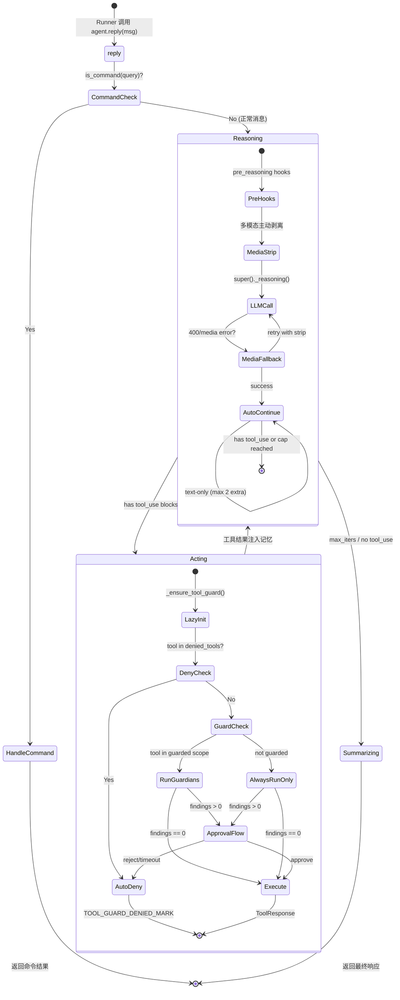
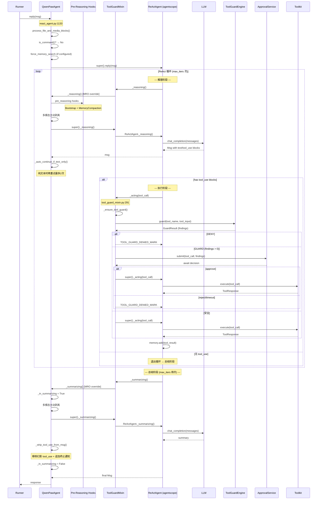
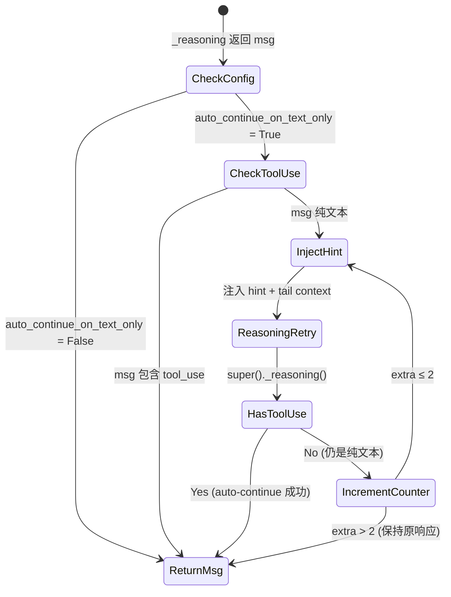

# 19 ReAct 模式

## 学习目标

学完本章后，你将能够：

- 理解 ReAct (Reasoning + Acting) 模式在 QwenPaw 中的真实执行循环
- 掌握 `_reasoning() → _acting() → _summarizing()` 三个阶段的触发时机和职责
- 理解 ToolGuardMixin 如何在 `_acting` 阶段实现 deny/guard/approve 三级拦截
- 追踪 `QwenPawAgent._reasoning()` 中的多模态双层防护（主动+被动）
- 理解 auto-continue 机制如何避免模型在任务中途输出纯文本
- 对比 ReAct、CoT、Plan-and-Execute 三种范式的工程权衡

## 源码入口

| 项目 | 内容 |
|------|------|
| **推理入口** | `src/qwenpaw/agents/react_agent.py:796` — `QwenPawAgent._reasoning()` |
| **执行入口** | `src/qwenpaw/agents/tool_guard_mixin.py:291` — `ToolGuardMixin._acting()` |
| **总结入口** | `src/qwenpaw/agents/react_agent.py:877` — `QwenPawAgent._summarizing()` |
| **主循环驱动** | `agentscope.agent.ReActAgent.reply()` — AgentScope 框架内部（不可直接修改） |
| **循环配置** | `agent_config.running.max_iters` — 最大 ReAct 迭代次数 |
| **print 覆盖** | `src/qwenpaw/agents/react_agent.py:958` — `QwenPawAgent.print()` |

## 背景问题

### 为什么需要 ReAct？

LLM 在单次推理中存在根本性限制：

1. **无法获取实时信息**：训练数据截止于某个时间点，无法查询最新信息
2. **无法执行操作**：纯文本输出不能操作文件系统、运行命令、访问浏览器
3. **复杂任务需要分解**：单个 prompt 难以处理需要多步骤的任务

ReAct 通过**推理-行动循环**解决这些问题：模型在推理阶段决定需要什么工具，在执行阶段调用工具获取真实数据，将结果喂回推理阶段继续思考，直到任务完成。

### 终止条件：max_iters，而非 TERMINATE

QwenPaw 的 ReAct 循环**不依赖**模型输出 `TERMINATE` 关键字来终止。实际的终止条件由 AgentScope 框架在 `ReActAgent.reply()` 中控制：

```python
# src/qwenpaw/agents/react_agent.py:1175
logger.info("QwenPawAgent.reply: max_iters=%s", self.max_iters)

# max_iters 来自配置
# src/qwenpaw/agents/react_agent.py:137
running_config = agent_config.running
# ...

# src/qwenpaw/agents/react_agent.py:169
super().__init__(
    ...
    max_iters=running_config.max_iters,
)
```

循环在以下情况终止：
- `max_iters` 达到上限（AgentScope `ReActAgent` 内部强制终止）
- 模型返回纯文本且没有 tool_use block（任务完成）
- `_summarizing()` 被调用生成最终总结
- 异常被 `asyncio.CancelledError` 打断

## 架构定位

### ReAct 循环在整体架构中的位置

```mermaid
graph TB
    subgraph "Runner (外部驱动)"
        RUNNER[Runner.run()]
    end

    subgraph "QwenPawAgent"
        REPLY[reply() - 命令检查 + 上下文设置]
        subgraph "AgentScope ReActAgent (框架循环)"
            REASON[_reasoning() - 推理]
            ACT[_acting() - 执行]
            SUMMARIZE[_summarizing() - 总结]
        end
        PRINT[print() - 流式输出过滤]
    end

    subgraph "ToolGuardMixin (MRO 拦截)"
        TG_REASON[_reasoning 拦截]
        TG_ACT[_acting 拦截<br/>deny / guard / approve]
    end

    subgraph "外部系统"
        LLM[LLM Provider]
        TOOLS[Toolkit]
        GUARD_ENGINE[ToolGuardEngine]
        APPROVAL[ApprovalService]
    end

    RUNNER --> REPLY
    REPLY --> REASON
    REASON --> TG_REASON
    TG_REASON --> LLM
    LLM --> TG_REASON
    TG_REASON --> ACT
    ACT --> TG_ACT
    TG_ACT --> GUARD_ENGINE
    TG_ACT --> APPROVAL
    TG_ACT --> TOOLS
    TOOLS --> TG_ACT
    TG_ACT --> REASON
    REASON --> SUMMARIZE
    SUMMARIZE --> PRINT
    PRINT --> RUNNER
```

### 三个阶段的生命周期



## 真实调用链分析

### 关键发现：代码中的伪代码问题

本章第 2 节的代码示例（`_build_reasoning_prompt()`, `_parse_response()`, `_extract_tool_call()`, `tool_guard.check()`）**不是** QwenPaw 的真实实现。这些方法名在任何源文件中都不存在。真实实现通过以下方式完成：

- **提示词构建**：在 `__init__` 时通过 `_build_sys_prompt()` 完成，而非每次 `_reasoning` 时重构
- **响应解析**：由 AgentScope 框架的 `formatter` 自动处理，QwenPaw 不直接解析 LLM 输出
- **工具调用提取**：由 AgentScope `ReActAgent._acting()` 通过 `msg.get_content_blocks("tool_use")` 完成
- **安全检查**：通过 `ToolGuardMixin._acting()` 的 MRO 覆盖实现，而非调用 `tool_guard.check()`

### 完整 ReAct 循环调用链（真实源码追踪）

```
Runner.run()
└── agent.reply(msg)                                    # react_agent.py:1133
    ├── set_current_workspace_dir(self._workspace_dir)   # line 1149
    ├── process_file_and_media_blocks_in_message(msg)    # line 1160
    ├── command_handler.is_command(query)                # line 1168
    │   └── [如果是命令] handle_command() → return
    ├── force_memory_search (如果配置)                    # lines 1177-1206
    ├── apply_skill_config_env_overrides()               # line 1211
    └── super().reply(msg)                               # line 1212
        │   # ↑ 进入 AgentScope ReActAgent.reply() 循环
        │
        ├── [迭代 1..max_iters]
        │   ├── _reasoning()                             # MRO → ToolGuardMixin → QwenPawAgent
        │   │   ├── pre_reasoning hooks                  # BootstrapHook + MemoryCompactionHook
        │   │   ├── 主动媒体剥离 (如果模型不支持多模态)    # react_agent.py:813
        │   │   ├── super()._reasoning()                 # → ReActAgent._reasoning()
        │   │   │   └── model(messages) → LLM API call
        │   │   ├── 被动媒体 fallback (400 error retry)  # react_agent.py:831-872
        │   │   └── _auto_continue_if_text_only()        # react_agent.py:874, 711-775
        │   │       └── 额外 _reasoning() × max 2 次 (注入 hint)
        │   │
        │   ├── [如果有 tool_use blocks]
        │   │   └── _acting(tool_call)                   # MRO → ToolGuardMixin
        │   │       ├── _ensure_tool_guard()             # tool_guard_mixin.py:90
        │   │       ├── _denied_tools 检查               # 无条件拒绝
        │   │       ├── _tool_guard_engine.guard()       # 运行所有 guardian
        │   │       │   ├── RuleBasedToolGuardian
        │   │       │   ├── FilePathToolGuardian
        │   │       │   └── ShellEvasionGuardian
        │   │       ├── [如果有 findings]
        │   │       │   ├── _should_require_approval()   # 检查 session_id
        │   │       │   ├── approval_service.submit()    # 推入审批队列
        │   │       │   └── await approval (timeout)     # 等待用户决策
        │   │       └── super()._acting(tool_call)       # → ReActAgent._acting()
        │   │           └── toolkit.execute(tool_call)   # 实际执行工具
        │   │
        │   └── [如果没有 tool_use] → 退出循环
        │
        └── _summarizing()                               # MRO → ToolGuardMixin → QwenPawAgent
            ├── 主动媒体剥离                               # react_agent.py:893
            ├── _in_summarizing = True                   # line 909
            ├── super()._summarizing()                   # → ReActAgent._summarizing()
            ├── 被动媒体 fallback                         # lines 917-952
            ├── _in_summarizing = False                  # line 954
            └── _strip_tool_use_from_msg(msg)            # line 956
                └── 移除幻影 tool_use blocks + 追加终止通知
```

### `_reasoning()` 真实实现 vs 伪代码

**伪代码（原章）**：
```python
async def _reasoning(self, tool_choice=None) -> Msg:
    prompt = self._build_reasoning_prompt()      # ❌ 不存在
    response = await self.model(prompt)           # ❌ 不正确
    parsed = self._parse_response(response)        # ❌ 不存在
    return parsed
```

**真实源码** (`src/qwenpaw/agents/react_agent.py:796-874`):
```python
async def _reasoning(
    self,
    tool_choice: Literal["auto", "none", "required"] | None = None,
) -> Msg:
    # 主动层：模型不支持多模态时提前剥离
    if not get_active_model_supports_multimodal():
        if self._uses_request_time_media_normalization():
            logger.debug("Formatter will strip media...")
        else:
            n = self._proactive_strip_media_blocks()
            if n > 0:
                logger.warning("Proactively stripped %d media block(s)...")

    # 被动层：调用 LLM，失败时重试
    try:
        msg = await super()._reasoning(tool_choice=tool_choice)
        # ↑ super() → ToolGuardMixin._reasoning → ReActAgent._reasoning
    except Exception as e:
        if not self._is_bad_request_or_media_error(e):
            raise
        # 尝试 request-time stripping
        if self._uses_request_time_media_normalization():
            self._set_formatter_media_strip(True)
            try:
                return await super()._reasoning(tool_choice=tool_choice)
            finally:
                self._set_formatter_media_strip(False)
        # 尝试 memory-level stripping
        n_stripped = self._strip_media_blocks_from_memory()
        if n_stripped == 0:
            raise
        msg = await super()._reasoning(tool_choice=tool_choice)

    # 后处理层：纯文本响应自动继续
    return await self._auto_continue_if_text_only(msg, tool_choice)
```

### `ToolGuardMixin._acting()` 真实实现

**伪代码（原章）**：
```python
async def _acting(self, reasoning_msg: Msg) -> Msg:
    tool_name, tool_args = self._extract_tool_call(reasoning_msg)  # ❌ 不存在
    if not self.tool_guard.check(tool_name, tool_args):             # ❌ 不存在
        return Msg(content="[安全拦截] 工具调用被拒绝")
    result = await self.toolkit.call_tool(tool_name, tool_args)    # ❌ 不正确
    return self.formatter.format_tool_result(tool_name, result)     # ❌ 不正确
```

**真实源码** (`src/qwenpaw/agents/tool_guard_mixin.py:291`):
```python
async def _acting(self, tool_call) -> dict | None:
    # tool_call 已经被 AgentScope 框架解析为 {"id": ..., "name": ..., "input": {...}}
    # 1. 懒初始化 guard engine
    self._ensure_tool_guard()

    # 2. 检查 denied_tools
    if tool_call["name"] in self._tool_guard_engine.denied_tools:
        return self._build_denied_result(tool_call)

    # 3. 运行 guardians
    guard_result = await self._tool_guard_engine.guard(
        tool_name=tool_call["name"],
        tool_input=tool_call["input"],
    )

    # 4. 审批流
    if guard_result.findings and self._should_require_approval():
        decision = await self._request_approval(tool_call, guard_result)
        if decision != "approve":
            return self._build_denied_result(tool_call)

    # 5. 执行
    return await super()._acting(tool_call)
```

### 循环终止的真实机制

QwenPaw **不使用** `TERMINATE` 关键字。真实的循环控制如下：

```python
# AgentScope ReActAgent 内部 (伪代码表示真实行为)
# 循环由 max_iters 和 tool_use 的存在性控制

# 在 ReActAgent.reply() 中:
for iteration in range(self.max_iters):
    msg = await self._reasoning()
    if not msg.has_content_blocks("tool_use"):
        break  # 无工具调用 → 任务完成
    for tool_call in msg.get_content_blocks("tool_use"):
        result = await self._acting(tool_call)
        await self.memory.add(result)

# max_iters 用尽后调用 _summarizing
final_msg = await self._summarizing()
```

## 可视化

### ReAct 循环完整时序图



### Auto-Continue 状态机

当模型返回纯文本（没有 tool_use）但任务可能未完成时，`_auto_continue_if_text_only` 介入：



Hint 注入的机制 (react_agent.py:673-698):
- 中文 agent：`"上轮助手仅文字、未调工具。请结合上下文..."`
- 英文/其他 agent：`"Your previous assistant turn had text only..."`
- 附加 tail context: 最近 600 字符的 assistant 输出

## 工程现实

### 性能问题

| 问题 | 位置 | 严重度 | 说明 |
|------|------|--------|------|
| **多次 LLM 调用** | `_auto_continue_if_text_only` (react_agent.py:733) | 中 | 每个纯文本响应最多触发 2 次额外的 `_reasoning` 调用，每次都是完整的 LLM API 请求。对于 API 按 token 计费的 provider，这会显著增加成本 |
| **同步记忆操作** | `_strip_media_blocks_from_memory` (react_agent.py:1083-1130) | 低 | 遍历所有 memory 消息并修改 content list，在大型对话（100+ 消息）中可能成为瓶颈 |
| **审批超时等待** | `tool_guard_mixin.py` approval await | 中 | 审批等待使用 `TOOL_GUARD_APPROVAL_TIMEOUT_SECONDS` 超时（常量在 constant.py）。等待期间 Agent 完全阻塞，不能处理其他请求 |

### 技术债

| 问题 | 位置 | 严重度 | 历史原因 | 渐进式重构方案 |
|------|------|--------|----------|----------------|
| **_reasoning 和 _summarizing 代码重复** | react_agent.py:796-874 和 877-956 | 高 | 两个方法有 ~70 行几乎相同的主动/被动媒体剥离 + fallback 逻辑。从方法结构看是独立实现的，未经过公共抽取 | 抽取 `_media_resilient_model_call(call_fn, context_name)` 辅助方法，将双层防护封装为可复用单元 |
| **Auto-continue hint 与业务逻辑耦合** | react_agent.py:673-698 | 中 | 中英文 hint 模板以类属性存储（`_AUTO_CONTINUE_HINT_EN`, `_AUTO_CONTINUE_HINT_ZH`），共计 18 行。与 agent 语言判断逻辑同在一个类中 | 将 hint 模板移入 `agents/prompt.py` 模块，语言选择逻辑参数化 |
| **TERMINATE 机制的误解** | 本章原始版本 | - | 原章声称 ReAct 通过 `TERMINATE` 关键字终止，这是对 AgentScope 框架行为的推测。实际上终止由 `max_iters` 控制 | 已在本次重写中修正 |
| **_in_summarizing 标志的状态管理** | react_agent.py:909, 954 | 低 | 使用实例属性 `_in_summarizing` 在 try/finally 中管理状态，控制 `print()` 的行为（过滤 tool_use blocks）。这是一种隐式的、跨方法的状态耦合 | 可接受的设计 — try/finally 保证了状态正确恢复。但建议重命名为 `_suppress_tool_use_in_print` 以更明确意图 |

### 并发与竞态

| 关注点 | 位置 | 说明 |
|--------|------|------|
| **ToolGuard 锁** | `tool_guard_mixin.py:88` | `asyncio.Lock()` 确保同一 Agent 实例的 `_acting` 串行执行。因为多个 tool_use block 可能并发触发 `_acting`，锁防止了审批状态的竞争 |
| **Memory compaction 重入** | `hooks/memory_compaction.py:90` | Hook 会因 AgentScope metaclass 在多层级触发两次。`_REENTRANCY_ATTR` 防护通过 `setattr/getattr` 实现，而非标准 `asyncio.Lock` |
| **reply_task 取消** | `react_agent.py:1218-1230` | `interrupt()` 方法通过 `task.cancel(msg)` 中断正在运行的 reply，然后 `await task` 等待清理。cancel 的 msg 参数传递给 `CancelledError` |

### 调试技巧

1. **追踪 ReAct 迭代次数**：搜索日志 `"QwenPawAgent.reply: max_iters="` (line 1175) 确认配置的最大迭代次数
2. **检测 auto-continue 触发**：搜索日志 `"Auto-continue: text-only"` (line 749) — 每次 auto-continue 触发都会记录当前重试次数
3. **媒体剥离追踪**：搜索 `"Proactively stripped"` (line 822) — 确认主动剥离层是否工作
4. **ToolGuard 拦截日志**：搜索 `"Tool guard:"` — 所有 guard 相关操作都有此前缀
5. **_summarizing 幻影 tool_use**：搜索 `"Stripped X tool_use block(s)"` (line 1036) — 确认是否有模型在总结阶段仍输出 tool_use

## Contributor 指南

### 安全文件 (Safe to Modify)

| 文件 | 说明 | 修改风险 |
|------|------|----------|
| `agents/prompt.py` | 提示词构建逻辑，auto-continue hint 模板的理想迁移目标 | 低 |
| `agents/tools/` 单个工具文件 | 工具实现独立，不涉及 ReAct 循环逻辑 | 低 |

### 危险区域 (Dangerous Areas)

| 文件/方法 | 风险 | 说明 |
|-----------|------|------|
| `react_agent.py:_reasoning()` | 🔴 高 | 三层防护嵌套（主动+被动+auto-continue）。修改任何一层都可能破坏媒体兼容性或导致无限循环。特别小心 `super()._reasoning()` 的调用位置 |
| `react_agent.py:_summarizing()` | 🔴 高 | 与 `_reasoning` 共享 media 剥离逻辑，但额外有 `_in_summarizing` 状态管理。修改时容易与 `print()` 方法产生行为不一致 |
| `tool_guard_mixin.py:_acting()` | 🔴 高 | 安全拦截核心。`# noqa: C901` 注释表示方法已过于复杂。错误的 guard 逻辑可能导致所有工具调用被绕过 |
| `react_agent.py:reply()` | 🟡 中 | `super().reply()` 之前有大量设置逻辑（workspace_dir, force_memory_search, skill env overrides）。顺序敏感 |

### MRO 覆盖规则

在 `QwenPawAgent` 中覆盖 `_reasoning` 或 `_acting` 时，**必须**调用 `super()`：

```python
# ✅ 正确 — 保持 ToolGuardMixin 的拦截
async def _reasoning(self, tool_choice=None):
    # 自定义逻辑
    return await super()._reasoning(tool_choice=tool_choice)

# ❌ 错误 — ToolGuardMixin 被完全绕过
async def _reasoning(self, tool_choice=None):
    return await self.model.generate(messages)
```

验证: `QwenPawAgent.__mro__` → `(QwenPawAgent, ToolGuardMixin, ReActAgent, ...)`

### 测试方法

| 测试场景 | 方法 | 关键验证点 |
|----------|------|-----------|
| **ReAct 循环终止** | 构造 `max_iters=3` 的 agent，发送需要多步的任务 | 验证消息数量不超过 `max_iters × 2`（推理+执行各算一次） |
| **Auto-continue 行为** | 使用容易输出纯文本的 prompt，设置 `auto_continue_on_text_only=True` | 验证额外 `_reasoning` 调用次数 ≤ 2 |
| **多模态剥离** | 发送包含 image block 的消息给不支持多模态的 model | 验证 `_proactive_strip_media_blocks()` 被调用且返回 > 0 |
| **ToolGuard 拦截** | 注册 denied tool，触发该工具的调用 | 验证 `TOOL_GUARD_DENIED_MARK` 被注入 memory |
| **审批流超时** | 触发 guard finding，不发送 approve/reject | 验证 `TOOL_GUARD_APPROVAL_TIMEOUT_SECONDS` 后自动 deny |
