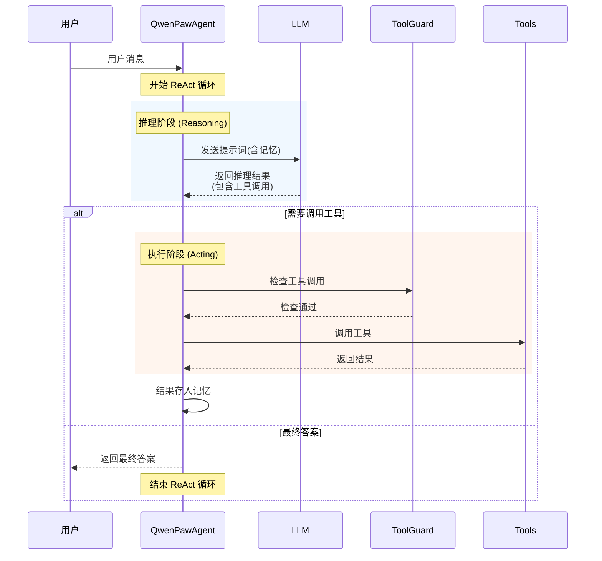
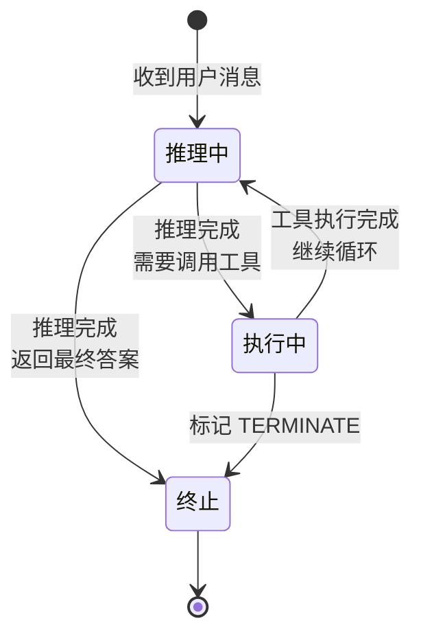

# 19 ReAct 模式

## 本章导读

| 项目 | 内容 |
|------|------|
| **学习目标** | 完成本章后，你能够：1) 解释 ReAct 模式的工作原理 2) 理解 Reasoning 和 Acting 的区别 3) 分析 QwenPaw 中 ReAct 的实现 |
| **前置知识** | [18-智能体架构](./18-智能体架构.md) |
| **预计时长** | 25 分钟 |
| **难度等级** | ⭐⭐⭐ |
| **核心关键词** | `ReAct` `Reasoning` `Acting` `推理` `执行` |

> **一句话概述**：本章深入讲解 ReAct (Reasoning + Acting) 模式，这是 QwenPaw 智能体的核心推理框架。

---

## 1. 什么是 ReAct？

### 1.1 概念定义

**ReAct = Reasoning + Acting**

ReAct 是一种让 AI 智能体能够**持续思考和行动**的模式。它不是一次性生成答案，而是：

```
输入 → 推理 → 行动 → 观察结果 → 推理 → 行动 → ... → 最终答案
         ↑                                                    │
         └────────────────────────────────────────────────────┘
                          (循环直到完成任务)
```

### 1.2 ReAct vs 传统方法

| 方法 | 特点 | 问题 |
|------|------|------|
| **ReAct** | 推理与行动交替 | 实现复杂 |
| **CoT (Chain of Thought)** | 只推理不行动 | 无法使用工具 |
| **Action Only** | 只行动不推理 | 缺乏规划 |

---

## 2. QwenPaw 中的 ReAct

### 2.1 源码路径

**文件**: `src/qwenpaw/agents/react_agent.py`

**核心方法**:
- `_reasoning()`: 推理阶段
- `_acting()`: 执行阶段
- `reply()`: 主入口

### 2.2 核心流程

```python
async def reply(self, msg: Optional[Msg] = None) -> Generator[Msg, None, None]:
    """
    主入口：协调推理和执行循环
    """
    msg = msg or Msg(user_id=self.user_id, content="")

    while True:
        # 1. 推理阶段：模型决定下一步
        reasoning_msg = await self._reasoning()

        # 2. 如果是最终答案，结束循环
        if reasoning_msg.content.endswith("TERMINATE"):
            yield reasoning_msg
            break

        # 3. 执行阶段：调用工具
        acting_msg = await self._acting(reasoning_msg)

        # 4. 将执行结果加入记忆，继续循环
        self.memory.add(acting_msg)
```

### 2.3 推理阶段详解

```python
async def _reasoning(self, tool_choice=None) -> Msg:
    """
    推理阶段：让模型决定下一步行动
    """
    # 1. 构建提示词，包含历史记忆
    prompt = self._build_reasoning_prompt()

    # 2. 调用 LLM 获取响应
    response = await self.model(prompt)

    # 3. 解析响应，提取工具调用
    parsed = self._parse_response(response)

    return parsed
```

### 2.4 执行阶段详解

```python
async def _acting(self, reasoning_msg: Msg) -> Msg:
    """
    执行阶段：根据推理结果调用工具
    """
    # 1. 提取工具名称和参数
    tool_name, tool_args = self._extract_tool_call(reasoning_msg)

    # 2. ToolGuard 安全检查
    if not self.tool_guard.check(tool_name, tool_args):
        return Msg(content="[安全拦截] 工具调用被拒绝")

    # 3. 调用工具
    result = await self.toolkit.call_tool(tool_name, tool_args)

    # 4. 格式化结果
    return self.formatter.format_tool_result(tool_name, result)
```

---

## 3. ReAct 循环可视化

### 3.1 时序图



### 3.2 状态机



---

## 4. 工程实现细节

### 4.1 多模态支持

```python
async def _reasoning(self, tool_choice=None) -> Msg:
    """带有多模态过滤的推理方法"""

    # 1. 主动过滤层：模型不支持多模态时提前移除媒体块
    if not get_active_model_supports_multimodal():
        self._proactive_strip_media_blocks()

    # 2. 被动回退层：模型调用失败时移除媒体块并重试
    try:
        msg = await super()._reasoning(tool_choice=tool_choice)
    except Exception as e:
        if self._is_bad_request_or_media_error(e):
            self._set_formatter_media_strip(True)
            msg = await super()._reasoning(tool_choice=tool_choice)

    # 3. 自动继续：文本响应但任务未完成时继续推理
    return await self._auto_continue_if_text_only(msg, tool_choice)
```

### 4.2 错误处理

```python
def _is_bad_request_or_media_error(self, e: Exception) -> bool:
    """判断是否是媒体相关的错误"""
    if isinstance(e, BadRequestError):
        error_code = getattr(e, "error_code", None)
        return error_code in (13, 400, 413)  # 媒体相关错误码
    return False
```

---

## 5. 设计决策

### 5.1 为什么用 ReAct？

**ReAct 的优势**：
- **可追溯**：每一步推理都有记录
- **可控**：可以在每步插入检查
- **可扩展**：容易添加新工具

**替代方案考虑**：
- Plan-and-Execute：先规划再执行，但延迟高
- Action-Only：简单但缺乏规划能力

### 5.2 循环终止条件

```python
# 终止条件
TERMINATE = "TERMINATE"

# 在推理提示词中告诉模型
SYSTEM_PROMPT = """
当你认为任务已经完成时，在回复末尾添加 TERMINATE。
例如：「根据搜索结果，答案是... TERMINATE」
"""
```

---

## 6. 常见问题

### 6.1 循环不终止怎么办？

**原因**：模型没有生成 TERMINATE 标记

**解决方案**：
1. 检查 system prompt 是否包含终止说明
2. 设置最大循环次数
3. 检查模型是否正确理解任务

### 6.2 工具调用失败怎么办？

**默认行为**：
- 记录错误到记忆
- 继续推理，可能选择其他工具

**可配置行为**：
- 最多重试次数
- 失败后返回错误信息

---

## 7. 小结

### 核心要点

| 概念 | 说明 |
|------|------|
| **ReAct** | Reasoning + Acting，推理与行动交替 |
| **推理阶段** | 模型决定下一步行动 |
| **执行阶段** | 调用工具并获取结果 |
| **终止条件** | 回复包含 TERMINATE 标记 |

### 延伸阅读

| 资源 | 说明 |
|------|------|
| [18-智能体架构](./18-智能体架构.md) | QwenPawAgent 整体结构 |
| [20-工具系统](./20-工具系统.md) | 工具调用的具体实现 |

### 下一章

[20-工具系统](./20-工具系统.md)

---

*本章编辑历史*
- 2026-05-10: 初始创建
