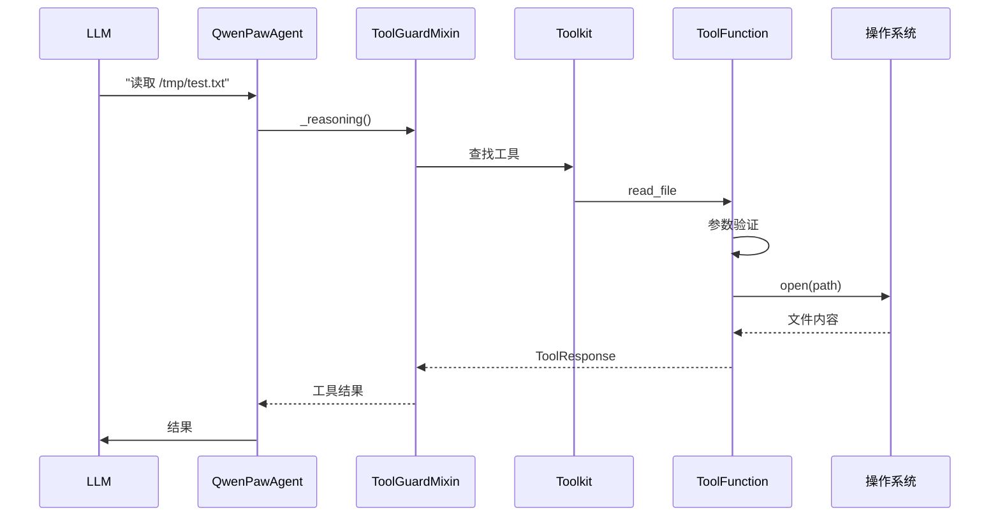
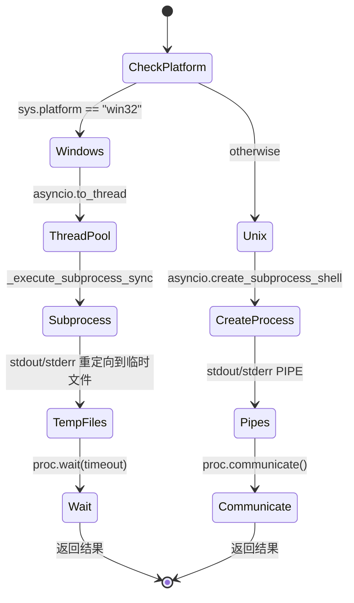

# 20 工具系统

## 学习目标

学完本章后，你将能够：

- 理解 QwenPaw 工具系统的架构设计
- 掌握工具注册和调用的流程
- 理解 `execute_shell_command` 的跨平台实现
- 理解文件操作工具的安全机制
- 理解浏览器控制工具的实现方式

## 源码入口

| 项目 | 内容 |
|------|------|
| **文件路径** | `src/qwenpaw/agents/tools/` |
| **核心文件** | `__init__.py`, `shell.py`, `file_io.py`, `browser_control.py` |
| **工具基类** | `agentscope.tool.Toolkit` |
| **响应类型** | `agentscope.tool.ToolResponse` |

## 背景问题

### 为什么需要工具系统？

QwenPaw Agent 需要与外部世界交互：
- **执行命令**：运行 shell 命令
- **文件操作**：读写、编辑文件
- **浏览器控制**：自动化浏览器操作
- **多智能体通信**：与其他 Agent 协作

工具系统将 LLM 的输出（文本）转换为可执行的操作。

### 工具系统的设计理念

1. **声明式注册**：通过 `@tool` 装饰器或 `Toolkit.register_tool_function` 注册
2. **类型安全**：使用 Pydantic 模型定义工具参数和响应
3. **异步支持**：部分工具支持 `async_execution`
4. **安全拦截**：通过 ToolGuardMixin 拦截危险操作

## 架构定位

### 工具分类

```
┌─────────────────────────────────────────────────────────────┐
│                      Toolkit                                │
│  ┌───────────────┐ ┌───────────────┐ ┌───────────────┐     │
│  │  Shell 工具   │ │  文件工具    │ │  浏览器工具   │     │
│  │ execute_shell │ │  read_file   │ │  browser_use  │     │
│  └───────────────┘ └───────────────┘ └───────────────┘     │
│  ┌───────────────┐ ┌───────────────┐ ┌───────────────┐     │
│  │  搜索工具    │ │  媒体工具    │ │  智能体工具   │     │
│  │  grep_search  │ │  view_image  │ │  chat_with_   │     │
│  │  glob_search  │ │  view_video  │ │    agent      │     │
│  └───────────────┘ └───────────────┘ └───────────────┘     │
└─────────────────────────────────────────────────────────────┘
```

### 工具与模块关系

```python
# agents/tools/__init__.py 导出
from .shell import execute_shell_command           # Shell 执行
from .file_io import read_file, write_file        # 文件 IO
from .file_search import grep_search, glob_search # 文件搜索
from .browser_control import browser_use           # 浏览器控制
from .view_media import view_image, view_video     # 媒体查看
from .memory_search import create_memory_search_tool  # 记忆搜索
from .agent_management import list_agents, ...    # 智能体管理
```

## 核心源码分析

### 工具注册流程

工具通过 `Toolkit.register_tool_function` 注册：

```python
# src/qwenpaw/agents/react_agent.py:186
def _create_toolkit(self, namesake_strategy: NamesakeStrategy = "skip") -> Toolkit:
    toolkit = Toolkit()

    tool_functions = {
        "execute_shell_command": execute_shell_command,
        "read_file": read_file,
        "write_file": write_file,
        "edit_file": edit_file,
        # ...
    }

    for tool_name, tool_func in tool_functions.items():
        if not enabled_tools.get(tool_name, True):  # 默认启用
            continue

        toolkit.register_tool_function(
            tool_func,
            namesake_strategy=namesake_strategy,
            async_execution=async_exec,  # 部分工具支持异步
        )
```

### Shell 命令执行 (execute_shell_command)

这是最复杂的工具，处理跨平台兼容性：

```python
# src/qwenpaw/agents/tools/shell.py
async def execute_shell_command(
    command: str,
    timeout: float = 60.0,
    cwd: Optional[Path] = None,
) -> ToolResponse:
    """Execute a shell command and return its output.

    Platform shells: Windows uses cmd.exe; Linux/macOS use /bin/sh or /bin/bash.
    """
```

**跨平台处理**：

1. **Windows (`win32`)**：
   ```python
   if sys.platform == "win32":
       # 使用线程池避免 asyncio subprocess 限制
       returncode, stdout_str, stderr_str = await asyncio.to_thread(
           _execute_subprocess_sync, cmd, str(working_dir), timeout, env
       )
   ```
   - 使用 `cmd /D /S /C` 包装命令
   - `CREATE_NEW_PROCESS_GROUP | CREATE_NO_WINDOW` 避免创建控制台窗口
   - 临时文件代替管道，避免子进程继承句柄导致阻塞

2. **Unix/Linux/macOS**：
   ```python
   else:
       proc = await asyncio.create_subprocess_shell(
           cmd,
           stdout=asyncio.subprocess.PIPE,
           stderr=asyncio.subprocess.PIPE,
           start_new_tasks=True,  # 创建新进程组
       )
   ```

**命令预处理**：

```python
def _collapse_embedded_newlines(cmd: str) -> str:
    """将 JSON 解码后的换行符转换回空格。

    LLMs 在 JSON 中产生的 \\n 会被解码为真实换行符，
    但在 shell 中需要区分：
    - 引号内的换行符应该保留（Unix）
    - 引号外的换行符应该转换为空格
    """
    if sys.platform == "win32":
        # cmd.exe 无法处理换行，必须全部转换
        return cmd.replace("\r\n", " ").replace("\n", " ")
    return _collapse_newlines_outside_quotes(cmd)  # Unix 保留引号内换行
```

**超时处理**：

```python
try:
    stdout, stderr = await asyncio.wait_for(
        proc.communicate(),
        timeout=timeout,
    )
except asyncio.TimeoutError:
    # 杀死整个进程组（包括子进程）
    pgid = os.getpgid(proc.pid)
    os.killpg(pgid, signal.SIGTERM)
    # 如果没响应，用 SIGKILL
    os.killpg(pgid, signal.SIGKILL)
```

### 文件操作工具 (file_io.py)

```python
from .file_io import (
    read_file,
    write_file,
    edit_file,
    append_file,
)
```

**read_file** 实现要点：
- 使用 `Path` 处理路径，支持相对路径
- 智能编码检测：`utf-8` → `locale.getpreferredencoding()` → `errors="replace"`
- 返回 `ToolResponse` 格式

```python
def read_file(path: Path, ...) -> ToolResponse:
    """Read a file and return its content."""
    try:
        content = path.read_text(encoding=encoding)
        return ToolResponse(content=[TextBlock(type="text", text=content)])
    except Exception as e:
        return ToolResponse(content=[TextBlock(type="text", text=f"Error: {e}")])
```

**edit_file** 实现要点：
- 使用 `str.replace()` 进行精确字符串替换（替换**所有**匹配项）
- 先检查文件存在性和 `old_text` 是否在内容中
- 使用 `read_file_safe` 读取文件内容（带编码回退）

### 浏览器控制 (browser_control.py)

```python
from .browser_control import browser_use
```

浏览器控制工具允许 Agent 操作浏览器：
- 导航到 URL
- 点击元素
- 填写表单
- 截图

## 可视化结构

### 工具调用流程



### Shell 命令跨平台差异



## 工程经验

### 为什么用临时文件代替管道？

**问题**：Windows 上子进程可能继承 stdout/stderr 管道。

```python
# 问题：使用管道可能导致阻塞
proc = subprocess.Popen(
    cmd, stdout=subprocess.PIPE, stderr=subprocess.PIPE
)
# 如果 proc 启动了其他进程，这些进程的输出会填满管道
# 导致 proc.communicate() 永远阻塞
```

**解决方案**：

```python
# 使用临时文件
stdout_fd, stdout_path = tempfile.mkstemp(prefix="qwenpaw_out_")
proc = subprocess.Popen(
    cmd, stdout=stdout_file, stderr=stderr_file  # 子进程写入临时文件
)
proc.wait()  # 只等待直接子进程，不阻塞
```

### 为什么需要进程组？

**问题**：杀死 shell 进程时，子进程可能变成孤儿。

```python
# 创建新进程组
proc = await asyncio.create_subprocess_shell(
    cmd,
    start_new_session=True,  # 创建新进程组
)
# 超时时杀死整个进程组
os.killpg(pgid, signal.SIGTERM)
```

### 历史包袱

1. **`smart_decode` 函数**：早期实现，没有统一编码处理
2. **`_collapse_embedded_newlines`**：为了解决 LLM JSON 输出换行问题

## Contributor 指南

### 适合新手修改的区域

1. **添加新工具**：
   ```python
   # 1. 在 agents/tools/ 下创建新文件
   # 2. 在 __init__.py 中导出
   # 3. 在 react_agent.py 的 _create_toolkit 中注册
   ```

2. **修改工具参数**：
   - 修改函数签名
   - 更新类型注解
   - 添加默认值

### 危险区域

1. **Shell 命令注入**：使用 `subprocess` 时必须分离命令和参数，绝不直接拼接用户输入到命令字符串

2. **路径遍历**：验证路径在允许范围内，使用 `Path.resolve()` 检查

### 调试方法

1. **测试工具函数**：
   ```python
   import asyncio
   from qwenpaw.agents.tools import execute_shell_command

   async def test():
       result = await execute_shell_command("echo hello", timeout=5)
       print(result)

   asyncio.run(test())
   ```

2. **检查工具注册**：
   ```python
   agent = QwenPawAgent(...)
   print(agent.toolkit.get_tool_names())
   ```

### 测试方法

```python
import pytest
from pathlib import Path
from qwenpaw.agents.tools import read_file

def test_read_file_basic(tmp_path):
    """测试读取文件基本功能"""
    test_file = tmp_path / "test.txt"
    test_file.write_text("hello world")

    result = read_file(path=test_file)
    assert "hello world" in result.content[0].text

def test_read_file_encoding(tmp_path):
    """测试编码处理"""
    test_file = tmp_path / "test.txt"
    test_file.write_bytes("你好".encode("gbk"))

    result = read_file(path=test_file, encoding="gbk")
    assert "你好" in result.content[0].text
```

---

## 延伸阅读

- [18 智能体架构](./18-智能体架构.md)
- [21 记忆系统](./21-记忆系统.md)
- AgentScope Toolkit 文档：https://agentscope.readthedocs.io/
