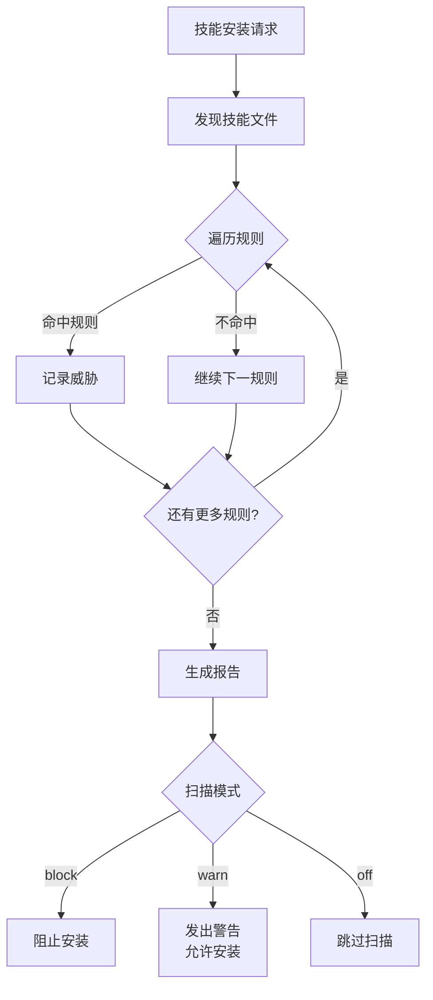

# 38 技能安全扫描

## 本章导读

| 项目 | 内容 |
|------|------|
| **学习目标** | 完成本章后，你能够：1) 理解 skill_scanner 的作用和原理 2) 分析扫描规则的实现 3) 知道如何配置扫描模式 |
| **前置知识** | [35-安全架构](./35-安全架构.md) |
| **预计时长** | 20 分钟 |
| **难度等级** | ⭐⭐⭐ |
| **核心关键词** | `skill_scanner` `安全扫描` `规则匹配` `威胁检测` |

> **一句话概述**：本章讲解技能安全扫描系统如何检测和阻止恶意技能代码。

---

## 1. 背景问题

### 1.1 为什么需要技能扫描？

QwenPaw 的技能（Skill）可以是第三方来源：

```
技能来源：
├── 内置技能（QwenPaw 官方开发）
│     └── 代码经过审核，安全
├── 社区技能（其他开发者分享）
│     └── 可能包含恶意代码
└── 自定义技能（你自己编写）
      └── 信任来源，但仍需检查
```

**风险场景**：
- 用户从网上下载了一个"酷炫"的技能
- 技能代码悄悄把你的 API Key 发送到外部服务器
- 技能代码加密你的文件并索要赎金

### 1.2 扫描时机

```
技能安装流程：
用户安装技能
      │
      ▼
┌─────────────────┐
│  SkillScanner   │ ← 在这里扫描
│  (安装前扫描)    │
└────────┬────────┘
         │
    ┌────┴────┐
    │ 扫描结果 │
    ├─────────┤
    │ Block   │ → 阻止安装
    │ Warn    │ → 警告但允许
    │ Off     │ → 不扫描
    └─────────┘
         │
         ▼
   安装成功/失败
```

---

## 2. 源码入口

**源码路径**: `src/qwenpaw/security/skill_scanner/`

**核心文件**:
- `scanner.py` - 扫描器编排器（`SkillScanner` 类）
- `analyzers/pattern_analyzer.py` - 基于正则的分析器（`PatternAnalyzer`）
- `scan_policy.py` - YAML 驱动的扫描策略（`ScanPolicy`）
- `rules/signatures/` - YAML 签名规则文件
- `models.py` - `Finding`, `ScanResult`, `SkillFile` 数据模型

**关键类**: `SkillScanner`

```python
# scanner.py — 真实接口（简化）
class SkillScanner:
    """编排文件发现 → 分析器执行 → 收集 Finding → 生成 ScanResult"""
    def __init__(self):
        self._analyzers: list[BaseAnalyzer] = [PatternAnalyzer()]

    def scan_skill(self, path: Path) -> ScanResult:
        """扫描指定路径下的技能目录"""
        # result.is_safe 是最终的布尔判定
```

---

## 3. 扫描流程

### 3.1 整体流程



### 3.2 核心代码

```python
def scan(self, skill_path: str) -> ScanReport:
    """扫描技能目录，返回扫描报告"""

    # 1. 发现所有 Python 文件
    py_files = self._discover_files(skill_path)

    # 2. 遍历规则匹配
    threats = []
    for file_path in py_files:
        for rule in self.rules:
            if rule.match(file_path):
                threats.append(
                    Threat(
                        rule=rule,
                        file=file_path,
                        line=rule.find_line(file_path),
                    )
                )

    # 3. 生成报告
    return ScanReport(threats=threats, skill_path=skill_path)
```

---

## 4. 扫描规则

### 4.1 内置规则

| 规则 | 检测内容 | 危险等级 |
|------|----------|----------|
| `network_connection` | 异常网络连接 | 🔴 高 |
| `file_write_outside` | 在工作区外写文件 | 🔴 高 |
| `subprocess_execute` | 执行外部命令 | 🔴 高 |
| `env_access` | 访问环境变量 | 🟡 中 |
| `eval_usage` | 使用 eval/exec | 🟡 中 |
| `import_suspicious` | 导入可疑模块 | 🟡 中 |

### 4.2 YAML 签名规则示例

实际检测规则以 YAML 格式存储在 `rules/signatures/` 目录下，由 `PatternAnalyzer` 加载和匹配（非 Python `Rule` 类）：

```yaml
# rules/signatures/example.yaml — YAML 签名格式
id: "network-connection"
severity: "high"
description: "检测到可疑的网络请求"
patterns:
  - "requests\\."
  - "urllib\\."
  - "\\.get\\("
file_types:
  - ".py"
  - ".sh"
```

`ScanPolicy` 通过 `data/default_policy.yaml` 控制哪些文件类型被扫描、哪些扩展名被排除（`_FALLBACK_SKIP_EXTENSIONS` 作为后备）。

---

## 5. 扫描策略

### 5.1 ScanPolicy 机制

扫描行为由 `ScanPolicy` 控制（非简单的 `block/warn/off` 模式切换）：

| 机制 | 说明 |
|------|------|
| **ScanPolicy** | YAML 驱动的策略文件，定义文件分类、规则范围、允许列表 |
| **BaseAnalyzer** | 抽象分析器接口，`PatternAnalyzer` 是默认实现 |
| **ScanResult.is_safe** | 扫描完成后通过 `result.is_safe` 判定是否安全 |
| **自定义分析器** | 可通过 `scanner.register_analyzer()` 注册额外的 `BaseAnalyzer` |
| `off` | 完全关闭扫描 | 开发调试 |

### 5.2 配置方式

```python
# 初始化时指定
scanner = SkillScanner(mode="warn")

# 或通过配置
# config.yaml
security:
  skill_scanner:
    mode: "warn"  # block / warn / off
```

---

## 6. 工程经验

### 6.1 误报处理

**问题**：正常代码可能被误判为威胁

**解决方案**：
- 规则需要精细调优
- 支持白名单机制
- 提供 `off` 模式供用户选择

### 6.2 绕过风险

**问题**：攻击者可能尝试绕过扫描

**防护**：
- 规则持续更新
- 多层检测（不只是正则）
- 社区反馈机制

### 6.3 性能影响

**问题**：扫描可能影响安装速度

**优化**：
- 增量扫描（只扫描变更文件）
- 并行处理
- 缓存扫描结果

---

## 7. Contributor 指南

### 7.1 适合新手修改的文件

| 文件 | 原因 |
|------|------|
| `analyzers/pattern_analyzer.py` | 添加新检测模式，逻辑清晰 |
| `rules/signatures/` | 添加 YAML 签名规则，无需修改代码 |

### 7.2 危险区域

| 区域 | 风险 |
|------|------|
| `scanner.py` 核心逻辑 | 修改可能影响扫描准确性 |
| 规则正则表达式 | 错误可能导致漏报或误报 |

### 7.3 调试方法

```python
# 启用调试模式
scanner = SkillScanner(mode="warn", debug=True)

# 单独测试某条规则
result = rule.match("path/to/file.py")
```

### 7.4 添加新规则

```python
# 在 rules/signatures/ 中添加新的 YAML 签名文件
new_rule = Rule(
    name="your_rule_name",
    pattern=r"可疑代码模式",
    severity="medium",
    description="描述这条规则检测什么",
)

# 添加到默认规则列表
default_rules.append(new_rule)
```

---

## 8. 小结

### 核心要点

| 概念 | 说明 |
|------|------|
| **SkillScanner** | 技能安装前的安全扫描器 |
| **扫描时机** | 技能安装前，不影响运行时性能 |
| **扫描策略** | `ScanPolicy` YAML 驱动，可自定义文件分类和规则范围 |
| **检测机制** | `PatternAnalyzer` 基于 YAML 签名的正则匹配 |

### 延伸阅读

| 资源 | 说明 |
|------|------|
| [35-安全架构](./35-安全架构.md) | 安全系统整体介绍 |
| [36-ToolGuard系统](./36-ToolGuard系统.md) | 运行时工具安全 |

### 下一章

[39-配置系统](./level-6-config-plugins/39-配置系统.md)

---

*本章编辑历史*
- 2026-05-10: 初始创建
